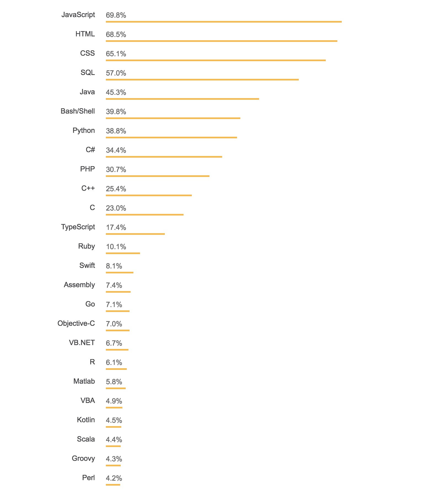
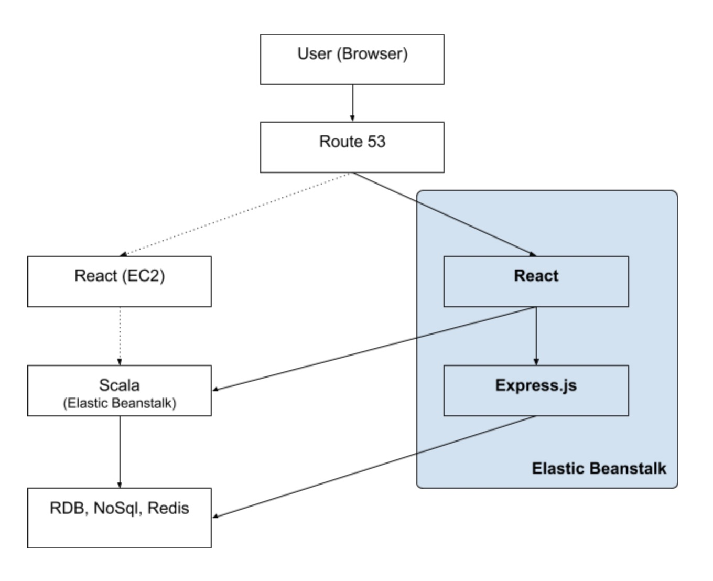
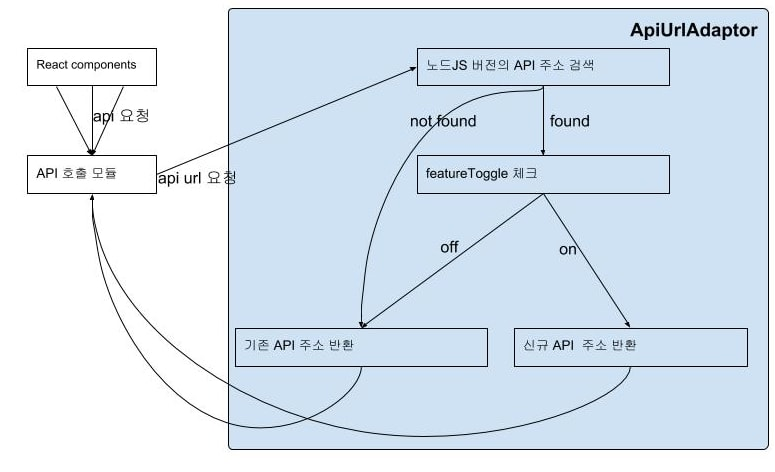

매드업은 광고 진행을 위한 기술 솔루션을 개발하는 팀입니다.
광고주로부터 의뢰을 받아 적절한 곳으로 광고를 보내는 역할을 하고 있지요.
광고는 우리가 모르고 있던 수많은 이해 당사자들의 손을 거쳐 스마트폰으로 전송되고 있답니다.

스마트폰의 보급으로 인해 개인을 식별할 수 있는 데이터가 늘어나는 상황과
효율적인 광고 전달이라는 과제가 애드테크 산업의 매력 포인트라고 생각합니다.

오늘은 광고 진행을 위한 **매드업의 웹 어드민 서비스**를 소개할까 합니다.
서비스를 이루고 있는 **개발 기술**에 대해서 말이죠.

## 문제

매드업 어드민은 리액트와 스칼라 언어로 만든 웹 서비스입니다.

리액트 기반의 프론트엔드는 리덕스, 앤트 디자인 라이브러리를 이용해 구현했고
AWS EC2 인스턴스로 구성한 웹서버에서 호스팅됩니다.

스칼라 기반의 백엔드는 프론트엔드에게 HTTP API 형태로 데이터를 전달하고
AWS 빈스톡 위에서 돌아가는 서비스입니다.

**"프론트엔드/백엔드로 나누어 각자의 서버로 운영하는게 효율적일까?"**

서비스 구조를 프론트엔드와 백엔드로 나누게 되면 개발자의 역할까지 분리해서 일하게 됩니다.
종종 부작용이 생길 수 있는데 예를 들면 이런 것이죠.

> '이 화면의 데이터는 디비의 어떤 테이블에 있는건가요?'

> '그건 백엔드 개발자에게 물어 보세요'

**"이러한 역할 분리가 필요한 규모인가?"**

원작자의 코드를 건네 받았지만 개발 히스토리에 대한 정보가 부족한 개발팀은 코드를 함부로 건드릴 수 없었습니다.
뿐만 아니라 스칼라 개발자가 부족한 상황이라 아무나 백엔드 시스템을 개발할 수 없었죠.

**"스칼라가 지금도 합리적인 선택일까?"**

## 대안

이러한 문제를 해결하기 위해 몇 가지 기준을 세웠습니다.

**코드와 인프라를 단순하게 운영하자.**

프론트엔드와 백엔드는 각자의 깃 저장소와 서버로 운영되고 있어서 현재 상황에서는 관리 비용의 문제가 있었습니다.
배보다 배꼽이 더 큰 상황이라고 할 수 있죠.
하나의 코드 저장소, 하나의 서버로 운영한다면 적은 인원이 집중할 수 있는 환경을 만들 수 있을 것입니다.

**혼자 개발하지 말자.**

각 플래폼 별로 한 명이 개발하는 업무 구조는 개인이 서비스 전반을 파악하기 힘들었습니다.
아무래도 본인이 만지는 코드만 보게되고 남이 짠 코드는 안보게 되니까요.
그렇게 해도 어찌어찌 일은 진행 되겠지만 전체 서비스를 파악하는 것은 한계에 부딪히기 마련입니다.

뿐만 아니라 팀으로 일하는 협업 체계를 갖기도 어렵습니다.
프론트엔드와 백엔드를 함께 개발하는 환경을 갖추는 것이 우리가 팀으로 일할 수 있는 기반작업이라고 판단했습니다.
처음엔 빠르게 결정하고 개발하는 것 같지만 시간이 흐를수록 혼자 일하는 건 좀 외롭거든요.

**보편적인 기술을 사용하자**

팀에는 스칼라 코드를 읽을 수 있는 사람이 부족합니다. 백엔드 코드를 만질 수 있는 리소스가 부족한건 당연한 상황이죠. 나아가 개발직군 채용에도 적잖은 영향을 줍니다.

올해 스택오버플로우에서 조사한 개발 언어 인기조사에서의 스칼라 순위가 이를 방증하고 있다고 생각합니다.

<small style="display:block;text-align:center">- [Stackoverflow Developer Servey Results 2018](https://insights.stackoverflow.com/survey/2018/#technology-programming-scripting-and-markup-languages) 참고 -</small>

대안으로 **자바스크립트**를 선택했습니다.
정도의 차이는 있지만 팀원 모두가 노드JS에 대한 경험이 있었고, 최소한 코드를 읽을 수 있는 역량은 갖추고 있는 상황이기 때문입니다.

개발 환경도 중요했는데 무거운 스칼라 환경을 돌리는 것에 비해 몇 초 내에 구동되는 노드 환경이 우리에게 더 맞았습니다.
빌드 언어와 달리 코드를 바로 실행하는 스크립트 언어 특징으로 인해 더 빨리 테스트 코드를 작성할 수 있습니다.

뿐만 아니라 기존에 사용하고 있어서 익숙한 빈스톡 환경을 그대로 가져갈 수 있다는 점도 선택의 중요한 이유였습니다.
([Elastic Beanstalk가 지원되는 플랫폼](https://docs.aws.amazon.com/ko_kr/elasticbeanstalk/latest/dg/concepts.platforms.html) 참고)

## 해결

먼저는 분리된 **저장소와 운영 서버를 단일화**하는 작업을 진행했습니다.
익스프레스 프레임웍을 기반으로 API 서버를 만들고,
리액트 어플리케이션을 올려 정적 파일로 처리할 수 있는 단일 웹어플리케이션을 재구축했습니다.
이 어플리케이션 코드는 하나의 빈스톡 환경에 배포하여 프론트엔드와 백앤드를 함께 호스팅하도록 했구요.

<small>- 현행 서버와 신규 서버(파란색) 병행 -</small>

신규 서비스는 여전히 스칼라로 만든 백엔드 API를 호출하고 있는 상태입니다.
운영 중인 서비스를 중단없이 기술 이관하기 위해 **점진적으로 개발**하자는 전략을 세웠습니다.
개발과 운영 두 가지를 동시에 진행할 수 있었던 것은 프론트엔드의 API 호출을 하나의 모듈이 처리하고 있는 현재 구조 덕분이었습니다.

우리는 API 담당 모듈 앞단에 `apiUrlAdaptor`라는 녀석을 두어 노드JS로 만든 신규 API와 스칼라로 만든 현행 API를 선택하는 역할을 부여했습니다.
개발 진척도에 따라 이 모듈이 신규/현행 API 선택을 판단하고 API 담당 모듈은 그 결과로 API를 호출할 수 있는 구조입니다.

예상치 못한 상황에 대비한 피쳐토글을 두어 `apiUrlAdaptor` 역할을 무력화하여 신규 API 사용을 방지하는 예비책도 준비했구요.

<small>- apiUrlAdaptor의 역할 -</small>

모든 API를 노드로 이관한 뒤 이 역할을 다한 `apiUrlAdaptor`와 피처토글을 제거하여
클라이언트에서 발생한 모든 API요청을 스칼라 서버에서서 노드JS 서버로 변경했습니다.
그리고 기존 스칼라 서버도 안전하게 페이드 아웃할 수 있었구요.

자바스크립트를 선택하면서 프론트앤드 개발자도 백엔드 개발에 함께 참여할 수 있었습니다.
이제는 한 명이 아니라 두 명이서 개발해야 하는 상황이 된 것이죠.
이전에는 내 코드만 보면 되었지만, 이제는 다른 사람의 코드를 같이 봐야합니다.
반대로 내가 작성하는 코드를 남이 볼 수도 있는 상황으로 변한 것이죠.

깃헙을 사용하는 저희는 **[깃헙 플로우](https://ujuc.github.io/2015/12/16/git-flow-github-flow-gitlab-flow/)에 따라 협업**했습니다.
이슈 기반으로 업무를 나누고 PR로 리뷰하는 방식인데 비교적 쉽게 적응할 수 있었습니다.
좀 더 업무 플로우를 정리한 뒤 이 부분을 따로 다뤄 볼 생각입니다.

## 결과

10주간 진행된 이 프로젝트로 인해 저희 팀은 몇 가지 실질적인 이득을 얻었습니다.

**인프라 리소스를 절약했습니다**.

프론트엔드와 백엔드 별로 운영하는 코드 저장소와 서비스 서버를 하나로 합쳤기 때문이죠.
운영 모니터링도 하나로 집중할 수 있어 비교적 업무 집중도가 향상되었습니다.

**기술 부채를 갚았습니다**.

기술의 문턱이 낮아지고 누구나 서비스 코드를 다룰수 있게 되었습니다.
지금은 4명이 하나의 서비스를 관리하고 있고 부재자 걱정도 대폭 줄었습니다.
개발자 채용도 좀 나아지겠죠?

**같이 일할 수 있습니다**.

코드와 서버를 단일화하는 과정에서 함께 일하는 방법을 배우기 시작했습니다.
내 코드만 보는 것이 아니라 동료의 코드도 살펴보기 시작했습니다.
프로그램을 작성할 때는 리뷰어를 배려하는 공손한 코드를 만들게 되었구요.

기술 스택을 변경했다고 해서 개발이 끝은 아닐겁니다.
이제부터 만들어 나갈 애드테크 서비스 개발의 사전 준비작업 중 하나를 이제 막 마친 셈이죠.
