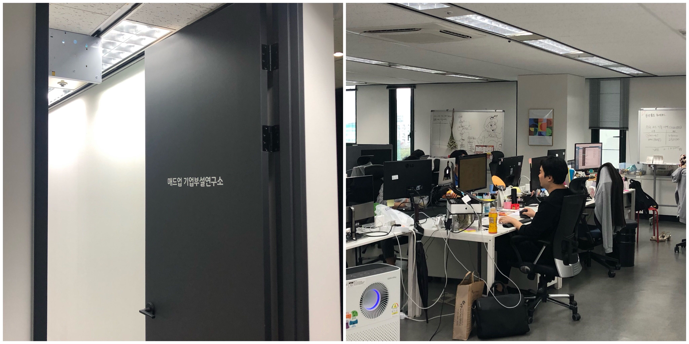
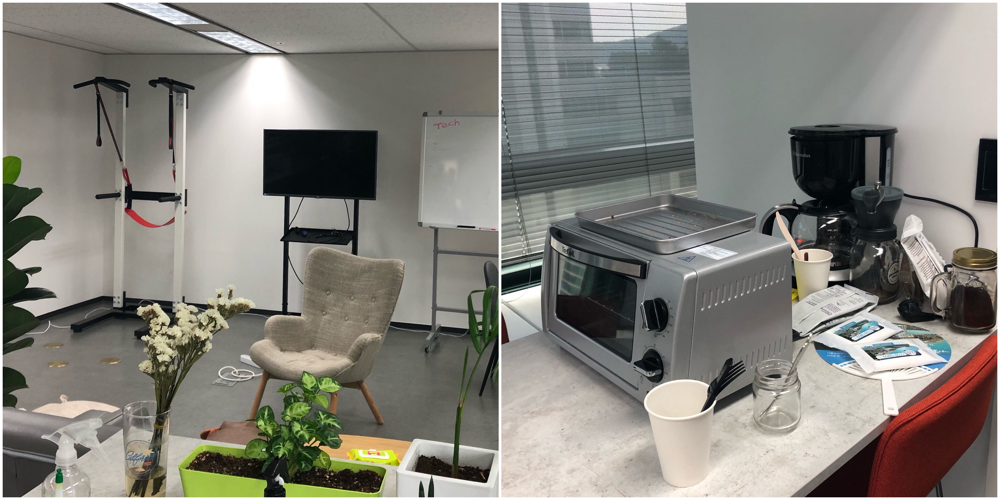
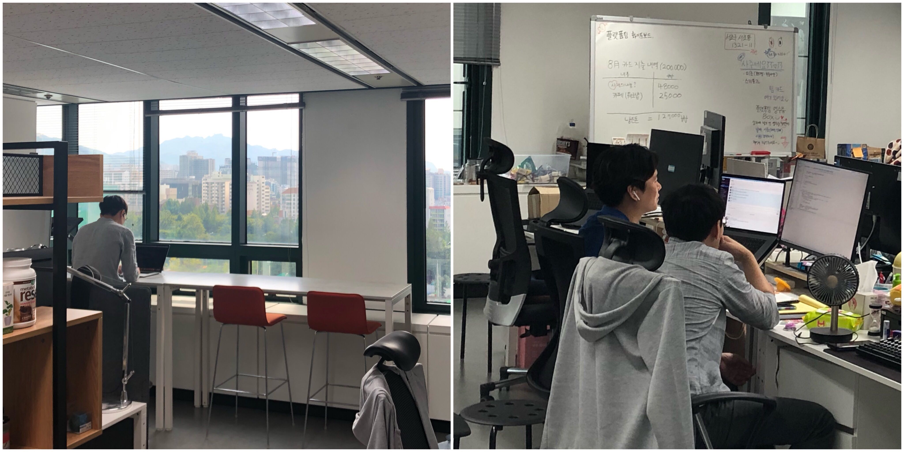
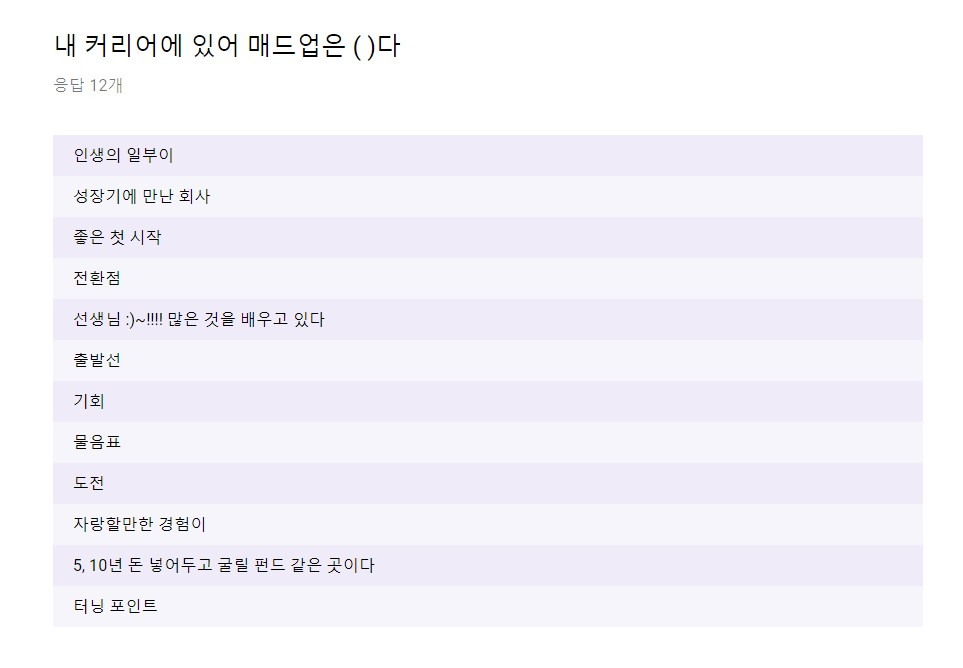
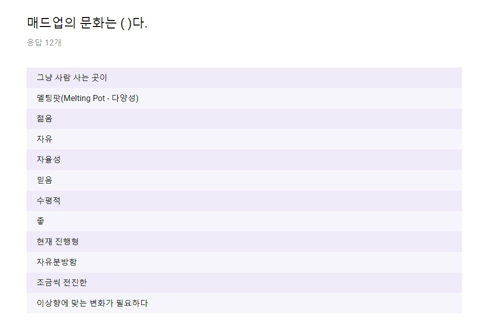

문 바로 앞에는 동호님 자리가 있습니다. 새 팀원이 올 때마다 본인 자리를 내주셔서 점점 문 쪽으로 자리가 밀렸습니다. 동호님 책상 위에 있는 어항모양(?) 블루투스 스피커에서는 노래가 나오고 있습니다.

책상에 칸막이는 따로 없지만 개인의 공간은 구분되어 있습니다. 책상 위를 꾸며 놓은 모습도 가지각색입니다. 들어갈 때마다 두 세명이 함께 컴퓨터를 바라보며 진지한 표정으로 이야기 나누는 장면을 볼 수 있습니다. ‘컴퓨터로 개발하는 곳이니 조용하겠지’라고 생각하실 수 있지만 오히려 피드백을 위한 대화가 많아 활기가 넘칩니다. 

몸을 왼쪽으로 90도 돌리면 테크사업부만의 작은 휴게공간이 보입니다. 소파와 운동기구 옆에는 토스트기가 있는 작은 테이블도 있습니다. 책상 앞에서는 무섭게 몰입하다가도 이곳에서는 세상 편한 자세로 쉬어갑니다. 마당에서 점심식사를 하는 인원의 대부분도 테크사업부 팀원들입니다. 삼삼오오 모여서 직접 싸온 도시락으로 식사를 합니다. 물론 밖에서, 안에서 자신만의 스타일로 밥을 먹는 혼밥족도 많습니다. 

> *막내에게 자리를 양보한 대표가 매일 노래를 틀어주고*,  
> *진지한 피드백과 유쾌한 대화가 끊임없이 오고 가며*,  
> *혼밥족과 비-혼밥족, 도시락형과 외식형이 공존하는*  
> *매드업 테크사업부를 소개합니다.*

  

## 매드업 테크사업부 소개
이제 마케터 개인의 ‘크리에이티브’만으로 광고하는 시대는 끝나고 데이터를 기반으로 광고하는 애드테크의 시대가 찾아왔습니다. 매드업 테크사업부는 마케팅 데이터 분석 능력을 기반으로 자체 플랫폼을 운영, 개발 중이며 디지털 마케팅 시장의 선두를 달리는 자회사 ‘매드잇’의 영업을 기술력으로 든든하게 받치고 있습니다.

매드업 테크사업부는 **매드업 네트워크**라는 NCPI 플랫폼을 운영합니다. (줄여서 ‘매네’라고들 부르고 있죠!) 비보상형 캠페인이 한 곳에 모여 있어 여러 매체의 광고를 한 번에 관리할 수 있는 매네를 통해 마케터들은 광고주들이 원하는 성과를 더욱 쉽게 달성할 수 있습니다. 여기에 매드업의 비밀무기, 새로운 마케팅 플랫폼이 개발에 박차를 가하고 있습니다.

매네와 비밀무기를 뚝딱뚝딱 짓고 더 튼튼히 보완하기 위해 총 다섯 개의 직무의 사람들이 한 오피스에서 함께 일합니다. 프론트엔드 개발자, 백엔드 개발자, 데이터 사이언티스트, 플랫폼 기획자, 그리고 AM(Account Manager)까지. 현재 모집 중인 UI/UX 디자이너까지 합류한다면 총 여섯 직무의 사람들이 협업할 예정입니다.

백엔드 개발자는 방대한 양의 광고 데이터를 수집하고 정리하는 등 플랫폼의 기초를 탄탄히 다지고, 프론트엔드 개발자는 가공한 데이터를 사용자가 쉽게 이용할 수 있도록 대시보드와 웹사이트를 구현합니다. 데이터 사이언티스트는 최적화된 광고 집행 방법을 제안하는 알고리즘을 설계하고, 알고리즘의 효율을 계속해서 평가, 개선합니다. 

플랫폼 운영자는 NCPI 플랫폼 매네를 이용하여 광고주들에게 마케팅 솔루션을 제공합니다. 동시에 플랫폼에 추가되어야 하는 부분을 기획하기도 하고, 더 많은 매체와 협력하기 위해 해외 파트너사들과 소통하기도 하죠.

  

## 매드업 테크사업부의 오늘을 기록하자
우리의 일상을 기록하기로 결심한 것은 두 가지 이유 때문이었습니다.

**먼저 우리의 모습을 촘촘히 기록해보아야 우리가 올바른 방향으로 가고 있는지, 모든 구성원이 같은 곳을 바라보고 있는지 점검할 수 있기 때문입니다.**  

매드업은 정말 빠르게 성장하고 있습니다. 12년에 ‘폰플’이라는 B2C 서비스로 창업한 회사가 15년에 디지털 마케팅 대행사로 업종을 바꾸고, 16년에 매드업 네트워크가 만들어졌습니다. 17년에 20명도 안 되던 전체 인원은 19년 현재 70명을 향해 가고 있고, 그 중 테크사업부 인원만 20명에 가깝습니다.

정신없이 흘러가기보다는 모두가 같은 비전을 공유하고 효과적으로 협업하고 있는지 끊임없이 확인하며 우리의 영역을 확장하고 싶습니다. 그러기 위해서는 지금 각 개발자의 역할은 무엇이고 운영자의 일상은 어떠한지, 우리 팀을 하나로 묶어주고 성장시키는 시스템은 무엇인지 돌아봐야 합니다. 

그리고 또다른 중요한 이유는 **우리와 함께할 smart하고 young하면서 witty한 새 동료를 구하고 있기** 때문입니다.

 

우리의 모습을 낱낱이! 드러내면 우리와 딱 맞는 동료가 찾아오기 편할 것이라 믿습니다. 아름답고 평화로운 생활만을 좋아하는 개발자/운영자 보다는 불편한 점은 적극적으로 해결하고, 새로운 것을 만들기 위해 도전하는 동료와 함께 하고 싶기 때문에 구성원들이 느끼고 있는 장단점을 그대로 공유할 계획입니다.

  

## 구성원이 말하는 매드업 테크사업부
어떤 내용을 공유하는 것이 좋을까 고민한 끝에 구성한 **MADUP TODAY**는 아래와 같습니다.

* 매드업 대표 동호님 인터뷰
* 세 개의 카테고리로 정리한 매드업 생활
* 각 포지션 파헤치기 – 다섯 명의 직무 인터뷰

총 9개의 글을 통해 우리는 어떤 생활을 하고 있는지, 각 구성원의 역할과 개인적으로 느끼는 고충은 무엇인지 등을 공유하려고 합니다. 

본격적으로 MADUP TODAY를 시작하기에 앞서 **구성원들에게 있어 매드업은 무엇이고, 매드업의 ‘문화’란 무엇인지** 들어보았습니다.

 

#### Q. 내 커리어에 있어 매드업은 (&nbsp;&nbsp;&nbsp;)다.

 
매드업은 누군가에게는 좋은 시작점이고, 누군가에게는 성장기에 만난 터닝포인트입니다. 

‘자랑할만한 경험’이고, ‘인생의 일부’라는 자부심 유형들도 보이고 아직 어떤 의미일 지 확신할 수 없다는 ‘물음표’도 보입니다.

 

#### Q) 매드업의 문화는 (&nbsp;&nbsp;&nbsp;)다 

테크사업부의 젊음이 넘치는 분위기가 느껴집니다. 자유롭고 수평적인 분위기를 이어가며 한 발씩 앞으로 나아가고 있는 팀. 

우리의 목표에 맞게 계속해서 변화해 나가자는 목소리가 있었기에 이렇게 빠르게 성장할 수 있었던 것 같습니다. 

이 기획이 진행되는 와중에도 테크사업부에서는 많은 부분이 변할 겁니다. 
팀의 세부 목표가 조금씩 수정될 수도 있고, 각 인원이 담당하는 역할이 달라질 수도 있습니다. 
팀원들은 계속해서 새로운 것들을 만들어내고, 더 창의적인 방법으로 문제를 해결하고 있을 것입니다.

빠르게 진화하는 테크사업부의 하루를 관심있게 지켜봐주세요! :) ;) 

---

[매드업 홈페이지 바로가기](http://madup.com/)  
  
[매드업 지원자를 위한 영상 -1](https://www.youtube.com/watch?v=6eegjYQv9WM&t=87s) /
[매드업 지원자를 위한 영상 -2](https://www.youtube.com/watch?v=4r6D8bP53IE&t=224s)  
  
[애드테크 기업 매드업, 134억 규모 시리즈B 투자 유치](http://www.datanet.co.kr/news/articleView.html?idxno=124884) / 
[모바일 애드테크 신인류 '매드업'](https://www.venturesquare.net/771278)  
