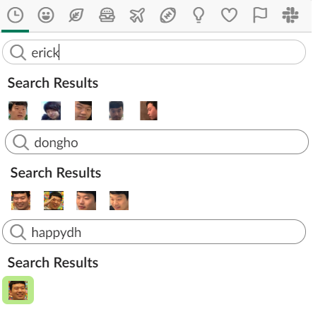
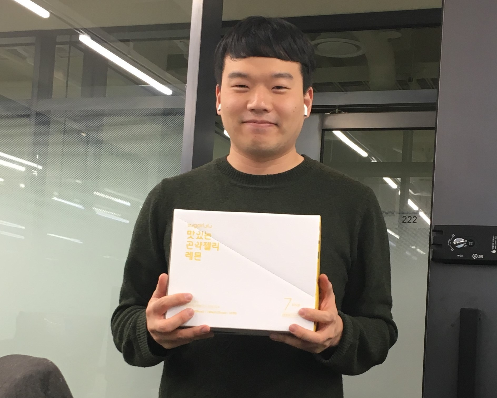
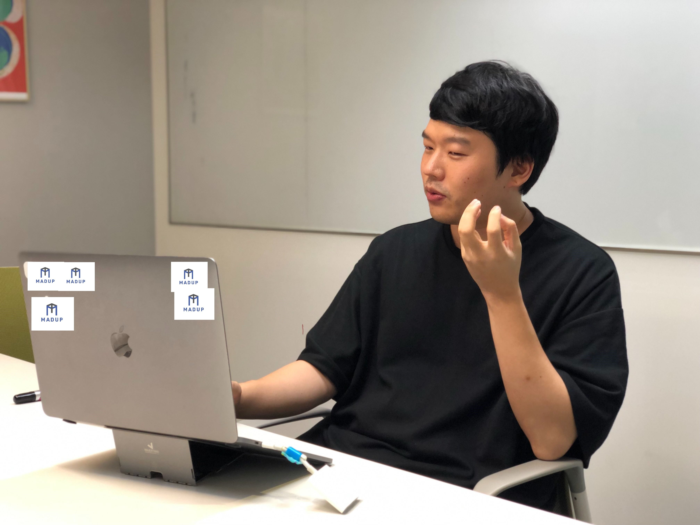
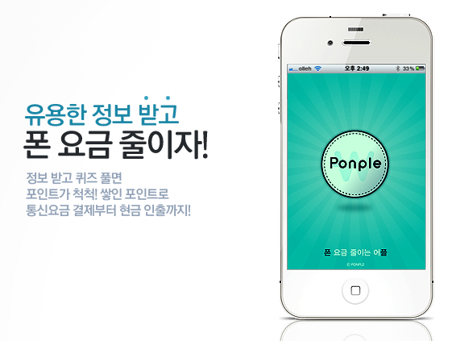
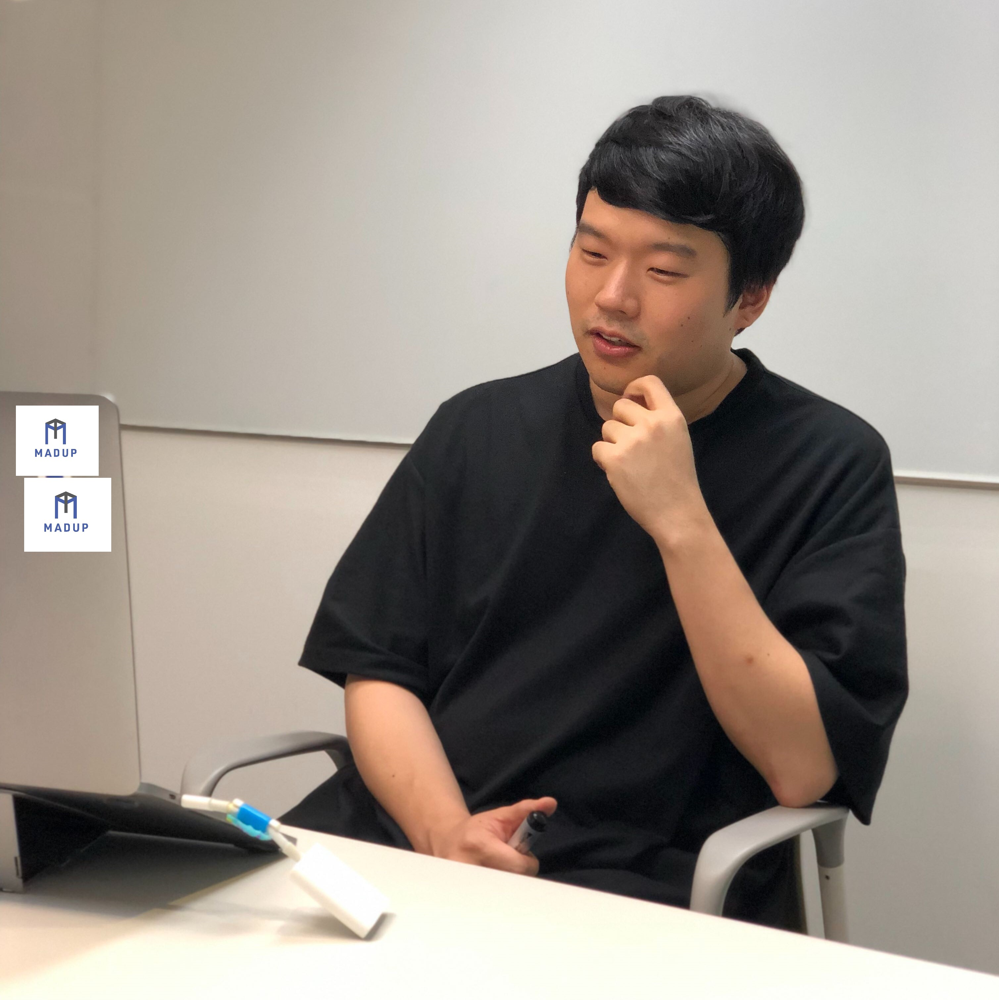
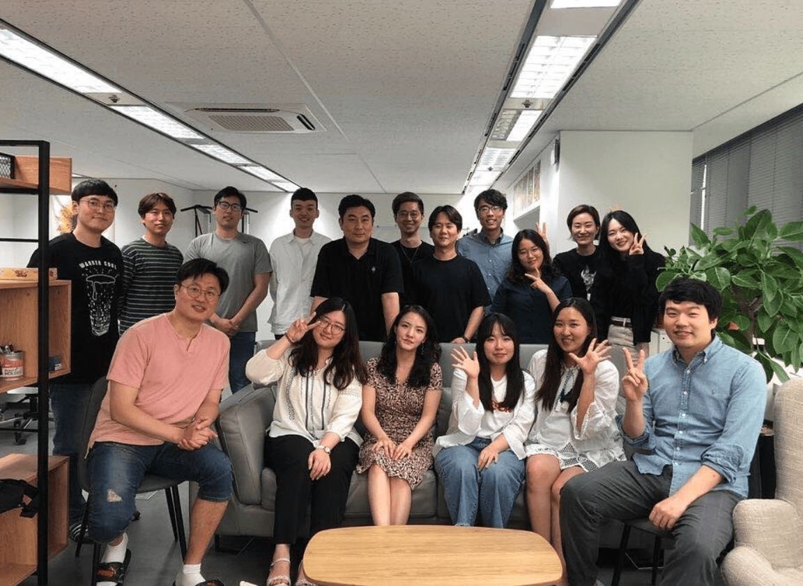

[MADUP TODAY #2] 이동호 대표의 매드업 테크사업부 이야기!

---

제가 가장 자주 사용하는 슬랙 이모지는 **:choongsung_dongho:** 입니다.  

제가 직접 만들어서 전파시키고 있는 이모지로, 커뮤니케이션 팀 전원이 즐겨 사용합니다. 

입사 후 한 달 동안 동호님이 정말 궁금했습니다. 창업을 위해 서울대 중퇴, 회사를 키우기 위해 서른 살이 되어서야 입대, 전공은 심리학이지만 ‘테크사업부’ 리더로 일하는 중. 거기다가 ‘절벽론’을 만들어낸 이론가이자 에어팟, 맥북은 이미 신체의 일부가 되어버린 디지털 시대의 퍼스트 무버! 엄청난 아우라가 뿜어져 나올 것 같은 스토리의 주인공이지만, 동호님은 마주칠 때마다 세상 제일 수줍은 미소로 인사해주시고 빠르게 사라지셨습니다.  

그런 동호님이 어떤 분인지, 절벽론은 대체 무엇인지 궁금해서 가벼운 점심식사를 요청드렸고, 점심식사를 하는 동안 제가 궁금했던 절벽론, 회사의 비전에 대한 이야기를 들을 수 있었습니다. 그리고 그 속에서 저는 시장 흐름을 읽어내는 남다른 인사이트, 아무도 오르지 못한 곳에 가보겠다는 도전 정신, 그리고 테크사업부 동료들에 대한 따뜻한 마음을 발견할 수 있었습니다. 짧은 점심시간 대화 후, 테크사업부를 소개한다면 가장 먼저 동호님의 이야기를 전해야겠다는 생각이 들었습니다. 그래서 동호님의 바쁜 스케줄 사이에 시간을 잡아 인터뷰를 부탁드렸고, 회사의 목표, 요즘 테크사업부의 가장 큰 미션에 대한 이야기 뿐만 아니라 조금 더 개인적인 이야기도 들어볼 수 있었습니다.  
 
동호님은 자신을 표현하는 세 가지 키워드로 직접 **‘꿈, 도전, 쑥스러움(인터뷰라고 하니 쑥스러워서)’** 을 뽑아주셨습니다. 제가 느낀 동호님의 강렬한 성장욕구, 열정, 그리고 따뜻함이 이 인터뷰 글에서 조금이나마 전해지기를 바랍니다!  

  

---

#### 매드업 테크사업부 소개 부탁드립니다!

**성장을 갈망하는 사람들**이 모여 기술과 데이터 기반으로 **마케팅을 혁신**하는 일을 하고 있습니다.
 
   

#### 마케팅 혁신에 대해서 조금 더 구체적으로 들려주세요. 애드테크 시장에서 매드업은 어떤 마케팅 혁신을 꿈꾸고 있나요?

애드테크 시장은 다른 어떤 분야에도 뒤지지 않을 만큼 가장 뛰어난 기술력을 가진 회사들이 플레이 중인 시장입니다. 매출의 80% 이상이 광고 수익인 구글과 페이스북이 대표적인 회사들이죠. 빠르게 시장 규모가 커지고 있어서 2021년에는 전세계적으로 애드테크 시장의 규모가 1000억 달러가 될 것이라는 예측도 있습니다. 5년 사이 300% 증가한 수치입니다. 애드테크 시장이 빠르게 성장하고 있지만 뛰어난 기술 회사들과 경쟁하는 만큼, 시장 안에서의 포지션을 잘 설정하는 것이 중요합니다. 매드업 테크사업부는 애드테크 안에서도 **‘광고 매체 운영의 자동화’** 를 목표로 하고 있습니다. 알고리즘과 AI를 기반으로 진행되는 업무라 광고 매체 운영의 로보어드바이저라고도 표현합니다.  

  

기존의 광고 매체 운영은 보통 광고대행사들이 사람의 손으로 하고 있었어요. '손퓨터'라고도 하죠. 저는 여기에 기술력을 더하면 더 효과적인 마케팅이 가능할 것이라 보고 데이터 분석을 기반으로 광고를 집행하는 회사를 창업했습니다. 퍼포먼스 마케팅 회사가 늘어나고 있고, 그 중에서 저희처럼 데이터 분석에 더욱 집중하는 회사도 많아졌지만, 아직도 분석 결과를 반영하여 사람이 집행하는 정도에 불과하죠. 우리는 데이터를 잘 다루는 것을 뛰어넘어 사람의 손을 거치지 않고도 광고를 집행해주는 광고 매체 운영 알고리즘을 구축하려고 합니다.  

> 매드업의 자회사 ‘매드잇’은 데이터 기반으로 퍼포먼스 마케팅을 수행하는 광고대행사로, 높은 수주율을 유지하며 업계에서의 입지를 탄탄하게 다지고 있습니다. 매드잇은 전 직원에게 데이터 활용의 중요성을 강조하고, 모바일 광고를 중심으로 서비스를 제공해왔습니다.
> 이렇게 창립 초부터 업계의 흐름을 잘 읽은 덕에 만들어진 기간이 그리 오래되지 않았음에도 불구하고 업계에서 핵심 플레이어로 자리매김했다고 자부합니다. 매드업 테크사업부는 이보다도 한 발 더 앞서나가기 위하여 광고 매체 운영 자동화 서비스를 준비하고 있습니다.  

  

#### 그런데 사실 처음부터 애드테크 회사로 시작하신 건 아니었지 않나요? B2C 앱이 첫 창업 아이템이라고 알고 있습니다.

처음 창업했을 때에는 ‘폰플’이라는 앱을 개발했었어요. 스마트폰이 생겨나면서 피처폰을 사용할 때보다 휴대폰 요금이 크게 오르더라고요. 그래서 요금을 줄일 수 있는 방법을 고민하다가, 폰을 사용하지 않고 가만히 두는 시간을 활용해서 수익을 내보자는 아이디어가 떠올랐습니다.  

  

스마트폰으로 아무것도 하지 않고 가만히 두는 시간이 아까웠어요. 스마트폰은 최첨단 기술로 만들었고 기능도 많은 기기인데, 사람들이 사용하지 않고 가만히 두는 시간이 많잖아요. 가만히 두는 시간에 수익을 내고 그만큼 휴대폰 요금이 줄어드는 서비스를 기획했고, 지금 있는 서비스 중에는 ‘캐시 슬라이드’와 비슷해요.  

  

#### 첫 창업은 만족스러우셨나요?

좋은 경험을 많이 했어요. 통신사의 요금 청구서에 딱 찍혀서 나오는 금액을 줄이는 게 목표였는데 제휴가 정말 어려웠어요. 처음에는 가능할 지 확신도 없었고요. 그런데도 통신사 3사 제휴를 전부 해내서 결국은 차감된 금액을 청구서로 받아볼 수 있게 만들었던 게 정말 뿌듯했던 경험입니다. ‘정말 불가능할 것 같아도 가능하도록 만드는 길은 있구나’를 느끼게 해준 일?  

  

#### 왜 애드테크 기반 광고대행사로 피벗팅 하신 건가요?

폰플에 광고를 넣기 위해서 광고주를 많이 만나봤는데요, 많은 회사, 특히 스타트업은 생각보다 광고에 대해 무지했습니다. 이 과정에서 여러 회사에 마케팅 관련 조언을 해줬고, 여기서 마케팅 노하우가 쌓였어요. 또 그 당시 시장을 분석해보니까 **대부분의 광고대행사들이 모바일 환경이나 앱에 대한 이해도가 낮고, 기술적으로도 뛰어나지 않았습니다.** 앞서 말씀드린 것처럼 인력기반으로만 광고를 집행하고 있었어요. 기존 방식에 익숙해져서 굳어 있는 상태라고 해야 할까요? 큰 광고 대행 업계 안에 파고들어갈 수 있는 빈틈이 많아 보였어요.  

  

**앱을 만들면서 개발도 해봤고, 기술에 대한 이해도도 높았어요. 거기다가 스타트업을 많이 만나보면서 어떤 서비스가 살아남을지 알아보는 안목도 키웠기 때문에 이 광고 대행 업계를 우리가 리드할 수 있겠다는 자신이 있었습니다.**

  

#### 시장의 빈틈을 찾아내거나, 어떤 서비스가 필요할 지 예측하신 이야기를 들어보니까 딱 한 발자국 앞에서 시장을 바라보고 계신 것 같아요. 이런 통찰의 비결이 따로 있을까요? 

시장에 대한 관심이 아닐까요? 항상 어떤 분야나 회사가 성공할 지 관심있게 지켜봤고, 성공한 회사들의 성장 패턴을 분석했어요. 저희 광고주 중에 작은 규모일 때부터 함께 하기 시작해서, 전국민이 알 정도로 유명해진 지금까지도 관계를 유지하고 있는 앱 회사가 여럿 있어요. **저는 이러한 기업들이 어떤 데이터적 특성을 가졌는지 분석했어요. 데이터를 근거로 성장 가능성을 예측하는 거죠.** 그리고 성장 가능성이 높아보이는 회사들과 지속적으로 함께 가기 위해 노력했습니다. 그러다보면 어느 방향으로 가야할 지, 다음 스텝에 대한 확신이 생기는 것 같아요.  

> 스마트폰이 등장하자마자 발빠르게 앱 서비스를 개발하고, 대부분의 광고 대행사가 인력 기반으로 웹 광고에 집중하고 있을 때, 데이터 기반의 모바일 광고 중심 회사를 만들었습니다. 그리고 이제는 애드테크 시장에서 더욱 경쟁력을 가지기 위해 광고 매체 운영 자동화 알고리즘을 개발중입니다. 계속해서 새로운 기회를 빠르게 포착할 수 있었던 것은 시장을 면밀히 관찰하고 분석했기 때문이라고 정리할 수 있을 것 같습니다.  

> 아무리 시장 분석에 자신이 있어도, 새로운 사업이나 서비스 개발에 뛰어드는 것은 엄청난 용기가 필요하시지 않았을까 궁금했습니다. 동호님은 이 부분에 대해서 스스로 ‘절벽을 오르는 사람’이라고 설명하시면서 ‘절벽론’을 들려주셨습니다.  

  

#### 동호님의 ‘절벽론’! 더 많은 분들께 전파할 수 있도록 설명 부탁드립니다.

저는 **'가파른 성장'** 을 **'절벽을 오른다'** 고 표현합니다. 사람은 누구나 태어나면 자연스럽게 조금씩 성장을 하죠. 그런데 이 '가파른 성장'은 조금씩 성장하는 것과 다르게, **인생의 한순간에 도전을 결심하고 의식적으로 '절벽'을 오를 때에 가능합니다.**  

이 절벽은 사람에 따라 여러 가지 형태일 수 있습니다. 해외로 이민을 가는 것도, 대학원에 진학하는 것도 그 중 하나일 수 있어요. 또 정말 끝내주게 멋진 제품을 기획하거나, 세계 최고의 자바스크립트 전문가가 되기 위해 노력하거나, 한 팀의 리더가 되어 구성원들에게 비전을 제시하는 것도 하나의 절벽입니다. 저 역시 창업을 결심하였을 때, 하나의 절벽을 오르기 시작했다고 생각하고 있습니다.  

사실 성장, 성취가 인생에서 중요한 가치가 아닌 사람들도 있고, 중요도가 다른 가치에 비해 낮은 사람들도 많습니다. 이러한 삶의 방식도 충분히 의미가 있다고 생각해요. 그러나 어떤 사람들에게는 인생에서 무언가를 이룬다는 것, 성장, 성취를 한다는 게 다른 것에 비할 수 없는 가장 중요한 가치입니다. 저는 이런 사람들이 ‘절벽을 오르고 싶어하는 사람’이라고 생각하고, 그러한 사람들과 함께하고 싶다고 생각합니다.  

  

#### 창업은 언제부터 꿈꾸셨는지 궁금합니다. 어렸을 때부터 창업가가 되고 싶으셨나요?

  

처음에는 막연히 세상에 기여하면서 큰 성취감을 느끼는 삶을 살고 싶었어요. 시간이 지나면서 저는 기술을 기반으로 새로운 가치를 만드는 일을 해야겠다고 구체화할 수 있었습니다. 방대한 양의 데이터를 다룰 수 있는 기술은 인류의 생활을 바꿀 수 있는 것이라고 생각해요. 인공지능을 활용할 수 있는 세상에 살고 있는 것을 엄청난 행운이라 느낄 정도로요. 이런 최신 기술과 데이터를 다루는 일을 하고 싶어 창업을 결심했습니다.  
또 창업은 제가 한 일에 대한 피드백이 바로 나오고, 환경이 아니라 제 능력으로 평가받을 수 있거든요. 이런 부분들도 제 가치관과 잘 맞는다고 생각했습니다.  

  

#### 성장과 성취를 중요하게 여기는 ‘절벽을 오르는 사람들’이 있고, 그들이 오르고 싶어하는 절벽, 즉 도달하고 싶은 목적지는 사람마다 다르다는 말씀이시네요. 조직이 오르는 절벽도 있을 텐데, 그렇다면 다른 사람과 함께 오를 절벽을 선택하는 기준은 무엇일까요?  

저는 4가지 요소가 기준이 된다고 생각합니다.  

첫 번째는 **비전**입니다. 여기서의 비전은 우리가 하고 싶은 구체적인 일을 의미합니다. 비전은 조직의 절벽 자체를 규정합니다. 우리가 어떤 절벽을 오를 것인지 잘 규정되어 있고, 멋진 절벽이어야 많은 사람들이 함께하고 싶어할 것입니다.  

두 번째는 **동료**입니다. 등산을 생각해보면 어떤 산을 오르는 지도 중요하지만, 어떤 사람들과 같이 오르는 지가 중요하잖아요? 혼자서는 오르기 어려운 절벽이어도 동료들과 함께 서로 끈을 묶고 잡아주면서 간다면 원하는 곳에 도착할 수 있습니다. 그리고 좋은 동료들이 있다면 힘든 길도 즐겁게 오를 수 있어요.  

세 번째는 **성장과 성취**입니다. ‘절벽’이라는 것이 가파른 성장 곡선을 나타내잖아요. 이 성장이 회사의 성장이면서 동시에 개인의 성장으로 이어져야 합니다.  

네 번째는 **보상**입니다. 절벽을 오르는 것은 고된 일입니다. 이 절벽을 올랐을 때, 충분한 보상이 있어야 계속 다음 절벽을 오르고 싶은 생각이 들 것입니다.  
 
위의 4가지 요소를 잘 갖추는 것, 그리고 절벽을 오르고 싶어하는 사람들을 찾아내는 것이 제가 가장 중요하게 생각하는 일입니다.  

   

#### 그럼 매드업이 오르고 있는 절벽은 무엇인가요? 잘 오르고 있다고 평가하시나요?

네, 회사 전체를 생각하면 두 개의 서로 다른 비전을 가진 절벽이 있어요. 하나는 **광고대행업계에서 눈에 띄는 플레이어가 되는 것**, 하나는 **우리만의 광고 매체 운영 자동화 프로덕트를 만드는 것.**  

전자는 완벽하게 다 올랐다고는 할 수 없겠지만 매출액도, 구성원 수도 눈에 띄게 늘어나고 있는 만큼 잘 오르고 있다고 평가할 수 있을 것 같네요. 두 번째는 새로운 도전을 시작한 단계여서 아직 정확히 평가하기는 어려운 것 같습니다. 그래도 확실한 건 앞에서 말씀드린 네 가지 요소를 보다 나은 것으로 만들기 위해서 항상 노력하고 있습니다.  

  

#### 그러면 그 두 번째 가파른 성장에 있어 자신감을 가지게 해주는 매드업 만의 강점이 있을까요?

저희 구성원들이라고 생각합니다. **회사 내에서 매일매일 조금씩이라도 더 성장하기 위해 노력하고 계신 분들이 많아요.** 정말 바쁜 업무 중에도 데이터 분석을 공부하고 계신 많은 분들, 멋진 제품을 만들기 위해 새로운 직무에 도전하시는 분들. 이 분들 모두 매일 절벽을 오르고 있는 것이예요.  
 
그리고 성장을 위해서 노력하다 보면 지치는 날이 있기 마련인데, **우리 팀의 따뜻함**이 그런 힘든날을 이겨내게 해주는 것 같아요. 누군가가 노력해서 만든 강점이 아니라 초기 멤버들이 따뜻하신 분들이고, 그 따뜻함이 계속 부서에 전파되고 있어요.  

> 가파른 성장을 추구하는 사람들은 곧 절벽을 오르는 사람들이라 부를 수 있고, 비전, 동료, 성취, 그리고 보상에 따라 사람들은 자신이 오를 절벽을 선택합니다.
> 동호님이 항상 중요하게 생각하시는 것은 우리의 절벽이 매력적일 수 있도록 항상 네 가지 요소를 점검하는 것과 절벽을 오르는 삶을 살고 싶어하는 이들을 찾아내는 것입니다.

---

[매드업 홈페이지 바로가기](http://madup.com/)  
  
[매드업 지원자를 위한 영상 -1](https://www.youtube.com/watch?v=6eegjYQv9WM&t=87s) /
[매드업 지원자를 위한 영상 -2](https://www.youtube.com/watch?v=4r6D8bP53IE&t=224s)  
  
[애드테크 기업 매드업, 134억 규모 시리즈B 투자 유치](http://www.datanet.co.kr/news/articleView.html?idxno=124884) / 
[모바일 애드테크 신인류 '매드업'](https://www.venturesquare.net/771278)  
