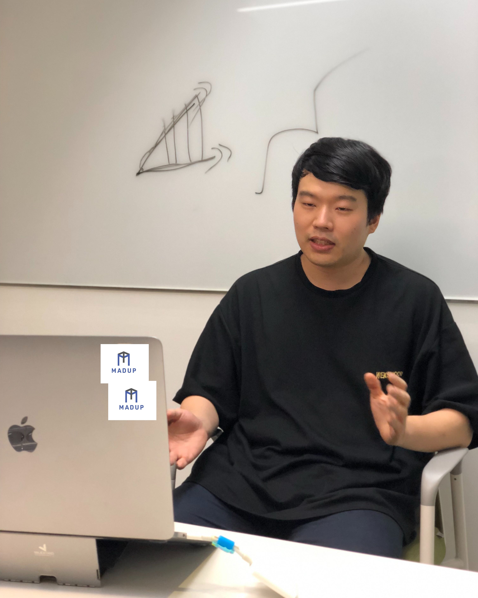
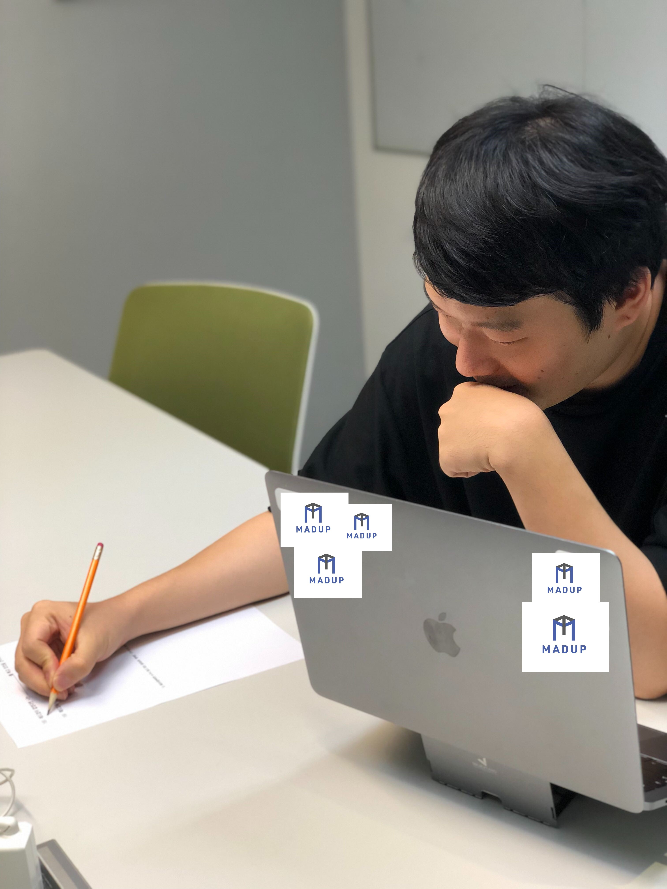
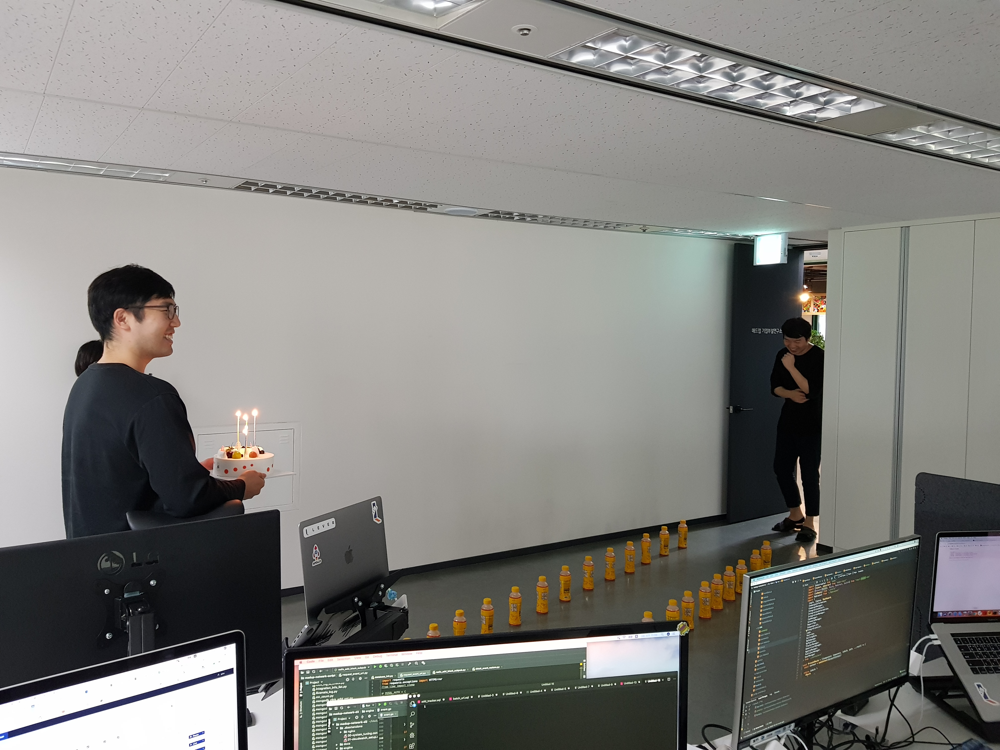

#### 저도 테크사업부 오피스에 들어설 때마다 편안한 분위기가 느껴져서 좋은 것 같아요. 자주 방문하고 싶은 분위기? 그래도 해결하기 어려운 과제도 있을 것 같아요. 테크사업부가 한 걸음 더 올라가는 데에 있어 가장 극복해내고 싶으신 점은 무엇인가요?

지금 당장은 팀 전체와 구성원들의 방향성을 정렬하는 일인 것 같아요.  
 
구체적으로 말씀드리면, 우선 회사 전체의 방향성을 정확히 정의 내리고 잘 설명해야 합니다. 그래야 같은 방향을 바라보는 사람들이 모일 수 있어요. 또 방향성이 명확해야만 필요한 업무를 구체적으로 파악하고 개인에게 역할분담을 할 수 있죠.  
 
그 다음으로 해야 할 일은, 그 방향성에 맞는 일을 하면서 구성원이 만족하고 있는지 파악하는 것입니다. 회사의 성장을 위해 개인이 맡아야 하는 업무를 수행하면서 개별 구성원 또한 본인의 성장을 느낄 수 있어야 해요. 부여된 역할과 개인이 추구하는 방향 간에 차이가 크면 회사는 구성원을 ‘관리’해야 하고, ‘관리’에는 시간과 노력이 많이 들어갈 뿐만 아니라 그 효율도 낮습니다. 그런데 구성원이 생각하는 자신의 성장을 위해 필요한 일과, 회사가 부여하는 회사의 성장을 위해 필요한 일이 일치한다면, ‘관리’가 아닌 구성원 간 시너지로 회사가 운영됩니다. 이럴수록 구성원의 만족도가 높아지겠죠.  

그런데 회사의 방향성은 항상 조금씩 수정될 수밖에 없습니다. 그리고 그럴 때마다 여기에 필요한 구성원들의 역할도 함께 수정되어야만 하고, 동시에 이 수정된 역할을 수행하면서 개인이 성장할 수 있는지도 파악해야 합니다. 이 정렬하는 일을 지속적으로 잘 해내는 것이 가장 큰 과제입니다.

  

#### 리더로서 가장 노력하고 계신 부분도 그것인가요? 리더로서의 동호님을 직접 평가하신다면?

방향성을 정의 내리는 것이 생각보다 어려운 일 같아요. 개인에게 무엇을 기대해야 하는지 끊임없이 조금씩 수정하는 작업도 마찬가지고요.  

그래서 저를 평가하자면.. 아직 많이 부족하고요, 리더로서의 가파른 성장이 많이 필요합니다.  

> 생각보다 솔직하게 대답해주셔서 놀랐습니다. ‘우리는 변하지 않는 최고의 비전이 있다’는 자랑은 많이 들어봤어도, ‘방향성을 정의내리는 것 자체가 사실 어려운 일’이라는 솔직한 이야기는 다른 곳에서 들어보지 못한 것 같습니다. 계속해서 솔직한 답변을 기대하며 동호님께 매드업 생활과 매드업 밖에서의 생활에 대한 질문을 몇 가지 더 드렸습니다.

  

#### 매드업 리더로서, 성장을 갈망하는 개인으로서 성취를 얻어서 뿌듯하고 기쁠 때도 많지만, 마음대로 되지 않는 것들 때문에 힘든 날도 많으셨을 것 같아요.

회사가 지금 플래티넘 타워로 오기 전까지 이사를 13번 다녔어요. 창업 초기에는 카드 돌려쓰기 했던 적도 있고요. 정말 힘들 때는 하루 종일 운동장을 돌면서 도와달라는 전화를 한 적도 있어요. 어플을 만드는 회사로 시작해서 광고대행업으로 전환하던 시기가 제일 힘들었던 것 같네요. 투자 유치에 성공했을 때는 관까지 들어갔다가 뚫고 나온 것 같다는 이야기를 듣기도 했어요.  
 

  

#### 창업 이후로는 회사 생활이 곧 동호님 삶의 전부인 것처럼 생활해 오셨겠네요. 만약에 동호님에서 매드업을 빼면 무엇이 남을까요?

음.. 주말에 영화관 가는 것 밖에 안 하는 한량? 주말에 영화관을 한 번은 가는 것 같아요. 영화도 좋은데 ‘영화관’을 좋아해서(웃음). 아, 수영하는 것도 좋아합니다.

  

#### 그럼 반대로 매드업에서 동호님을 빼면?

군복무를 위해서 2017년부터 2018년 사이에 1년 9개월 동안 자리를 비웠었는데요, 우리 팀원 분들이 다들 잘 해주셔서 큰 차이가 없는 것 같더라고요! (웃음) 회사에 도움이 되는 플러스형 인재가 되기 위해 노력해야겠네요.  

  

#### 이렇게 말씀하실 정도면 동료들에게 큰 믿음을 가지고 계신 것 같아요. 동호님은 어떤 동료와 함께 하고 싶으신가요? 앞에서 나왔던 이야기에 따르면 성장을 사랑하는 사람인 것 같아요!

네, 절벽을 오르기로 결심한 분들과 함께하고 싶습니다.  
과거에 그런 경험이 있었다면 더 좋겠죠?  

  

#### 과거에 그런 경험이 부족할 수도 있을텐데, 그러면 성장 가능성은 어떻게 파악하시나요?

저는 면접에서 면접자 분들께 질문을 많이 드리기도 하지만, 우리 회사에 대해서도 많이 이야기를 해드려요. 우리가 도달하고자 하는 목표에 대한 이야기를 구체적으로 해드리면서 대화를 나누죠. 싫어하시는 분도 분명 계셨어요. 힘들게 굳이 ‘절벽’을 올라야 하는지 의문을 가지시는 분들도 있고. 정확한 지표가 있는 건 아니어도 대화를 나누어보면 알 수 있는 것 같습니다.  

  

#### 이렇게 성장 욕구가 강한 분들을 한 곳에 모아 일을 하다 보면, 서로 충돌하는 부분도 종종 있을 것 같아요. 

갈등은 사실 어느 곳에나 있겠죠? 그런데 해결은 정말 쉽지 않아요.  
저희는 갈등이 생기면 논의를 많이 했습니다. 지금은 다른 해결 방법도 찾고 있어요.  

  

#### 논의가 많으면 비효율적으로 시간을 쓰게 되지는 않았나요? 다른 방법으로는 어떤 것을 시도하고 계신가요?

갈등에 대한 오랜 시간의 논의는 모두를 지치게 했던 것 같아요. 그래서 요즘 들어 생각하는 것은 논의를 오래 지속하기 보다는, 문제를 잘 정의 내리고 이를 잘 기록해 놓는 것이 중요하다는 생각을 합니다. 문제 상황이 무엇인지에 대해서 잘 정의 내리고, 이를 적어놓고 해결해야 하는 문제 목록에 넣어두면, 결국 이 문제를 해결하기 위한 방법을 찾는 생산적인 과정들이 이루어지고, 결국은 해결되는 경우가 많습니다. 반대로 잘 정의되지 않고, 기록되지 않은 문제는 해결은 잊혀진 채로 지속적으로 문제와 갈등을 유발합니다. 잘 정의된 문제는 해결 가능하지만, 정의되지 않은 문제는 지속적으로 모두를 괴롭힌다고 볼 수 있습니다.

또한 갈등보다는 문제에 대한 주제로 이야기하자면, 여러 회사들의 많은 구성원들이 문제를 인식하고도 이를 해결하지 않고 지나가는 경우들이 많습니다. 업무를 하다 미래에 문제가 발생할 것으로 예상되는 일을 보더라도 그냥 지나가는 것이지요. 보통은 자신에게 책임과 권한이 없다고 생각하거나, 또는 이를 해결하기 위한 커뮤니케이션 과정들이 너무 힘들 것이라고 생각하기 때문입니다. 사실 이러한 부분들을 최소화 시키는 것이 매우 중요합니다. 여기서 새로운 기회가 생겨나기 때문입니다.

  

#### 문제가 발생하면 누군가가 그 문제를 해결해야 한다는 책임감을 느끼게 하는 것이 중요하겠네요.

그렇죠. 여기서도 정렬의 중요성이 나오는데, 공통의 목표에 맞게 개인의 업무를 잘 정렬하면, 각자 어떤 일을 하는 지 명확하기 때문에 책임자를 정하는 것도 쉽습니다. 별다른 말없이도 자신이 문제를 해결해야 한다는 것을 알게 할 수 있고요.  

> 힘든 시기를 거쳐 회사를 성장시킬 수 있었던 건 회사에서 생겨나는 문제를 묻어두지 않고, 조금씩이라도 해결하기 위해 노력하셨기 때문이 아닐까요?
> 매드업을 만들지 않았다면 무슨 일을 하고 계셨을 지 질문하자, 동호님은 한참을 고민하시다가 ‘정말 생각이 안 난다’고 하셨습니다. 인터뷰 내내 이 곳을 더 좋은 일터로, 매드업의 절벽을 더 멋진 것으로 발전시키기 위한 동호님의 노력이 느껴졌습니다. 긴 인터뷰를 마무리하며, 동료들에게 한 마디를 부탁드렸습니다.

  

#### 마지막으로 테크사업부 팀원들과 미래의 팀원들에게 한 마디 부탁드립니다!
 
따뜻하고 멋진 분들과 함께 할 수 있어서 진심으로 고맙습니다.  
 
그리고 우리는 앞으로도 우리의 절벽을 계속해서 오를 겁니다! 절벽을 오르고 싶은 당신, 함께해요!  

---

사람이 하는 광고 대행을 넘어서 ‘광고 대행의 자동화’를 향한 가파른 성장을 하고 있는 매드업. 매드업이 오르는 이 절벽을 더욱 매력적으로 만들기 위해 동호님은 오늘도 우리의 방향성을 점검하고, 구성원의 성장을 함께 고민하며, 그저 묻어두기만 한 문제는 없는지 질문하고 계십니다.  

혹시 ‘절벽을 오르는 사람’이라면, 또 동호님과 우리의 절벽을 함께 오르고 싶다면, 언제든 매드업의 문을 두드려주세요!  

---

[매드업 홈페이지 바로가기](http://madup.com/)  
  
[매드업 지원자를 위한 영상 -1](https://www.youtube.com/watch?v=6eegjYQv9WM&t=87s) /
[매드업 지원자를 위한 영상 -2](https://www.youtube.com/watch?v=4r6D8bP53IE&t=224s)  
  
[애드테크 기업 매드업, 134억 규모 시리즈B 투자 유치](http://www.datanet.co.kr/news/articleView.html?idxno=124884) / 
[모바일 애드테크 신인류 '매드업'](https://www.venturesquare.net/771278)  
