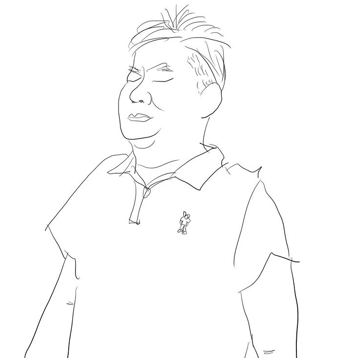

*MADUP TODAY 4 - Ethan, Cindy*

이번 콘텐츠로 프론트엔드 개발자 인터뷰를 진행하기로 했습니다. 바로 떠오른 이름은 바로 미림님, 현승님. 테크사업부에서는 신디와 이든이라고 부릅니다. 테크사업부는 다른 부서와 다르게 서로를 영어 이름으로 부릅니다. 제가 부르던 방식인 ‘님’ 호칭이 아닌 영어 이름으로 언급하다보니 (물론 방식에 따른 장단점이 있겠지만) 높임말을 사용하는 데에 드는 수고로움이 없어 소통이 더 편해진 것 같습니다.    

두 사람이 함께 마당에 앉아서 컴퓨터를 앞에 두고 이야기 나누는 모습을 종종 봤었는데요. 그 때마다 차분하고 진지한 눈빛에서 두 사람의 강한 성장욕구가 느껴졌습니다.  인터뷰에서도 역시 신디에게서는 더 많이 배우고 싶다는 열망이, 이든에게서는 배움에 대한 욕심뿐만 아니라 본인이 알고 있는 것을 동료들에게 나누고 싶다는 마음이 진하게 뿜어져 나왔습니다.   

인터뷰를 하면서 ‘영상을 찍을 수 있었다면 좋았을텐데’ 하는 아쉬움이 남았습니다. 시작부터 어색하니 노래를 틀자며 직접 BGM을 틀기도 하고, 서로의 말에 맞장구와 부연설명을 해주며 인터뷰 내내 활기가 넘쳤기 때문입니다. 그 분위기를 보여드릴 수 없어 아쉬울 뿐.  

---

 
<h4 style="text-align: right">
자기소개 부탁드립니다!
</h4>

**이든**  
매드업 테크사업부 플랫폼개발팀의 프론트엔드 개발자 박현승, 이든(Ethan)입니다. 개발은 그 전부터 공부했지만 11년도 12월부터 프론트 개발자로 ‘일’을 하기 시작했습니다.  

**신디**  
저도 이든과 같은 팀의 프론트엔드 개발자 유미림, 신디(Cindy)입니다. 그 전까지는 개발에 대해 아예 모르다가 대덕마이스터고등학교에 다니면서 개발공부를 시작했어요. 2017년 8월에 고3 현장실습생으로 매드업에 처음 들어와서 지금까지 함께하고 있습니다.

 
<h4 style="text-align: right">
매드업 프론트엔드 개발자가 하는 일을 자세하게 설명해주세요!
</h4>

**신디**  
저는 테크사업부의 새로운 프로덕트 웹 페이지를 개발하고 있어요. 기획자와 디자이너가 기획안을 전달해주면 그대로 구현하고, 백엔드 개발자가 만든 API를 연동해서 프로덕트의 페이지를 만들고 있습니다.  

**이든**    
저는 웹페이지에도 관여하면서 프로덕트를 만드는 데에 사용하는 레미콘이라는 디자인시스템을 만들고 있어요. 요즘은 새로 오신 디자이너 끌로에에게 디자인시스템에 대해 설명하고 이해를 돕는 게 주요한 업무입니다.

 
<h4 style="text-align: right">
디자인시스템은 정확히 어떤 건가요?
</h4>

**이든**    
프로덕트를 만들 때 필요한, 디자인된 재료 모음을 만드는 거죠. 그 이전까지는 다른 회사가 개발한 디자인시스템을 빌려와서 페이지를 만들었다면, 이번에 만들고 있는 새로운 프로덕트에는 저희가 직접 만든 디자인시스템을 활용할 예정이에요.  
디자인시스템의 핵심은 재사용가능성이예요. 디자인시스템에 있는 것으로 프로덕트1을 만들었다면 프로덕트2, 3도 만들 수 있어요. 재사용 가능성을 고려해야 하기 때문에 일반적인 웹페이지 디자인과는 달라요. 그래서 요즘엔 디자이너 끌로에가 디자인 시스템에 대해 정확히 이해한 것이 맞는지, 같은 생각을 가지고 있는지 확인하기 위해서 많은 대화를 나누고 있습니다.  
 
**신디**  
페이지에 버튼도 있고 셀렉트 박스도 있잖아요. 그게 다 디자인이 되어 있으면 한 번 사용을 하고 나서 다른 곳에서도 사용할 수 있죠. 그 항목 하나하나 디자인이 되면 이든이 그걸 구현하는 거예요.  그러면 저는 만들어진 것들을 조합해서 웹페이지를 만들어요.  

<b>승현</b>  
조금은 이해가 된 것 같아요..! 있는 것 그대로 사용하지 않고 완전히 새로운 디자인 시스템이 나온다고 생각하니까 설레네요.  
이전에 없던 것을 만들고 계시기 때문에 하루 일과도 매일 다를 것 같아요.

  

 
<h4 style="text-align: right">
하루일과는 어떤가요?
</h4>

**이든**    
우선 출퇴근 시간은 둘 중 하나예요. 테크사업부는 자율출근제로 오전 8시에서 11시 사이에 자유롭게 출근할 수 있잖아요. 그래서 저는 8시에 이른 출근을 해서 5시에 일찍 퇴근하거나, 11시에 늦게 출근해서 8시에 늦게 퇴근해요.  
아, 그런데 일찍 퇴근할 수 있는 날도 보통은 조금 더 일을 하고 가는 게 좋더라구요. 팀원들이랑 같이 밥도 먹고. 하루 일과가 정확히 정해져있지는 않아요. 또 특정 기간 동안 하는 일에 따라 일과가 달라지기도 하고요.  

**신디**  
저도 일과가 정해진 건 아니지만 목표를 이루기 위한 업무 사이클을 반복하고 있어요. 기획서를 토대로 사용자에게 보이는 페이지를 만들고, 팀이 만든 API를 연동한 후, 계획대로 만들어졌는지 테스트 해보는 것을 하나의 사이클로 작업하고 있어요.

---

 
<h4 style="text-align: right">
매드업을 선택한 이유는 무엇인가요?
</h4>

<b>승현</b>  
이제 조금 더 매드업 이야기를 해볼게요. 두 분이 매드업에 오신 이유는 무엇인가요?  
요즘 모든 회사가 개발자를 애타게 찾고 있잖아요. 다른 회사도 선택지에 있으셨을 것 같아요.  

  

**이든**    
우선 제가 ‘회사’를 다녀야겠다고 생각한 이유부터 말씀을 드릴게요.  

<b>승현</b>  
맞아요, 오랫동안 프리랜서로 일하셨다고 들었어요.  

  
 
**이든**    
네, 저는 1인 기업을 차려서 수주 받는 일을 해왔어요. 그런데 혼자 공부를 하다 보니까 저처럼 개발에 열정 있는 사람들이랑 같이 일하고 싶더라고요. 매드업에 대해서 알아보니까 같이 공부할 수 있는 욕심 많은 개발자들도 있고, 복지도 훌륭하다는 생각이 들었어요. 그래서 지원을 했고, 팀매니저 제이슨, 제이든이랑 면접을 봤었죠.  

<b>승현</b>  
면접은 어떠셨나요?  

  

**이든**    
저는 면접에서 질문을 많이 했어요. 같이 일할 개발자가 몇 명 있는지, 분위기는 유연하고 자유로운지에 대해서 특히 궁금했어요. 저는 자율적으로 일할 수 있는 곳에서 일해야 효율성이 오르고 일을 즐겁게 할 수 있거든요.  
여기에 대해서 그 당시에도 있었던 신디, 윌리, 제이슨이 어떤 일을 하고 있는지 이야기 해주셨고, 무엇보다 분위기에 대해서 해주신 이야기가 아직도 기억나요. 제가 유연한 분위기냐고 여쭤봤을 때 제이슨이 매드업은 ‘형체가 없을 정도로 유연하다’라고 했었는데, 그 말이 정말 매력적이었어요. 지금은 규모가 커지면서 체계를 많이 갖춘 상태지만, 실제로 처음 들어왔을 때는 형체가 정말 없더라고요! (웃음)   

 
<h4 style="text-align: right">
만족하셨나요?
</h4>

<b>승현</b>  
그러면 근무를 시작하신 이후에 동료, 복지, 그리고 분위기에 만족하셨나요?  
동료는 팀 분위기에서 이야기를 해주실 테니 복지와 회사의 분위기에 대해서 솔직하게 평가를 해주신다면?   

  

**이든**    
누군가는 체계가 꽉 잡혀있는 회사를 좋아할 수도 있겠지만 저는 성향상 초반의 ‘형체 없는 유연함’에 정말 만족했어요. 최근에는 점점 체계가 잡혀가고 있는데, 그 과정에서도 자율성을 존중하면서 체계를 쌓아가거든요. 그래서 지금의 분위기도 좋아요.  
들어오기 전에는 매드업 복지가 최고일 거라고 착각했었는데(웃음), 들어오고 나서는 사실 우리 회사보다 더 다양한 복지 정책을 갖춘 곳도 있다는 걸 알게 되긴 했어요.(웃음) 그런데 우리 회사는 이름뿐인 제도가 아니라 하기로 한 건 그대로 다 시행을 하고 있어서, 복지제도만 놓고 봐도 상위권에 들어가는 회사라고 생각합니다.  
 
 
<h4 style="text-align: right">
신디는 이곳에서 처음 직장생활을 시작했잖아요. 
어떻게 매드업에 오게 됐나요?  
</h4>

**신디**  
저는 마이스터고에서 공부를 해서 고등학교 3학년 때 여러 회사에 지원을 했었어요. 그런데 매드업이 가장 먼저 합격 발표가 났고, 다른 곳은 더 면접을 보지 않았어요.  

<b>승현</b>  
다른 곳에 면접을 볼 만도 했을 텐데요?  

  

**신디**  
면접을 보러 왔을 때 너무 긴장되지도, 풀리지도 않은 분위기가 좋았어요. 일을 하는 방식은 자유롭지만, 일을 대하는 태도나 자세는 진지한 분위기? 그리고 면접관 분들과 이야기를 나누면서 제가 열심히만 한다면 직접 해볼 수 있는 게 많을 것 같다고 느꼈어요. 들어와서 2년동안 일해보니까 실제로도 그렇고요. 스스로 고민하고 노력하는 시간만큼 해볼 수 있는 게 많아지고, 꾸준히 성장할 수 있어서 계속 즐겁게 다니고 있습니다.

 
<h4 style="text-align: right">
매드업은 어떤 곳이라고 생각하시나요?
</h4>

**신디**  
분위기가 자유로운 곳? 자유로운 만큼 스스로 정해야 하는 것도 많아요. 직접 정해가는 길이 힘들 수도 있어요. 그래도 직접 정한 목표를 향해 가는 거라서 즐거워요. 스타트업의 매력이죠!  

**이든**    
맞아요. 굉장히 평등해서 강제하는 분위기가 없어요. 테크사업부에서는 19세부터 40세가 함께, 아주 평등하게 일해요. 그리고 얼마나 오래 있었는지도 큰 상관이 없어요. 입사한 지 3-4개월 된 사람과 팀장이 서로 편안하게 개선할 점을 이야기해요.  

**신디**  
맞아요. 알고 보니까 제이슨은 저희 어머니랑 동갑이실 정도로 나이차이가 많이 나요. (웃음) 그런데도 정말 편하게 대화할 수 있어요.  

**이든**     
저는 ‘우리 회사 좋은 회사’라는 말을 자주 해요. 면접관으로 들어가면 면접자 분들께서 회사가 어떤지 종종 물어보시거든요. 그 때마다 ‘좋은 회사’라고 말하고 평소에도 그 말을 자주 해요.  

<b>승현</b>  
왜 ‘좋은 회사’라고 생각하세요?

  

**신디**  
'이든이 있어서!'라고 대답하실거죠???  

**이든**    
맞아요.(웃음) 음.. 안 좋을 이유가 없어요. 복지도, 분위기도, 대표도, 팀장도, 팀원도 다 좋아요. 싫어할 이유를 찾기가 어려워요. 그리고 저는 싫은 회사라면 안 다닐 성격인데(웃음), 즐겁게 다니고 있어요.  

 
<h4 style="text-align: right">
팀 분위기는 어떤가요?
</h4>

**신디**  
제가 좋아하는 저희 팀 특징은 두 가지인데요.  
먼저 질문 및 건의사항을 제이슨이 회의 때마다 꼭 물어봐주세요. 회의가 아니어도 언제든 건의사항 있으면 편하게 말할 수 있기는 하지만, 저는 주로 회의 때 평소에 생각했던 것들을 정리해서 말하는 것 같아요.  
그리고 두 번째는 팀비로 꼭 회식만 하는 게 아니라 다양한 경험을 해볼 수 있어요. 노량진에 회 먹으러 가기도 하고, 최근에는 롯데월드도 갔다 왔어요.  

**이든**    
어벤져스 1편에 로키랑 토니가 얘기하는데 토니가 자기 동료들을 쭉 이야기하더니 마지막에 딱 ‘We have a Hulk.’라고 하거든요. 저는 그걸 따와서 이렇게 한 마디 할게요. ‘We have Cindy.’  

<b>승현</b>  
신디가 팀에 미치는 영향이 큰가 보네요!  

  

**이든**    
신디는 추진력이 좋아서 팀 다같이 뭔가 해야 할 때 해결을 척척 해줘요. 신디뿐만 아니라 저희 팀 동료들 한 명 한 명 다 배울 점도 많고 각자의 장점이 있어요. 그런데 저희 팀 최대 장점은 팀장님이 훌륭하시다는 점.  

**신디**  
(끄덕끄덕) (격한 공감)  

**이든**    
제가 회사에 적응하던 시기에 우리 회사에 계속 다녀야겠다고 결심한 건 저희 팀매니저 제이슨 때문이에요.

  

  

<b>승현</b>  
오.. 직접 들려드리고 싶을 만큼 극찬이네요.  

   

**이든**    
팀을 리딩할만한 개발 실력은 기본이고, 연장자지만 권위적이지 않으세요. 꼭 반영하기 어렵더라도 팀원들 건의사항을 정말 주의 깊게 들어주시고, 21살인 신디랑 잘 싸우기도 하시고. (웃음) 평등한 위치에서 이야기할 수 있는 분이라 좋아요.  

 

*테크사업부가 준비중인 새로운 프로덕트와 디자인시스템, 그리고 팀에 대한 애정이 넘치는 대답이 이어졌습니다. 누군가 일하는 방식과 시간을 강요하기보다는 자율성을 존중하고 누구나 편안하게 자신의 목소리를 낼 수 있는 곳이기 때문에 두 사람은 즐겁게 생활할 수 있다고 이야기했습니다.*  
*그래서 더더욱 팀 전체와 자신의 목표를 향해 더 열정적으로 달려갈 수 있는 게 아닐까요?*

---

 
<h4 style="text-align: right">
프론트 개발자에게 가장 필요한 역량은 무엇인가요?
</h4>

**신디**  
저는 커뮤니케이션 능력이라고 생각해요. 에릭(이동호 대표)이 ‘다같이 힘을 합쳐서’ 새로운 프로덕트를 만드는 것을 추구하는데, 저도 거기에 동의해요. 그렇게 팀 전체가 협력해서 새로운 프로덕트를 만들려면 각자의 전문성을 존중하면서 궁금한 것과 원하는 것을 효과적으로 전달할 줄 알아야 해요.  

**이든**    
저는 HTML, CSS, Javascript의 베이직을 아는 것이라고 대답할게요. 기본을 모르고 코딩하는 사람들이 많아요. 그리고 제가 세 개를 콕 집어서 말한 건, 셋 중 하나라도 모르면 안 되기 때문이에요. 엄밀하게 말하면 프론트 개발자는 기본으로 세 가지를 다 잘 다룰 줄 알아야 해요. 프론트 개발 관련 수준이 높은 책은 다 이 세 가지를 어느 정도 할 줄 아는 사람이 읽게끔 쓰여있기도 하고, 이 세 가지를 다 할 줄 알면 그 이후에 접근성, SEO, UI/UX, React 등을 배우기에도 좋아요.  
HTML이나 CSS를 안 하시는 분들을 종종 봤는데, 그건 이미 만들어져 있는 프레임워크를 가져다가 쓰기 때문이예요. 이미 있는 틀을 가져다가 쓰는 것이 아니라 직접 그 틀을 만들기 위해서는 세 가지 모두 알아야 하죠. 그리고 해외시장까지 바라보고, 세계적인 기준을 생각한다면 한 가지도 빼놓지 않고 다 할 줄 아는 게 중요하다고 생각합니다.

 
<h4 style="text-align: right">
업무할 때 가장 자신있는 점과 가장 발전시키고 싶은 점은 
각각 무엇인가요? 두 분 다 앞서 말씀해주신 역량에 자신 있으신가요?
</h4>

**신디**  
그건 아닌 것 같아요. 어렵네요.. 제가 가장 자신있는 건.. 해야 할 일에 집중해서 빠르게 해결하는 거?  

**이든**     
신디는 손이 정말 빨라요  

**신디**  
전달받은 것을 반영할 때 집중만 하면 해야 할 일을 빠르게 할 수 있어요. 조금 더 발전시키고 싶은 건 제가 한 일을 정리해서 다른 사람이 이해할 수 있도록 설명하는 거예요. 제가 혼자서는 잘 해놓고 다른 사람한테 설명을 못해서 아쉬울 때가 많아요.  

<b>승현</b>  
신디는 역시 커뮤니케이션을 중요하게 생각하네요. 이든은요?  

  

**이든**    
저는 자신있는 점과 발전시키고 싶은 점 모두 HTML, CSS, Javascript라고 대답할게요. 이유는 위에서 말씀드린 것과 같아요.  

**신디**  
뭐야! 저도 저렇게 할래요! (웃음)

 
<h4 style="text-align: right">
개발자로서 성장하기 위해 어떤 노력을 하고 계신가요?
</h4>

**신디**  
업무와는 별개로 코딩 공부를 계속 해야 한다고 느껴서 하고는 있는데요, 제가 목표한 것에는 못 미치고 있는 것 같아요. 시간을 더 내고는 싶은데 일을 하면서 추가로 공부하기가 생각만큼 쉽지는 않네요. 그래도 일에서 많이 배우는 것 같아요. 이든은 이미 잘한다고 할거죠?  

**이든**    
(웃음) 그건 아니고. 저는 ‘월드 스탠다드’에 맞는 프론트 개발자가 되기 위해 해외에서 각광받는 것들을 꾸준히 살펴봐요. 전세계적으로 유행하는 것이 2-3년 후에야 한국에서 유행하더라고요. 한국에서 ‘어, 이게 중요한가보다!’하고 시작하면 늦는다는 걸 깨달았어요.  

(신디: 이든은 좀 사대주의 성향이네요!)  

사대주의..가 아니라 (웃음) 예를 들면 Java로 개발한 것을 주요 성과로 올리시는 분을 봤었는데, 10년 전에 많이 하던 코딩을 아직도 하시더라고요. 저는 새로운 것을 계속 추구하는 편이라서 해외 트렌드를 꾸준히 살피고 직접 실험해보고 있습니다.  

<b>승현</b>  
공부하신 내용 소개를 더 자세히 부탁드려도 될까요? 제가 이해할 수 있을까요?  

  

**이든**    
설명을 해드릴 수는 있는데 이해하시도록 설명하는 게 어렵겠네요. 아, 제가 혼자 공부한 내용을 모아두는 블로그를 운영하고 있는데 최근에는 혼자만 보지 말고 공개할 만한 테크 블로그를 준비하고 있어요. 블로그 오픈을 하면 공유하도록 하겠습니다.  
최근 관심있는 건 디자인 시스템이예요. 제가 이해한 바를 동료들에게도 알려주고, 더 나은 디자인시스템 만드는 법을 다같이 고민하고 있습니다. 

---

 
<h4 style="text-align: right">
입사 후 가장 기억에 남는 순간이 있다면 언제인가요?
</h4>

**신디**  
저는 플랫폼 팀원들이 사용할 리포트 정산 자동화 플랫폼을 처음 만들었을 때요. 그게 제가 입사하고 처음 만들어 낸 거라서 만든 기념으로 작은 파티했을 때가 기억에 남아요.  

**이든**    
저는 3개월 지나고 정직원 됐을 때요. 처음 회사라는 공동체에 들어온 거라서 수습기간 동안 좀 불안했던 것 같아요. 고용불안, 주거불안을 해결한 정직원 전환! (웃음)  

 
<h4 style="text-align: right">
그럼 두 분의 목표/꿈은 무엇인가요?
</h4>

**신디**  
저희 테크사업부가 요즘 새로운 프로덕트를 준비하고 있잖아요, 그 새로운 사업이 시작될 때부터 함께 해 온 멤버로서 그 프로덕트를 런칭하고 시장에서 1등을 하는 게 제 목표예요. 우리가 하나씩 하나씩 만들어낸 프로덕트가 성공하는 것!  

**이든**    
그래요? 저는 더 개인적인 목표 말하려고 했는데..(웃음)  

저는 ‘월드 클래스’ 프론트 엔드 개발자가 되기로 에릭(이동호 대표)과 약속했어요. ‘매드업을 나가려면 월드클래스가 되어서 나가야 한다!’ 약속을 했기 때문에 못 지키고 나갈 일은 없을 거예요. 저는 매드업에 있는 동안 그 정도로 성장하고 싶어요.  

<b>승현</b>   
두 분은 프론트 개발자로 일하시는 게 정말 즐거운 것 같아요.  

 

**이든**    
눈에 보이는 모든 것에 관여해서 재밌어요. 열심히 공부를 했는데도 프런트엔드 개발은 여전히 어렵네요. 어려우니까 더 재미있어요.   

**신디**  
저도 제가 쓴 게 그대로 눈에 보이는 게 신기해서 시작했고, 계속 하면서도 그 점 때문에 재미있어요. 그리고 팀원들이랑 일하고 공부하면서, 특히 이든한테 혼나면서 원리를 더 탄탄하게 쌓고 있어요. 원리를 알아가면서 ‘이게 이 뜻이었다니!’ 하는 순간들이 있는데, 그런 순간이 늘어날 때마다 더 애정이 생겨요. 알면 알수록 더 알고 싶은 것도 늘어나고요.

---
 

*테크사업부의 새로운 프로덕트를 시장 1위로 만들고 싶은, 2년차 개발자이지만 아직 21살인 신디, 
그리고 동료와 함께 개발공부를 하기 위해 매드업에 들어와 월드클래스 개발자를 꿈꾸는 이든.*  
*두 사람과 함께 더 나은 개발자로 성장하고 싶으신 분은 언제든 매드업의 문을 두드려주세요! 
매드업에 관심을 가지고 이 글을 읽어주신 분들께 두 사람이 마지막으로 전한 이야기로 인터뷰를 마무리하겠습니다.*

<b>승현</b>   
두 분과 이야기할수록 즐겁고 또 두 분이 정말 멋져요. 마지막으로 더 하고 싶으신 이야기가 있나요?

    

**이든**    
프론트 개발자에 많이 지원해주세요! 같이 공부하고 고민할 프론트 개발자가 필요합니다! 아, 또 한 번 어필하고 싶은 건, 정말 휼륭한 팀장님이 계시고, 즐겁게 일할 수 있는 분위기입니다. 제이슨(팀매니저) 미담으로 밤도 샐 수 있습니다.  
지원하시는 분들을 위해서 솔직하게 아쉬운 점도 말씀을 드리자면, 아직 프론트 개발자가 그리 많지는 않아서 프론트 개발 팀이 따로 있지는 않아요. 포지션 별 개발팀이 있는 게 아니어서 아쉬운데, 규모가 더 커지면 포지션 별 팀도 만들 수 있지 않을까 저 혼자 기대를 해보고 있습니다. 제 바람 중 하나예요!  

**신디**  
저도 강조하고 싶은 건 팀 분위기인데요, 누구든 바라는 바를 솔직하게 이야기할 수 있어요! 개발하기에 딱 좋은 곳이죠!
