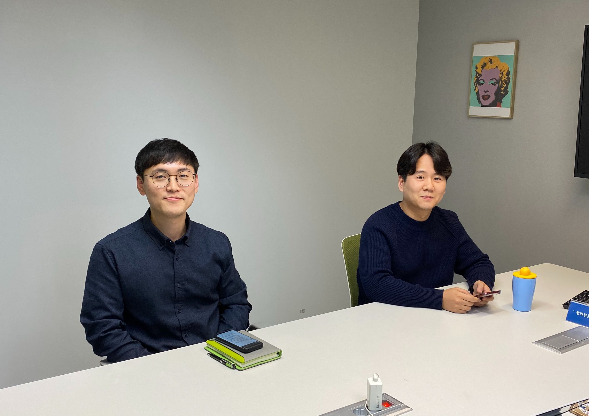
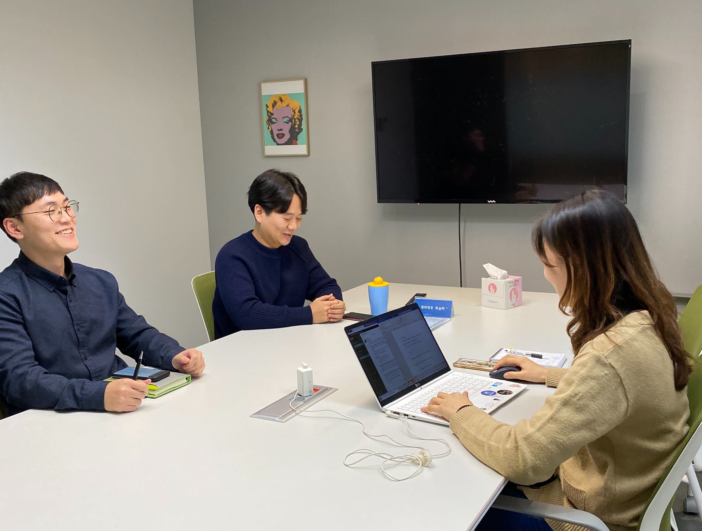
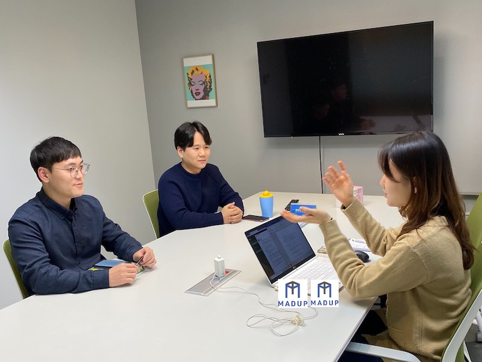

“저희 별로 안 친해서 가까이서 사진 안 찍을게요”  
“맞아요. 그냥 떨어져서 찍을래요”  

별로 친하지 않아서 가까이서 사진을 찍지 않겠다면서도, 본인만의 장단점을 이야기하는 질문에서 서로의 장점을 찾아주는 존과 팀.  
 
장난꾸러기 같은 팀과 차분해 보이는 존은 서로 많이 다른 것 같았지만, 지금 하고 있는 일과 함께 하는 동료를 아끼는 마음만큼은 똑같아 보였습니다. 비슷한 질문을 드렸음에도 프론트엔드 개발자와는 다른 답변을 들을 수 있었던 백엔드 개발자 인터뷰, 존과 팀의 이야기를 소개합니다. 

---

  

<h4 style="text-align: right">
간단하게 자기소개 부탁드립니다! 
</h4>

**팀**  
저는 플랫폼 개발팀에서 일하는 김민성입니다. 테크사업부에서는 팀(Tim)으로 부릅니다. 처음에는 매드업 네트워크를 개발하다가 지금은 레버 플랫폼을 개발하고 있어요.

**존**  
저는 플랫폼 개발팀 박승근, 존(John)입니다. 매드업 네트워크 담당 백엔드 개발자이고, 매드업 지박령인가 생각할 만큼 입사한 지 오래됐어요.

 
<h4 style="text-align: right">
두 분은 어떤 업무를 맡고 계신가요?
</h4>

**존**  
저는 새로운 것을 개발하기보다는 서버에 문제가 없도록 운영하는 역할입니다. 매드업 네트워크 개발은 옆에 있는 팀이 했죠. 저는 매드업 네트워크(매네) 서버를 계속 모니터링하고, 운영하시는 AE 분들의 요청사항을 반영해서 매네를 발전시키고 있습니다. 추가적으로 새 기능을 개발해서 탑재하기도 하고, AWS 서버 자원을 관리하고 모니터링하거나 매체사, 트래커, 광고주와의 커뮤니케이션을 통해 알게 되는 문제도 빠르게 해결해드립니다.

<b>승현</b>  
새로운 기능을 계속 만들어야 하면 힘들지 않으신가요?

  

**존**  
새로운 기능을 단기간에 만들어내는 건 아니라서 괜찮습니다. 시스템을 지속적으로 점검하면서 계획을 세우고, 그에 맞게 기능을 개발해 추가하기 때문에 매일매일 새로운 업무가 몰아치는 건 아니예요. 또 배포가 잦으면 사용자가 불편을 겪기 때문에 일정에 맞춰서 업그레이드 버전을 배포해요.  
그리고 매네 개발 말고도 리포팅 자동화를 위해 시간을 쏟고 있어요. 지금은 리포팅하는 데에 불편한 부분을 찾아서 시간을 단축시킬 수 있는 방법을 하나씩 개발하고 있는 단계이고, 완전한 자동화는 아마 내년부터 가능할 것 같아요. 저희 팀 말고 매네를 운영하는 플랫폼 팀에서도 리포팅을 더 빠르게 하기 위해 자체적으로 코딩 공부도 하고 계세요.  
제 업무를 전반적으로 같이 하는 건 프론트 개발자인 윌리예요. 윌리는 눈에 보이는 부분, 저는 보이지 않는 부분을 담당하는 거죠. 

<b>승현</b>  
팀도 직무 설명 부탁드려요!

**팀**  
저는 테크사업부가 출시할 새로운 서비스의 백 서버를 담당하고 있습니다. 사용자의 눈에 보이는 프론트가 있고, 프론트에서 볼 데이터를 생성하는 엔진이 있어요. 저는 이 중간에서 엔진으로부터 생성된 데이터를 가공하고 사용자가 볼 수 있게 전달하는 서버를 개발하고 있습니다.

<b>승현</b>  
같은 백엔드 개발자여도 존과 역할이 많이 다르네요!

**팀**  
맞아요. 운영은 반복적인 작업이 비교적 많고 그만큼 꼼꼼해야 하는데, 저는 꼼꼼함에는 크게 자신이 없어요. 그 대신 새로운 기술, 언어, 신제품 사용을 즐기고, 빠르게 받아들이는 건 자신이 있어서 완전히 새로운 걸 만드는 지금 일이 잘 맞는 것 같아요.  
그런데 새로 개발만 하면 안 되고 만든 걸 유지, 보수하는 것도 다 잘해야 하니까 노력할 게 아직 많네요.  

**존**  
대부분의 개발자들이 새로운 것을 만들기 좋아하죠. 저도 마찬가지고요.  
그런데 저는 지금 하고 있는 운영업무도 잘 맞아서 지금도 만족하고 있어요. 저희 팀, 저희 회사에서는 개인이 하고 싶은 것을 최대한 할 수 있게 보장하기 때문에 각자 성향에 맞는 업무를 맡게 된 것 같아요. 

 
<h4 style="text-align: right">
두 분 하루 일과는 어떻게 이루어져 있나요?
</h4>

**팀**  
새 프로덕트 기획서가 나오면 백엔드 요소를 개발하기 시작해요. 저는 주로 오전에 개발을 하고, 오후에는 매일 팀 회의를 해서 팀 전체와 개인 to-do list를 체크하고 피드백을 주고 받아요. 전날 어디까지 했는지, 무엇을 못했는지, 오늘 해야 할 일은 무엇인지를 다같이 공유하죠.  
보통 오전 8시쯤 와서 6시 ~ 6시반 사이에 퇴근해요. 더 일찍 퇴근하고는 싶은데(웃음) 요즘 개발 중인 새로운 프로덕트가 궤도에 올랐다고 해야할까요? 기획이 구체화되면서 업무에 속도가 붙어서, 일하다보면 어느새 조금 늦어져있어요. 최근에는 맡은 분량이 많아서 조금 더 늦게 갈 때도 있습니다.

<b>승현</b>  
존은 매네 운영 때문에 하루 중에 회의 시간이 많을 것 같아요.

**존**  
많을 때도 있고 적을 때도 있어요. 주로 요청을 받는 입장이어서 매번 일과가 조금씩 달라지죠. 요청업무 위주로 진행하면서, 그 이외의 시간에는 자동화 개발, 추가기능 개발에서 진전을 보이는 것을 목표로 하고 있어요. 매번 우선순위는 바뀌니까 어떤 것을 먼저 할 지 판단해야 하는 것도 중요해요.   
최근에는 윌리랑 같이 스프린트를 활용해서 일하기 시작했는데, 효과가 있는 것 같아요. 요청 업무를 하는 와중에도 목표로 했던 새로운 개발을 계획에 맞게 해내고 있거든요. 

---
 
<h4 style="text-align: right">
매드업에 어떻게 오시게 됐나요? 
특히 존은 가장 오래된 구성원 중 한 명이잖아요.
</h4>
**존**  
저는 처음에 안드로이드 개발자로 들어와서 핀켓 앱서비스 개발을 했어요. 회사가 제공하는 서비스가 변하면서 백 개발을 맡게 되었고요. 그 전부터 풀스택 개발자가 되고 싶다는 욕심이 있었는데, 백엔드 개발을 해 본 경험이 적어서 다른 곳에서는 아마 백엔드 업무를 맡겨주지 않았을 거예요.  
그런데 이곳에서는 제 니즈에 맞게 백엔드 개발 경험을 얻을 수 있었고, 제 개인적인 성장까지도 회사가 함께 고려해주기 때문에 이곳에서 오래 일하고 있는 것 같아요. 

**팀**  
저는 실무를 알고 싶어서 대학교 3학년 때 휴학을 하고 회사를 다녔어요. 그 곳에서 복학하고 졸업할 때까지 총 1년 6개월 근무하면서 제가 하고 싶은 개발이 뭔지 들여다볼 수 있었죠.  
그러다가 지인이 매드업을 소개해줬어요. 제가 해보고 싶은 것이 생기면 할 수 있도록 뒷받침 해주는 곳일 테니 가보라고 이야기하더라고요.  

**존**  
저도 전 직장 사수의 소개로 왔어요. 그 전에는 다른 회사에서 2년 넘게 근무하다가 스타트업에서도 일했었고, 프리랜서로도 잠깐 일했었어요. 계속 프론트 개발자에 가깝다고 볼 수 있는 안드로이드 개발을 했기 때문에 백 경험을 할 수 있는 곳이 없었는데, 여기서 백엔드 개발까지 할 수 있게 됐죠.  
이 곳은 개인이 추구하는 방향과 회사에서 바라는 업무 방향을 최대한 가깝게 만들기 위해 노력하는 회사라고 생각해요. 

 
<h4 style="text-align: right">
매드업을 외부에 소개할 때 어떻게 이야기하시나요? 
내부 구성원이 이곳을 어떻게 생각하고 평가하시는지 궁금합니다. 
</h4>

**존**  
저는 미리 생각해둔 문장이 있어요. '회사의 방향과 본인의 방향이 일치한다면 내가 시도하고 싶은 것을 할 수 있고, 든든한 지원을 받을 수 있는 곳'. 앞에서 이야기한 것과 같은 맥락이에요.  
다양한 경험과 소통을 좋아하는 사람들에게 딱 맞는 회사라고도 덧붙일 것 같아요. 서로 다른 의견이 있으면 충분한 설득의 시간을 가진 후에 일을 진행하기 때문에 소통을 좋아하시는 분들은 잘 맞을 거예요.  
추가적으로는 개발팀 특성이기도 하겠지만 미팅 같은 외부 제약이 거의 없어서 외적인 스트레스가 없어요. 딱 정해진 일을 잘 갖추어진 틀 안에서 하고 싶은 분들에게는 잘 안 맞는 분위기일 수도 있겠네요.  

**팀**  
맞아요. 우선 들어가면 본인에게 맞는 일을 하게 하고 서로 피드백을 하는 형태지, 일대일로 이끌어줄 사수를 만들어주거나, 특정 기간 동안 교육만 받게 하는 시스템은 아니예요. 자신이 맡은 바를 자신의 힘으로 최대한의 노력을 들여서 하다가, 감당하기 어려우면 도움을 청하는 곳이라고 생각합니다.  
그리고 저는 좋은 회사인지 여부를 판단할 때 두 가지 기준을 두고 판단해요. 첫 번째는 무엇을 하고 싶다고 했을 때, 그 의견이 설득력 있다면 받아들여지는지 여부입니다. 좋은 의견인데도 묵살되지는 않는지가 제게는 중요해요. 그리고 두 번째는 적절한 보상이 주어지는지입니다. 이건 사람마다 생각이 다르겠지만, 제 기준으로는 두 가지가 모두 잘 보장되는 것 같아요. 그래서 이 두 가지가 잘 보장되는 곳이라고 설명할 것 같습니다. 

 
<h4 style="text-align: right">
두 분이 함께 몸담고 계시는 플랫폼개발팀의 특징을 
한 문장으로 표현한다면 무엇일까요? 딱 떠오르는 문장을 얘기해주세요!
</h4>

**팀**  
친구 같다!  

**존**  
(팀을 가리키며) 저는 안 그런데요?  

**팀**  
(존을 바라보며) 저는 한 명(존) 빼고 다 친구라고 생각합니다.(웃음) 수직적, 경직적이지 않고 속에 있는 이야기도 편하게 할 수 있어요.  
물론 그렇게 속에 있는 이야기까지 안 하고 싶어하시는 분들도 많아요. 그런 분들도 존중하기 때문에 꼭 이야기하라고 강요하지 않아요.  

**존**  
저는 ‘의견을 정리하기 위해 상당한 의논의 시간을 가진다.’라고 하겠습니다.  
무언가 결정하기 위해 여러 명의 아이디어를 다 듣고 의논을 많이 해요. 그래서 더 존중 받으며 일할 수 있고, 모두가 납득할 수 있는 결정을 내릴 가능성이 높지만 이러한 방식을 택하면 필연적으로 따라오는 한계도 있는 것 같아요.  

<b>승현</b>  
어떤 한계가 있나요? 그러면 그런 한계를 보완하기 위해 어떤 노력을 하고 계신가요?

**존**  
결정단계까지 시간이 꽤 걸리고, 다양한 아이디어가 제시되니까 의견이 정리되고 수렴되기 전까지는 정신이 없을 때도 있어요. 그런데 저는 모두의 의견을 ‘최대한’ 존중하고 모두가 납득할 수 있는 결정을 내린다는 원칙을 택했다면 어쩔 수 없이 따라오는 문제라고 생각해요.  
이 한계를 해결하려고 들면 결국 한 두 명이 빠른 결정을 내리는, 결과적으로 지금과는 다른 의사결정 방식을 택해야 하는 거죠. 그래서 저는 한계를 해결하기보다는 이 방식에서 얻어낼 수 있는 것을 최대한 얻어내려고 노력하는 게 좋다고 생각해요.  
시간을 많이 들이는 대신 더 성공가능성이 높고, 더 만족스러운 결정을 하는 것!  

**팀**  
그래도 조금 더 효율적으로 회의하기 위해서 본질적인 것, 즉 사안의 핵심이 무엇인지를 우선 빠르게 이야기하고, 그에 맞는 이야기만 하려고 해요.  
그 후에 부차적인 이야기를 나중에 하는 방식이죠. 그리고 그런 회의를 거쳐서 결국은 가장 구체적이고 논리가 탄탄한 의견이 채택돼요. 확실하게 성과가 날 것으로 보이는 의견이요.  
그런데 자신의 의견이 반영되지는 못하더라도 최소한 편안하게 생각을 이야기할 수 있고 누구나 그것을 존중해주는 게 좋아요.  

  

*모두의 이야기를 듣고 최대한 반영하려고 하는 팀 분위기는 프론트엔드 개발자 인터뷰에서도 들었던 이야기였습니다. 그런데 이번에는 그러한 방식이 가진 한계와 이를 극복하기 위한 노력에 대해서 조금 더 들을 수 있었습니다.*  
*그리고 가장 기억에 남는 것은 ‘단점을 극복하기 위한 노력도 중요하지만, 우리의 방식에서 얻어낼 수 있는 것을 최대한 얻어내자’는 이야기였습니다. 우리는 종종 우리가 지닌 문제를 어떻게 없앨 수 있을지에 집중하다가 우리가 가진 자산을 잊어버리기도 합니다.*  
*우리가 선택한 방식의 단점을 없애고자 노력하기 전에 우리의 방식이 주는 장점을 극대화하자는 이야기가 새삼 새롭게 다가왔습니다. 테크사업부의 분위기에 대한 자부심으로도 느껴졌습니다.*  

---
 
<h4 style="text-align: right">
이제는 개발자로서의 삶과 직무에 관한 생각에 대해서 여쭤볼게요. 
왜 백엔드 개발자가 되고 싶으셨나요?
</h4>

**팀**  
저도 첫 회사에서는 안드로이드 개발로 시작했어요. 그런데 개발을 하다보니 서버를 다루는 데에 관심이 생기더라구요. 그리고 그 당시에는 백엔드가 급여가 가장 높았기도 하죠!(웃음)  

**존**  
그 당시에 우리나라에서는 서버 개발은 시니어급이 한다는 인식이 있었어요. 그리고 지금은 한 분야 전문 개발자가 인정받는 경우도 많지만 그 때는 풀스택을 갖춘 사람들을 선호했고요.  
그래서 백엔드 개발분야에 풀스택 시니어가 많으니 연봉이 높을 수 밖에 없었죠! 백은 신입도 거의 안 뽑았었어요.  

**팀**  
저도 급여 말고(웃음) 그 전 이야기를 더 구체화해볼게요. 그 당시에는 서버에서 주는 데이터를 받기만 했는데, 점점 데이터가 어디에 있고, 어디서 만들어지는 건지 알고 싶었어요.  
보이지가 않으니까 호기심이 계속 생기더라고요. 

**존**  
맞아요. 저도 안드로이드 개발을 할 때 점점 서버가 궁금해졌어요. 안드로이드는 프론트엔드에 가깝다고 볼 수 있는데, 제가 개발을 하면 할수록 의문이 늘더라고요. 제가 개발하는 부분과 서버를 연결할 때 문제가 생기면 이게 제 잘못인지 서버 잘못인지 알 수가 없으니까 답답했어요.  
그리고 ‘이 부분을 굳이 서버개발자에게 요청안하고 직접 해보자!’ 하다 보니까 백엔드 개발자가 돼있네요.  

<b>승현</b>  
프론트엔드 개발자 분들과 직무를 선택한 이유가 정말 다르네요.  
프론트 개발자 분들은 코드를 짜서 넣었을 때 그게 바로 눈에 보이는 점에서 매력을 느꼈다고 하셨는데,  
두 분은 오히려 눈에 보이지 않는 것이 궁금해서 백을 골랐다고 하셔서요.

**팀**  
백엔드는 보이지 않는 부분을 짜는 역할이기 때문에 ‘얘가 컴인지.. 내가 컴인지..’라는 마음으로 컴퓨터와 하나가 되어서 일해야 해요. 그래서 아무래도 처음 개발을 시작하시는 분들은 결과가 눈에 보이는 프론트엔드 개발을 좋아하실 것 같아요.    
그래도 결론적으로는 두 분야를 조금씩은 다 알아야 해요. 프론트 개발자들이랑 의견 충돌이 있을 때가 있는데, 그럴 때는 프론트, 백 둘 다 알고 있으면 이길 수 있죠(웃음) 

 
<h4 style="text-align: right">
두 분이 생각하시기에 백엔드 개발자에게 가장 필요한 역량은 무엇인가요?
</h4>

**존**  
제가 지금 하고 있는 운영개발 업무에서는 안정성이 제일 중요하기 때문에 테스트를 굉장히 많이 할 수 있는 끈기가 중요해요. 버그 있는 코드를 배포하는 게 얼마나 위험한 일인지 경험해보면 아실 겁니다.  
그래서 끊임없이 의심하는 자세로 테스트를 여러 번 할 수 있는 힘이 필요하다고 생각해요. 그리고 모니터링을 미리 잘 해둬서 문제를 예방하는 것도 기본적이지만 다들 간과하는 부분이죠.  

**팀**  
저는 ‘컴퓨터’를 잘 알아야 한다는 것을 깨달았어요. 컴퓨터가 어떤 상태인지, 이 부분은 켜져있는지 꺼져있는지, 어디가 고장났는지 등등. 백 개발을 하기 전에는 컴퓨터 밑단까지는 몰라도 됐었거든요.  
그런데 지금은 컴퓨터 일부분이 켜져있는건지, 어떤 포트가 열렸고, 옵션은 어떻게 설정되어 있는지 다 알아야 더 잘 일할 수 있어요.  

**존**  
그러니까 ‘컴퓨터 자원의 특징과 한계를 알아야 한다’ 정도로 정리해볼 수 있겠네요.  
CPU나 RAM의 성능, 한계를 알고 있어야 그걸 잘 활용할 수 있어요. 또 프로그램 하나를 켰을 때 이 프로그램이 컴퓨터의 어느 위치에서 동작하고 있는지, 잘 돌아가고 있는지 등을 살펴볼 수 있어야 하고요. 저는 기본적인 전산 지식이 필요하다고도 생각해요.  

<b>승현</b>  
전산 지식이라면 어떤 걸 말씀하시는 건가요?

**존**  
음, 여러 가지가 있겠지만 유닉스OS를 직접 활용해보고 그에 대한 지식을 쌓아두면 좋아요. 학교에서 기본적인 전산 지식을 알려주기는 하지만 직접 해보는 것보다 더 좋은 건 없거든요. 저희는 여기서 리눅스를 사용하고 있어요.

 
<h4 style="text-align: right">
그럼 두 분은 개발자로서 가장 자신있는 점과 가장 발전시키고 싶은 점이 각 무엇인가요?
</h4>

**팀**  
저는 잘 모르겠는데..

**존**  
팀에 대해서 제가 생각해보면,  

**팀**  
오, 저 대신 말씀해주신다고요? 

**존**  
팀은 일찍 출근하는 날이 많아요. 그리고 그 때마다 굉장히 집중하고 있어요. 가장 집중력이 좋은 오전 시간에 나와서 몰입해서 일하는 게 좋은 습관인 것 같아요.

<b>승현</b>  
그럼 어느 정도 일찍 오시는 건가요?

**팀**  
8시 전후로 도착해요. 그 정도 시간이면 테크사업부에는 사람이 거의 없거든요. 그 조용한 시간에 집중해서 작업을 다 해놓고, 오후에는 회의하면서 서로 피드백하는 시간을 가져요.  

<b>승현</b>  
집중하기 좋은 시간을 찾아서 일하고, 한 번 집중할 때는 제대로 빠져든다는 말씀이시네요!  
그러면 반대로 팀이 존의 강점 얘기해주세요.

**팀**  
무슨 생각하고 있는지 모르겠는 사람인데..(웃음) 개발할 때 정말 꼼꼼하고 놓치는 게 없어요. 저는 예전에 DB도 한 번 날려봤었는데 존은 정말 신중하고 꼼꼼해서 웬만하면 트러블이 없어요.  
그리고 한 자리에서 오래 집중할 수 있는 것 같아요. 저는 집중하면 완전히 몰입해있기는 하지만 시간이 길지는 않거든요.  

**존**  
원래는 안 그랬는데 레드불을 먹으니까 오래 앉아있을 수 있는 것 같네요(웃음)  
요즘은 에너지드링크 마시면 잠을 못 자서 좀 줄이기는 했어요. 

<b>승현</b>  
꼼꼼한 성격이랑 맡고 계시는 업무랑 딱 맞는 것 같아요!

 

**존**  
저도 실수할 때가 있기는 하지만.. 이렇게 꼼꼼히 봐야 하는 업무를 선호하는 편이에요. 저는 간단하고 뻔한 것도 맞는 건지, 다른 방법은 없을 지 고민하는 편이거든요. 

<b>승현</b>  
그럼 두 분은 스스로 개선할 점은 무엇이라고 생각하시나요?

 

**존**  
저는 개발을 하면서 의심이 늘었어요. 이게 맞는 건가, 다른 방식은 없나. 그런데 어떤 것들은, 예를 들면 제가 완전히 익숙해져 있는 업무 같은 것들의 경우에는 다른 것에 비해 의심을 덜하더라고요.  
그래서 저는 제가 의심하지 않는 것도 한 번 더 생각해보고, 제 퍼포먼스를 지금보다도 더 확인하면서 가고 싶어요.  

**팀**  
저는 개선하고 싶은 점 너무 많은데..(웃음) 개발을 할수록 백엔드에서 알아야 할 명령어가 엄청나게 많다는 것을 느껴요. 알아야 할 개념도 많고. 저는 지금 당장 개발하는 데에 필요가 없는 개념은 나중에 보자고 생각하면서 놓치는 경우가 종종 있어서 그걸 고치고 싶어요.  
그래서 그런 개념이나 명령어를 스크랩을 해두고 보려고 하는데 쉽지는 않네요. 이렇게 디테일이 좀 부족한 것 같아서 디테일을 살리려고 노력 중입니다.  

**존**  
저는 개선할 점이랑 직접 연결된 건 아니지만 스스로 동기부여를 하려고 노력해요. 뭔가에 빠져서 사는 사람들에 대한 영상을 자주 보면서 저도 그렇게 일에 푹 빠져서 살아보겠다는 다짐을 하는 거죠. 운동 유튜버들을 보면 운동에 미쳐있잖아요. 저도 제가 맡은 일에 그렇게 미쳐보고 싶어요.  
제가 다양한 업무를 해보고 싶어서 안드로이드 개발에서 백엔드 개발로 넘어온 것이기는 하지만, 다양한 업무를 할 때는 확실히 한 분야에서의 성취감이 적은 것 같아요. 한 가지에 미쳐있는 사람들은 결과가 항상 좋고요.  
그래서 우선 지금 있는 자리에서, 지금 하고 있는 일에 파고들 동력을 얻기 위해서 한 가지에 미쳐있는 사람들에 대한 영상이나 글을 많이 봅니다.  

<b>승현</b>  
팀도 동기부여 방법이 따로 있나요?

 

**팀**  
동기부여를 하기 위해 존처럼 뭔가 찾아보지는 않아요. 저를 더 앞으로 나아가게 하는 데에 자존심이 어느정도 영향을 주는 것 같아요.  
다른 개발자들과 이야기를 나누다가 모르는 부분이 나왔을 때 상대방은 알고 저는 모르면 자존심이 상하더라고요. 그러면 그 부분을 더 공부하고 찾아봐요. 혼자서만 일하고 공부하면 제가 무엇을 모르는지조차 모르는데, 다른 사람과 함께 일하면 제가 모르는 것도 알게 되고, 제대로 알고 있지 못했던 것도 정확하게 알게 돼서 좋아요. 

---

 
<h4 style="text-align: right">
매드업 입사 후 가장 기억에 남는 순간이 있다면 언제인가요?
</h4>

**팀**  
저는 매드업 네트워크 개발을 하고 만든 거 라이브할 때요. 기존에 있던 매네 서버를 리뉴얼해서 다시 오픈한 거였어요. 기존에 있던 것들이 다 리뉴얼한 서버로 들어오는 12시를 다같이 기다리고 있었어요. 혹시 문제가 있을 수도 있으니까요.  
다들 긴장 상태로 기다리느라 완전히 녹초가 됐었는데, 12시가 딱 되고 보니까 생각보다 이슈가 없었어요.(웃음) 예상한 것보다 큰 트래픽도 없었고요. 그래도 존, 제이슨이랑 새벽 내내 모니터링하고 회사 아무데서나 기절하듯 잤어요.(웃음)  
팀매니저 제이슨한테 그 날 문제도 없는데 밤은 왜 샌거냐고 이런 식이면 그만두겠다고 장난으로 화도 냈었는데, 제이슨이 이게 서버 개발의 현주소고 현실이라고 하셨어요.(웃음) 뿌듯함 반, 힘들어서 관두고 싶은 마음 반 이렇게 들었는데(웃음), 그 때 ‘나도 서버 개발을 해냈구나’ 하는 마음이 몰려오더라고요.  

**존**  
저는 얼마 전에 있었던 롯데월드 회식이요. 제가 그 때 회식 진행자였는데 밥 먹고 술 먹고 하는 뻔한 회식을 싫어하시는 분들이 있었어요.  
그래서 새로운 액티비티를 해보는 게 우리 문화랑 잘 맞다고 생각해서 다양한 옵션을 제시했는데 그 중에 롯데월드가 된 거예요. 정말 될 줄은 몰랐죠.  
다들 롯데월드 가는 날을 기다리면서 즐거워하고, 들떠있고, 특히 신디는 롯데월드 간다고 옷이랑 신발도 새로 사더라고요. 이렇게 색다른 곳에서 즐겁게 회식을 하는 것도 우리 문화의 일부라고 느껴졌고, 정말 재미있게 놀았어요. 

 
<h4 style="text-align: right">
그럼 마지막으로 존과 팀은 개인적인 목표나 꿈이 있으신가요?
</h4>

**존**  
저는 보람있는 하루 끝에 오는 충만감을 느끼면서 살고 싶어요. 만족감이 몰려오는 날들이 매일매일 쌓이면 행복한 삶일 것 같아요. 집중해서 일을 하고 그에 따른 결과를 얻었을 때 저는 보통 만족감을 느끼는데, 그런 날들이 계속되면 좋겠어요.

**팀**  
저는 거창한 목표는 딱히 없는데..  

**존**  
저는 팀 나이 때 아예 생각이 없었어요. 취미생활 하는 거 정도에 관심있었던가?

**팀**  
(고민) 저는 재미있는 팀을 만드는 사람이 되고 싶어요. 어디를 가나 좋은 회사 이야기는 많은데, 보통 좋다고 이야기하는 것을 들어보면 회사에서 제공해주는 게 많다는 이야기더라고요.  
거기 구성원들이 어떤지, 그 팀에 들어가면 즐거운지에 대한 이야기는 많지 않아요. 저는 제가 지금 속한 플랫폼 개발팀과 우리 회사가 재미있는 곳이라고 생각하고, 이 즐거운 분위기를 유지하는 동료이고 싶어요. 

<b>승현</b>  
재미있다는 건 어떤 걸 의미하나요?

 

**팀**  
와서 같이 일하고, 회의하고, 밥먹으면 즐거워요. 그리고 일 때문에는 스트레스를 받을 수도 있겠지만, 사람 때문에 받은 적은 없어요.  

**존**  
팀이랑 싸우기도 어려우니까 그런 거 아닌가요?(웃음) 팀이랑 싸운다는 건 그 사람이 진짜 이상한 사람이라는 건데..(웃음)  

**팀**  
에이(웃음). 저는 이런 분위기가 지속됐으면 좋겠고, 저는 이런 재미있는 팀이 계속 재미있을 수 있도록 만드는 사람이고 싶어요 항상.  

  
*존과 팀은 겉으로 드러나는 것보다도 일에 대한 욕심과 플랫폼개발팀에 대한 애정을 더 많이 품고 있었습니다. 눈에 보이지 않는 서버를 운영, 개발하는 두 사람의 업무와 두 사람이 추구하는 생활이 비슷하다고 느꼈습니다.*  
*두 사람은 눈에 띄는 하나의 성과만을 추구하기보다는 보람찬 하루하루를 쌓아올리는 것을 좋아하고, 개인적 퍼포먼스도 중요하지만 즐거운 업무 환경을 만드는 데에 기여하는 동료가 되고 싶어했으니까요. 사람은 자신이 하는 일을 닮아가는 것일지도 모르겠습니다.*  
*존과 팀이 동료로 함께 하는 팀이라면 트러블 없는 서버처럼 안정적이고 튼튼한 곳일 것이라는 생각이 들었습니다. 두 사람이 든든하게 뒤를 지키고 있을 매드업 네트워크와 새로운 프로덕트의 미래를 더욱 기대해봅니다!*
