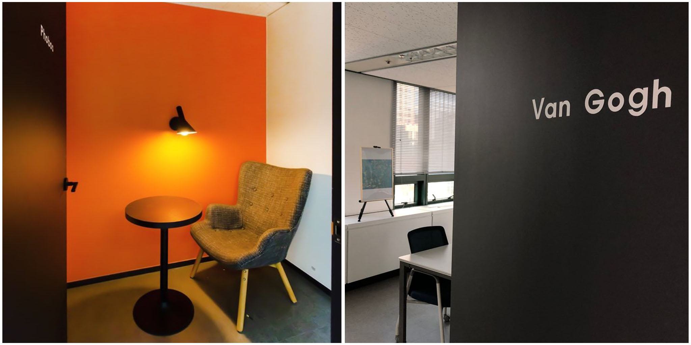
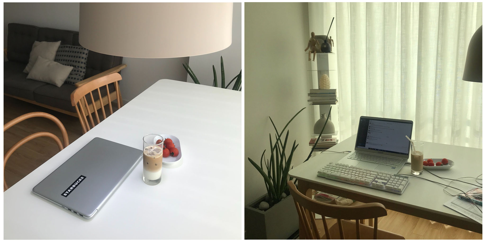
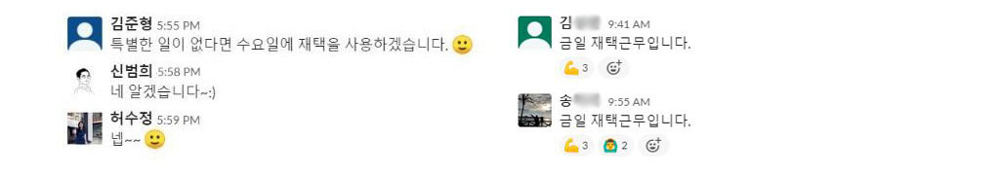
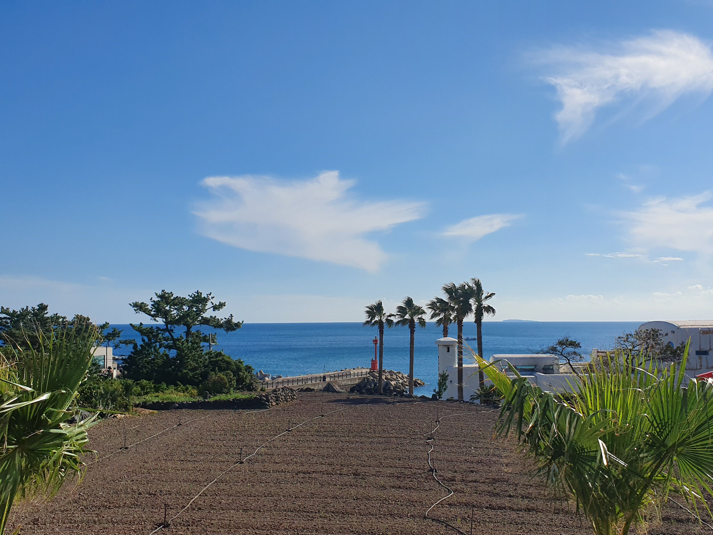
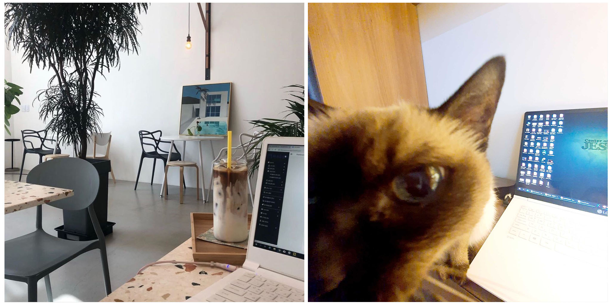
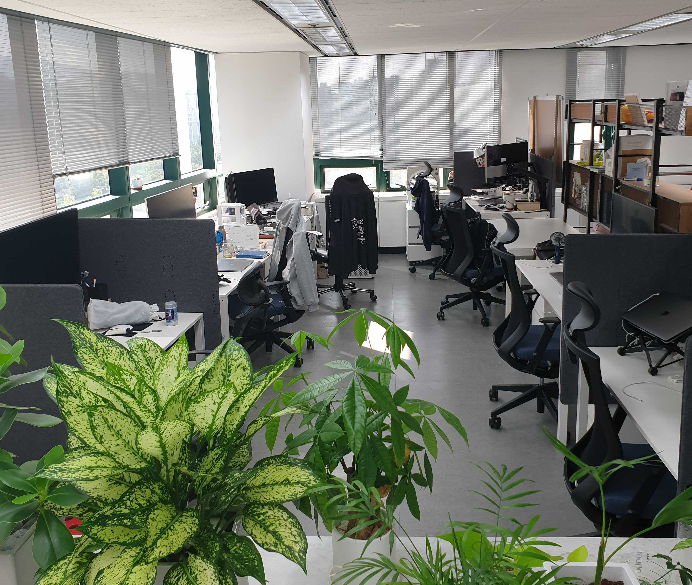
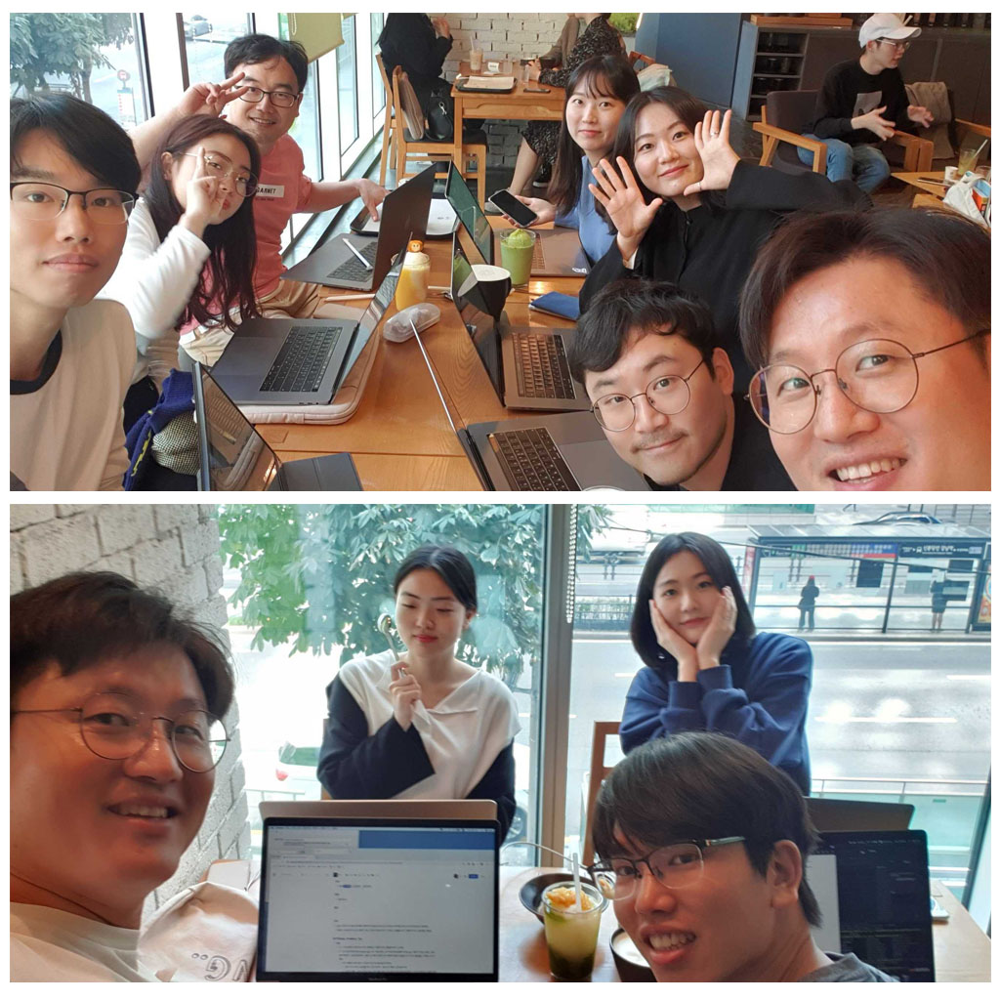
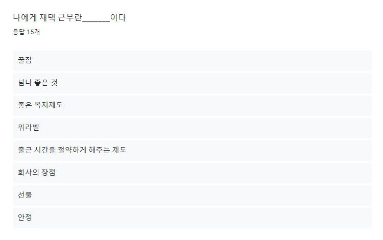

### 건축가들은 어떤 공간에서 일할까?
##### 공간이 사람을 움직인다
우리는 파티션이 있는 사무실 책상에서 집중하며 업무를 하다가도, 답답한 기분이 들면 다소 시끌시끌하고 탁 트인 카페로 자리를 옮깁니다. 상황과 기분에 맞는 적절한 공간은 잠시 삐걱댔던 생산성을 높여주기도 하고, 멈춰있던 창의력을 샘솟게 하기도 하니까요. 

그렇다면, '이런 공간을 만드는 건축가들은 어떤 공간에서 일할까?'하는 궁금증이 한 번쯤 들기도 합니다. 공간을 만드는 사람이니만큼 더욱 자신에게 딱 맞는 공간에서 자유롭게 일하지 않을까요?  

##### 매드업, 새로운 세계를 설계하는 건축가들
매드업의 동료들 역시 건축가입니다. 21세기가 되고 우주만큼 방대한 모니터 속 공간들이 속속들이 생겨나면서, 테크사업부의 개발자들과 데이터사이언티스트, 디자이너들은 다양한 웹과 앱을 구현하고 디자인합니다. 광고사업부의 마케터들 또한 광고 데이터를 분석해서 최적화된 모델을 구축해내지요.

이처럼 뚝딱뚝딱 새로운 세계를 설계하고 운영하는 중요한 임무를 맡고 있는 매드업의 건축가들은 공간의 중요성 역시 잘 알고 있습니다. 그래서 이들은 가끔은 딱딱하고 갑갑하게 느껴지는 사무실 책상에서 벗어나 자신에게 딱 맞는, 자신이 좋아하는 공간에서 자유롭게 일하곤 합니다.

##### 우리는 공간의 힘을 믿기 때문입니다

매드업은 좋은 공간이 생산성을 향상시킨다고 믿습니다. 그래서 회사 내에 빈백과 간식이 가득한 '마당', 혼자만의 공간인 '폰부스' 등을 만들고, 자칫하면 지루해질 수 있는 회의실에 앤디 워홀, 고흐 등 화가의 이름을 붙이기도 했죠.

하지만 가끔은 누가 뭐래도 내 집에서 일하고 싶기도 하고 내가 좋아하는 따뜻한 분위기의 카페에서 일하고 싶지 않나요? 그래서 매드업에는 '리모트 근무' 제도가 있습니다. 우리의 건축가들이 성장할 수 있는 공간이라면, 그 곳은 회사가 아니어도 좋으니까요.  

 

### 아무리 회사가 좋아도 집이 최고죠 - 재택 근무
##### 월 1회에서 2회로, 매드업이 재택 근무를 장려하는 이유

출퇴근 시간마다 붐비는 지하철, 맛집을 가기에는 너무 짧은 점심시간, 컨디션 나쁜 날 이불 속에서 나오기 싫은 귀차니즘을 모두 해결할 수 있다면 얼마나 좋을까요? 

매드업에는 모든 직원들의 자랑인 재택 근무 제도가 있기 때문에 회사에 가기 힘든 날은 얼마든지 집에서도 근무가 가능합니다. '재택을 쓰기에는 눈치가 보이지 않을까?'라는 생각이 들 수도 있지만, 매드업에서는 재택을 사용할 때 그 누구의 승인도 필요하지 않습니다. 한 동료분의 증언에 따르면 '재택을 안쓰고 있으면 오히려 팀장님부터 팀원까지 모두가 쓰라고 독촉한다'고 하니, 매드업 동료들이 재택 근무 제도를 얼마나 사랑하는지 엿볼 수 있는 부분입니다.

재택 근무의 역사는 2016년으로 거슬러 올라갑니다. 몸이 좋지 않은 날 연차를 사용하지 않고도 집에서 근무할 수 있는 방법에 대해 고민하게 되었고, 회의 끝에 임시로 재택 근무를 월 1회 허용하는 것이 시초였다고 해요. 시행해보니 직원 만족도가 높아지는 것이 눈에 보였고, 자연스레 회사의 생산성에도 도움이 되었기에 과감히 월 2회까지 확장한 것입니다. 

매드업의 인사담당자 분은 2018년 8월 태풍 솔릭이 북상했을 때 안전을 위해 전사 재택을 시행했던 경험을 회고하며, 재택 근무 제도를 매드업의 조직적 강점으로 꼽습니다. 평소에 재택 근무를 언제든 실시할 수 있도록 준비가 되어있다보니 위급한 상황에 차질 없이 바로 진행할 수 있었기 때문이지요.

##### 제주도 바다를 바라보며 재택 근무를
이렇듯 간편한 신청법과 재택을 장려하는 회사의 분위기 덕분인지, 재택 근무는 누구 한 명 빼놓지 않고 사용하는 인기쟁이입니다. 그만큼 직원들도 이제는 재택 근무의 달인이 되어, 활용법도 가지각색인데요.

> "제주도 여행 마지막 날에는 재택을 사용해서 제주도 스타벅스로 출근했어요. 바다를 보며 일을 하니 리프레시 되는 기분이었습니다." / 김준형 (커뮤니케이션팀)
> "이번 설날에는 연휴 앞뒤로 재택을 2번 써서 연휴기간을 피해 기차 티켓팅에 쉽게 성공했어요. 고향 친구들이 제일 부러워하는 부분이에요!" / 이혜린 (테크사업부 플랫폼팀)

'재택'이라고 꼭 집에서 근무할 필요는 없죠. 여행지에서 재택 근무를 사용하는 멋진 활용법도 있습니다. 연차로만은 짧은 휴가 기간이 아쉬울 때 재택 근무 히든카드를 꺼내들면, 여행에서 돌아오지 않고도 느긋하게 출근이 가능해요. 

명절이 되어 고향에 내려갈 때도 재택 근무의 인기는 식지 않습니다. 명절 때 본가에 내려가기 위해 새벽마다 기차 티켓팅을 기다렸다는 동료분께서는, 이제는 노련히 재택 근무를 활용해 남들보다 일찍 명절 연휴를 시작합니다. 여유로운 티켓팅 성공은 덤입니다. 장소와 시간에 구애받지 않고 좀더 유연한 나의 삶을 만드는 재택 근무의 장점을 잘 활용한 셈이지요.

여행지에서, 고향에서 재택 근무를 활용하는 법도 좋지만 대개는 집에서 재택 근무를 합니다. 한 달에 두번 재택 근무를 사용하는 것이 이제는 모두에게 자연스러운 일상으로 자리잡았기 때문이죠. 컨디션이 좋지 않은 날 무리해서 출근하지 않고 집에서 업무를 보고, 회사에선 다소 먼 동사무소에 갈 일이 있을 때 재택을 사용해 집 근처로 다녀오기도 합니다. 늘 같이 있고 싶은 반려묘나 가족과 함께 같은 공간에서 하루를 보내는 것도 재택 근무가 주는 소소하지만 특별한 행복이에요.

매드업의 구성원들은 재택 근무의 장점을 '생산성 향상'이라고 말합니다. 편한 모습으로 편한 공간에서, 왔다갔다 하는 시간과 에너지를 줄여 업무에 투자하기 때문입니다. 그러니 재택 근무는 회사와 직원 모두에게 win-win인 제도라고 할 수 있겠지요?

 

### 햇살 좋은 날은 노트북을 들고 최애 카페로 - 주변 근무
##### 텅 빈 사무실, 꽉 찬 생산성

유난히 사무실이 조용합니다. 둘러보니 자리에 아무도 없습니다. 점심시간이 훌쩍 지났는데, 다들 식사가 끝나지 않은걸까요? 사실 이 팀은 인근 카페에서 팀 회의 중입니다. 매드업에는 '주변 근무'라는 제도가 있기 때문인데요. 팀원들과 함께라면 회사 근처 어디에서나 근무가 가능한 신기한 제도입니다.

주변 근무 역시 '생산성 향상'에 중점을 두고 생겨났어요. 가끔은 회의실에 자리가 없을 때도 있고, 미팅 후에 회사로 돌아오는 이동시간이 낭비된다고 느껴질 때도 있기 마련이죠. 이럴 때 주변 근무는 업무 스케줄을 유연하게 조절할 수 있게 해줌으로써 매드업의 생산성 향상을 돕습니다. 적극적인 활용을 위해 입사 당일부터도 사용이 가능하고 제한 횟수 역시 없기 때문에, 날씨가 너무 좋은데 회사에만 있기 아깝다면 팀원들에게 주변 근무를 제안해볼 수도 있지요.

> "카페의 원형 테이블에 모여서 회의를 하니 훨씬 더 쾌적한 업무가 되더라구요." / 여지운 (광고사업부 영업팀)

주변 근무의 가장 큰 장점은 '커뮤니케이션'입니다. 도란도란 말소리가 들려오는 회사 주변 카페에 둘러앉아 스프린트 회고를 하면, 회의실에서 말하기엔 부담스러웠던 이야기들도 자유롭게 나눌 수 있는 분위기가 형성되기 때문이지요. 공간의 변화가 주는 재미와 리프레시 효과 역시 원활한 커뮤니케이션에 도움이 됩니다. 

주변 근무가 가져다주는 효과 덕분인지, 매드업의 동료들은 더 좋은 주변 근무를 위한 스킬들을 보유하고 있기도 한데요. 팀원들의 효과적인 커뮤니케이션을 위해 자리가 넉넉하고 한적한 피자집을 주변 근무 장소로 애용한다는 꿀팁도 있었답니다.

#### 나에게 리모트 근무란 ___________다.
이런 궁금증이 생기기도 합니다. '회사 밖에서 근무하면 커뮤니케이션이 불편하지 않을까?' 

리모트 근무는 분명 좋은 제도이지만, 유지하기 위해서는 노력이 필요합니다. 업무에 지장이 없기 위해선 막힘 없는 소통을 전제로 해야 하기 때문이지요. 매드업은 이런 문제를 해결하기 위해 사내 메신저(슬랙)를 적극적으로 활용합니다.  

  
재택 근무를 하는 날은 꼭 사내 메신저 프로필에 '재택' 표시를 합니다. 버튼 클릭 한 번으로 내 근무 상태를 알려줄 수 있으니 간단하고 편리해요. 메신저 알림 소리를 켜놓는 것도 잊지 않습니다. 또, 주변 근무를 할 때는 언제든 회사로 복귀할 수 있도록 너무 먼 거리의 장소는 지양하는 규칙도 만들었습니다.  

  
누군가에게 리모트 근무란 일과 삶의 균형을 맞춰주는 '워라밸'입니다. 누군가에겐 반복되는 일상에 찾아오는 '선물'같은 존재이기도 하네요. 한 마디로, '넘나 좋은 것'이라는 말이 딱 맞는 것 같습니다.  

매드업의 동료들은 리모트 근무 제도를 좋아하고 자랑스러워 합니다. 그만큼 리모트 근무를 하는 날은 더욱 꼼꼼한 업무 준비가 필수지요. 누가 시킨 것은 아니지만, 구성원들의 이런 자발적인 노력 덕분에 오늘도 리모트 근무는 더욱 빛이 납니다.

매드업의 자율적인 공간이 주는 힘을 느끼고 싶다면, 지금 매드업과 함께 하세요! :)

**매드업은 채용 중!**
[매드업 채용 바로가기][madup]

[madup]: <https://www.notion.so/78775178b17243c8b00112447343ab22>

