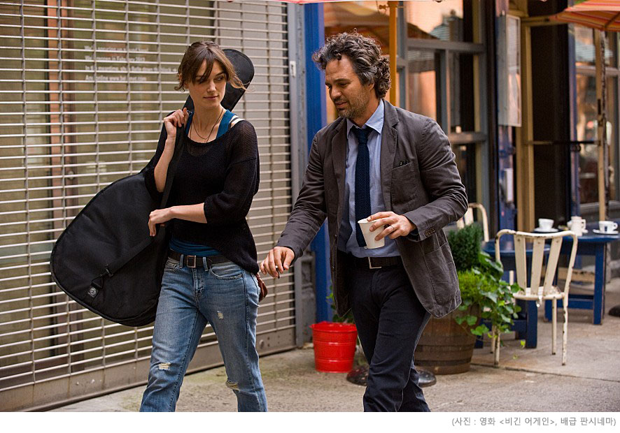
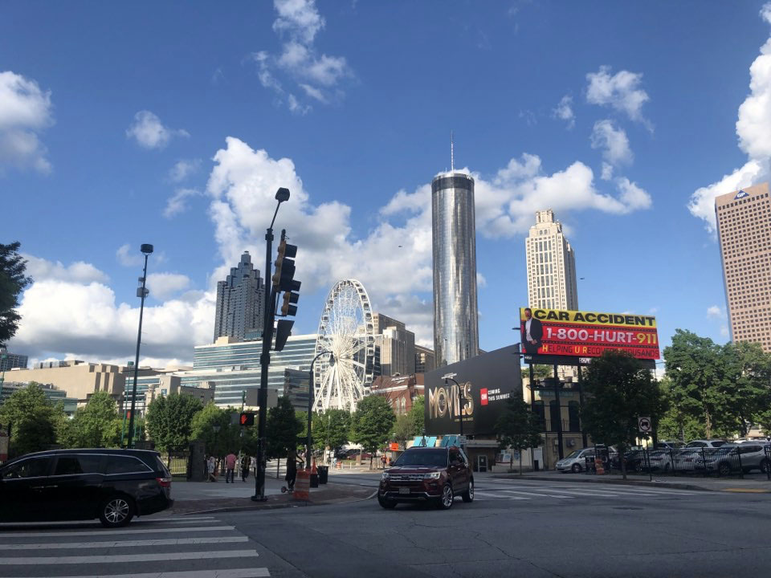
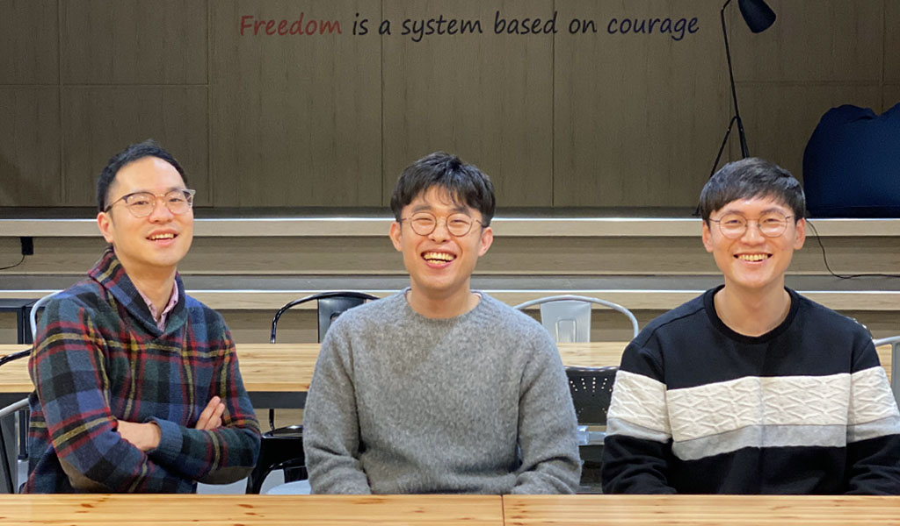
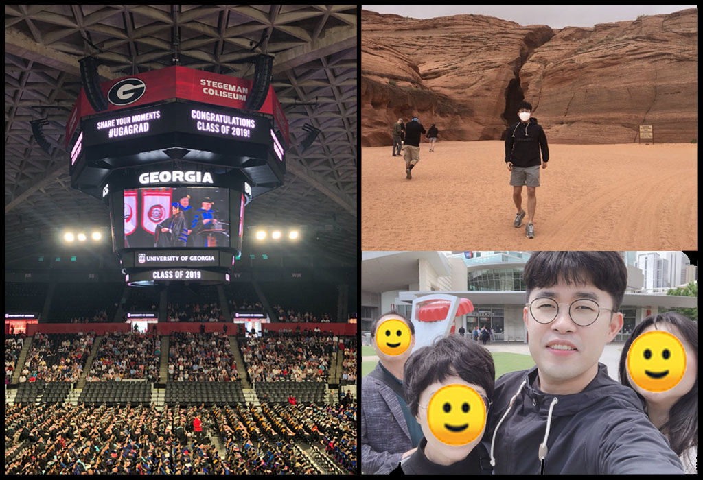
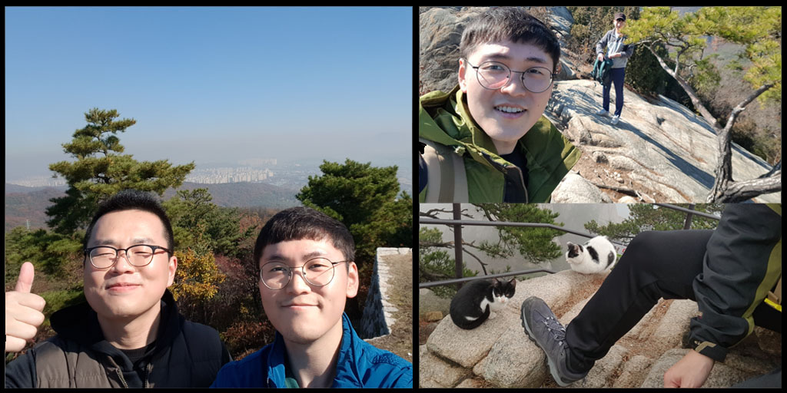
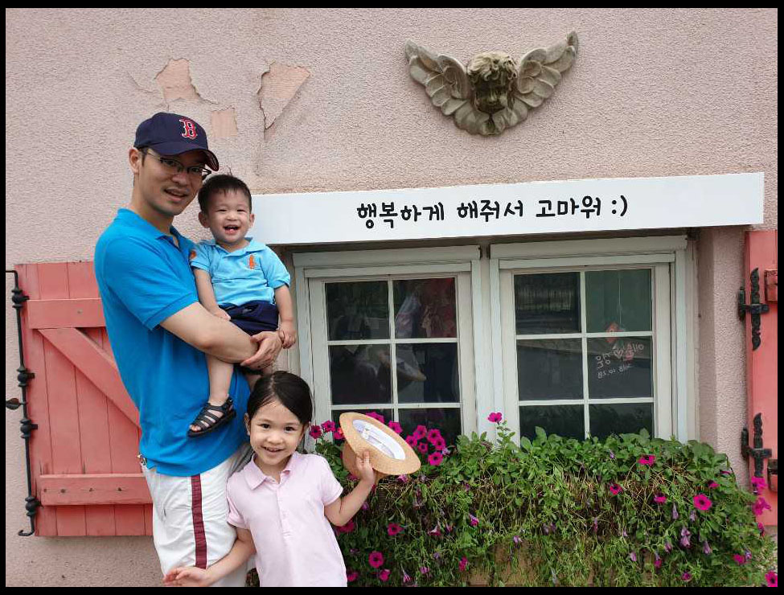
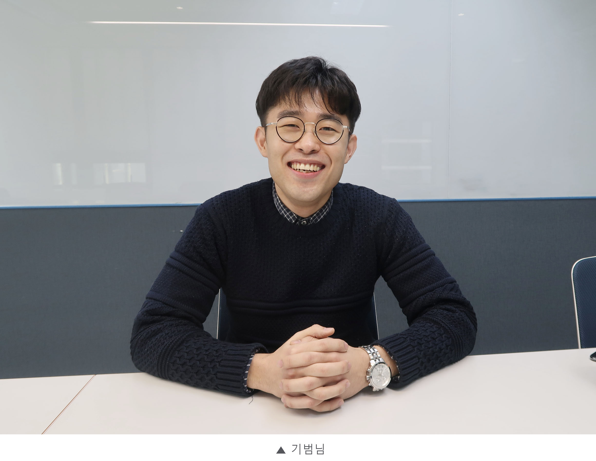
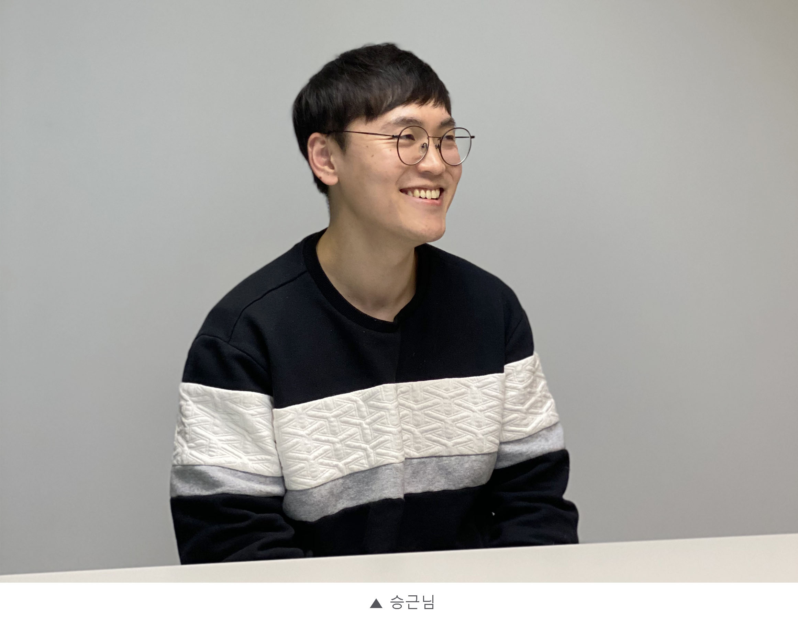
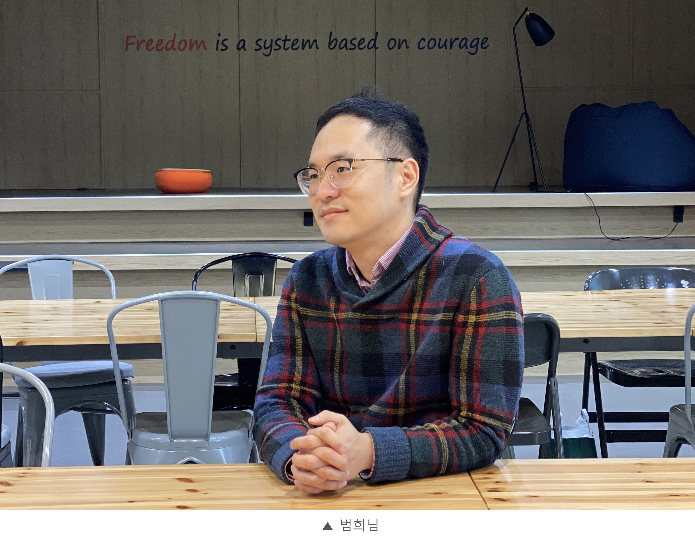
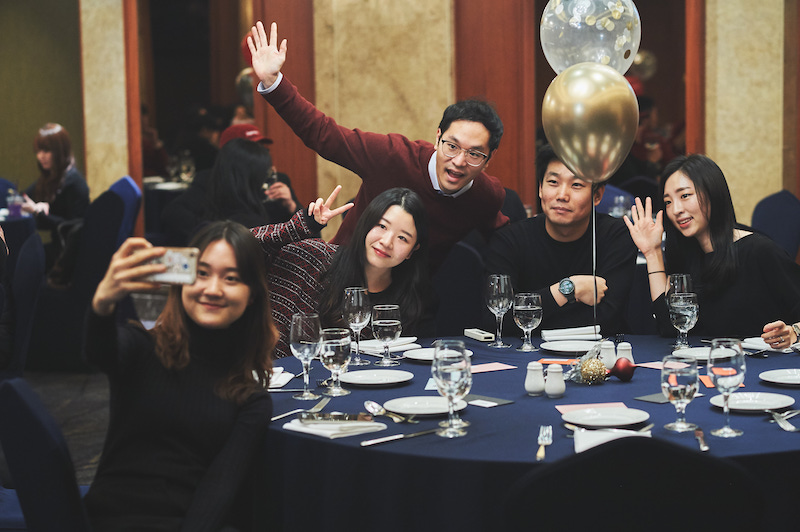

#### 일시정지 버튼을 누르고 싶을 때
영화 &#60;비긴 어게인&#62;을 아시나요? 이 영화의 두 주인공은 음반회사에서 인정받는 프로듀서였고, 사랑하는 연인과 함께 음악의 꿈을 펼쳐나가던 싱어송라이터였어요. 하지만 이들은 어느날 갑자기 회사에서 쫓겨나고 연인에게 배신당하게 됩니다. 한순간에 날개를 잃고 추락한 두 사람. 이 둘이 만나서 음악으로 다시 새로운 삶을 시작하는 이야기가 바로 &#60;비긴 어게인&#62;입니다.

인생에도 일시정지 버튼이 있다면, 잠시 모든 일에 '스톱'을 선언하고 쉬어가고 싶은 순간이 누구에게나 있기 마련입니다. 마치 &#60;비긴 어게인&#62;의 주인공들처럼 일이 잘 풀리지 않을 땐 특히 그렇죠. 이들은 복잡한 만사를 '스톱'하고 다시 일어서기 위해서 음악이라는 일시정지 버튼을 꾹 눌렀습니다. 누구 못지 않게 바쁜 삶을 살아가는 우리에게도 그런 버튼이 있다면 얼마나 좋을까요?

##### 바쁜 일상에 매드업이 쉼표를 드려요
그래서 매드업에는 **'비긴 어게인 휴가'** 제도가 있습니다. 함께 열심히 달려온 동료들에게 휴가라는 여유를 선물하는 일종의 리프레시 버튼인데요. 3년 만근한 동료에게는 2주, 5년 만근한 동료에게는 **한 달의 유급 휴가**와 휴가비 150만원까지 든든하게 지원합니다.
##### 동료가 최고의 복지다
늘 바쁘게 돌아가는 애드테크 세계에서 매드업은 왜 휴가비까지 지원하면서 동료들의 휴식을 적극 장려하는 걸까요? 저는 그 답을 매드업에 처음 입사했던 날의 기억에서 찾을 수 있었습니다. 신규입사자 교육 때 보았던 화면마다 깨알같이 적혀있는 '동료가 최고의 복지다'라는 한 마디. **'아- 이 회사가 사람 하나만큼은 진짜 중요하게 생각하는구나'**를 느낄 수 있던 순간이었죠.

매드업에서 2017년 '비긴 어게인 휴가'를 도입한 이유도 여기에 있습니다. 막 3년 근속자가 생길 무렵, 고생하는 동료들에게 작게나마 힘을 주고 싶은 마음에 도입한 제도인데요. 무려 100%의 이용률을 자랑하는 '비긴 어게인 휴가'! 직접 다녀오신 분들의 이야기를 들어보러 가실까요?

#### 매드업의 '비긴 어게인 휴가'를 소개합니다!

##### 기범님, 승근님, 범희님 반갑습니다 :) 자기소개 부탁드려요!
**송기범** : 안녕하세요, 광고사업부 데이터팀 팀매니저 송기범입니다. 업무 자동화나 분석 등 데이터와 관련된 업무를 중점으로 하고 있어요.  
**박승근** : 테크사업부 CX팀의 백엔드 개발자 박승근, 영어 이름은 존입니다. 현재 매드업 네트워크의 서버와 레버 홈페이지 서버를 담당하고 있어요.  
**신범희** : 저는 커뮤니케이션팀 팀매니저 신범희입니다. 회사의 인사와 문화에 관련된 영역을 맡고 있어요.  

##### 비긴 어게인 휴가, 각자만의 스타일로 멋지게 보내셨다고 들었는데 자랑해주세요!
**송기범** : 저는 작년 5월에 2주 정도 가족들과 함께 미국에 있는 누나 졸업식에 다녀왔어요. 커다란 스테디움 같은 곳에서 졸업식을 했는데, 누나가 전광판에 나오는 걸 보고 정말 신기했어요. 피아노 박사를 하시는 누나가 거기서 가르치는 학생들의 뮤지컬 공연을 보러 갔던 것도 특별한 순간들 중 하나였죠.

저희 가족은 아버지도 유럽에 계셔서 만날 기회가 흔치 않은데, 5월이면 마침 어버이날도 있어서 선물도 사드리고 여행도 시켜드릴 겸 졸업식 일정에 맞춰서 휴가를 썼어요. 기간이 짧았으면 미국까지 가기 어려웠을텐데 2주나 되는 비긴 어게인 휴가 덕분에 잘 다녀왔습니다. 
그리고 남은 주말에는 회사로 돌아갈 마음의 준비를 단단히 하면서 쉬었어요. (웃음)

**박승근** : 전 2018년 10월 말에 다녀왔어요. 가을에는 날씨도 좋고 업무도 어느 정도 정리할 수 있는 시간이라고 생각해서 날짜를 골랐어요.

당시 개인적인 슬럼프를 겪으면서 나약해져 있는 저 자신의 모습이 마음에 들지 않았고, 이런 상태를 바꾸려면 몸이 힘들어야 한다는 생각에 산행을 하기로 했어요. 휴가 기간 동안 정신을 수양한다는 생각으로 혼자 혹은 지인들과 산을 올랐습니다.
'나'라는 사람을 바꾸는데 2주라는 시간이 그렇게 길지는 않았지만, 돌아온 이후에도 스스로를 단련하면서 전진할 수 있는 터닝포인트가 되었던 것 같아요.

**신범희** : 저는 2019년 7월 말에 비긴 어게인을 다녀왔는데요. 둘째가 두 살밖에 안돼서 엄마 손이 많이 갈 때였죠. 그런데 첫째가 유치원 여름방학 때문에 집에 와버리면 아내가 힘들겠다는 생각이 들었고, 같이 감내를 해야겠다고 마음 먹었어요.

휴가가 길다보니 버킷리스트를 다 해보는 느낌으로, '내일은 뭐할까?' 하면서 아이들과 다양한 것들을 함께할 수 있었던 것이 가장 기억에 남아요. 평소에는 너무 바쁘니까 가족들과 여러 액티비티를 하기는 힘든데, 피노키오 박물관도 가고, 평창에서 백숙도 먹고, 뮤지컬도 보러 가고... 기간이 넉넉하니까 그만큼 마음의 여유가 있는거죠.
인상적이었던건 청평 여행을 갔을 때 리조트에서 나오면서 딸이 거기서 살고싶다고 말한 거예요. (웃음) 아이들하고 사진도 많이 찍고 좋은 추억이 되었어요.

##### 그런데 아무래도 회사를 오래 비우는 것이다보니, 걱정하셨던 점도 있었을 것 같아요.

**송기범** : 저는 팀매니저로 있다보니까 떠나기 전에 뭔가 계속 불안했어요. 광고사업부는 업무가 굉장히 빠르게 돌아가는 편이어서, '내가 휴가를 가도 진짜 괜찮을까?'하는 걱정 때문이었죠. 

그런데 동료분들이 너무 잘해줘서, 생각보다 제가 없어도 회사가 잘 돌아가더라구요. (웃음) 갔다 오면 해야 할 일이 산더미처럼 쌓여 있을 것 같은데 사실 그렇진 않아요. 오히려 다녀와서 리프레시가 되니까 바뀐 업무에 적응하는 속도도 빨라졌어요.

##### 정말 '다시 시작할' 에너지가 생기셨군요. 그렇다면 휴가를 다녀오기 전과 후의 나, 무엇이 달라졌나요?
**송기범** : 몸 컨디션이 확실히 좋아졌어요. 한동안 업무에서 벗어나 쉬다보니 정신 건강에 특히 좋았던 것 같아요. 그러다보니 사람을 대하는 태도가 긍정적으로 바뀌고, 덕분에 다른 일들도 잘 수행할 수 있었습니다. 

**신범희** : 저보다도 팀에 시사하는 바가 컸다고 생각해요. 회사는 누가 휴가를 가든 안 가든 일이 돌아가야 하는데, 팀매니저가 먼저 2주를 다녀왔다는 것은 다른 사람들도 갈 수 있다는 것이죠. 우리 팀원분들도 때가 되면 부담 없이 다녀올 수 있다는 확신을 줄 수 있었다는 게 가장 달라진 점이 아닐까요.

##### 세 분 모두 올해 5년 비긴 어게인 휴가 대상자이신데, 다음 번 한 달 휴가는 어떻게 즐기실 예정인가요?

**박승근** : '나'라는 사람을 바꾸는데 2주라는 시간이 그렇게 길지는 않았어요. 그래서 5년 비긴 어게인 휴가 때는 한 달 동안 습관을 만드는 시간을 가지려고 합니다. 온전히 스스로에게 집중하면서 나에게 필요한 습관을 하나씩 만들어, 휴가를 다녀온 이후에도 그런 습관들이 제 삶의 일부분이 될 수 있도록 하는 것이 목표예요.

##### 비긴 어게인, 정말 좋은 제도인 것 같아요. 다음 번에 다녀올 동료들에게 전할 한 마디가 있다면 이번 기회에 말해주세요!
**송기범** : 슬랙(사내 메신저)을 무조건 지워라! 특히나 AE 분들은 긴장감 속에 살고 있잖아요. 잠깐 내려놓으셔도 팀원들이 잘해주고 계시니까, 꼭 시간을 내셔서라도 가시길 바랍니다.

**신범희** : 결혼을 안 하신 분이라면 '떠나라'! 결혼하고 아이들이 생겨서 얻을 수 있는 행복이 있지만, 결혼하기 전 어디든 갈 수 있을 때 가보는 것도 특권이니까요.
사실 2주나 자리를 비웠는데 회사가 별 어려운 상황이 발생하지 않으면 서운한 마음도 있습니다. (웃음) 그만큼 빈자리를 채우기 위해서 주변에서 노력을 많이 해주신거죠. 서로 간의 팀워크를 느껴볼 수 있는 시간이라고 생각해요. 비긴 어게인, 추천합니다!

##### 세 분 모두 좋은 말씀 정말 감사합니다. 아쉽지만 마무리 질문을 할까 하는데요. '나에게 비긴어게인 휴가란?'

**박승근** : **'개인정비 시간'**이다. 짧은 휴가에서는 경험할 수 없는, '나'라는 사람에 대해 좀 더 깊은 생각을 하고 정리할 수 있었던 시간이었기 때문입니다.

**송기범** : 비긴어게인 휴가는 **'한숨'**이다! 한숨을 쉬는건 답답할 때 몸에 산소를 공급하기 위한 행동이라고 하네요. 비긴어게인으로 한 템포 쉬어간다는 의미를 담았어요.

**신범희** : **'문화'**다! 이 제도를 처음으로 기획한 사람으로서, 이런 휴가 제도를 두고 있다는 것은 우리 회사가 지향하는 문화적인 부분을 설명해준다고 생각해요. 개인의 업무적인 리프레시를 바라는 마음도 있지만, 한편으로는 그 사람의 삶에서 또 일어날 수 있는 멋진 일이 2주라는 긴 시간동안 일어났으면 하는 바람을 담았기 때문이에요.
동료분들께 비긴 어게인이 매드업을 다니는 하나의 재미, 기쁨, 행복이 되기를 바랍니다.

#### 다시 시작하는 힘 또한 우리 안에 있다는 것
다시 영화 &#60;비긴 어게인&#62; 이야기를 해볼까 합니다. 두 주인공은 모두 음악으로 아픔을 맛봤지만 결국 그들을 다시 일으킨 힘도 음악이었죠. 하지만 음악만이 유일하게 그들을 치유해준 요소는 아니었어요. 

사실 그들이 다시 노래를 할 수 있게 해줬던 것은 **곁에 있던 사람들**이었습니다. 서로의 안목을 믿어주고, 음악적으로 서포트해주고, 공연을 할 수 있도록 대가 없이 도와준 사람들이 있었기 때문에 그들이 '비긴 어게인'할 수 있었던 것이겠지요.

매드업은 **사람이 성장의 원동력**임을 잘 알고 있기 때문에 서로의 에너지가 되어주기 위해서 오늘도 노력합니다. 지쳐서 빵빵한 충전이 필요할 때 동료들을 믿고 얼마든지 리프레시 하고 올 수 있게끔 말이지요. 그래서 매드업에 '비긴 어게인 휴가' 제도가 탄생할 수 있었고 지금도 유지되는 것이 아닐까요?

동료가 최고의 복지이기에, 매드업은 동료 모두가 '다시 시작'할 힘을 얻을 수 있도록 '비긴 어게인'을 적극적으로 지원합니다.
우리의 복지가 되어주세요. 우리도 당신의 복지가 되어드리겠습니다 :)

매드업과 지금 함께 하고 싶다면,  
**매드업은 채용 중!**  
[매드업 채용 바로가기][madup]  
[카드뉴스 보기][techfacebook]

[madup]: <https://www.notion.so/maduphr/f5cafd7a9ab645889a843dcb2bc8605e>
[techfacebook]: <https://bit.ly/32d8f1f>
