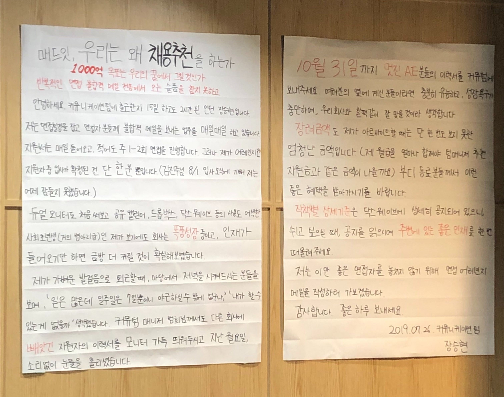
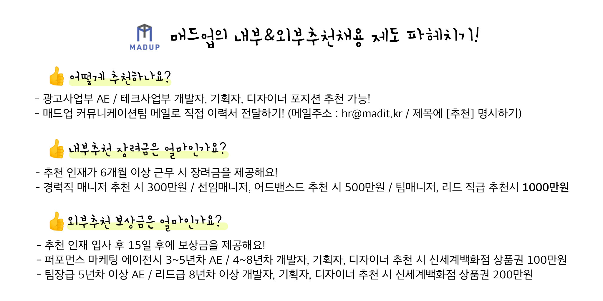
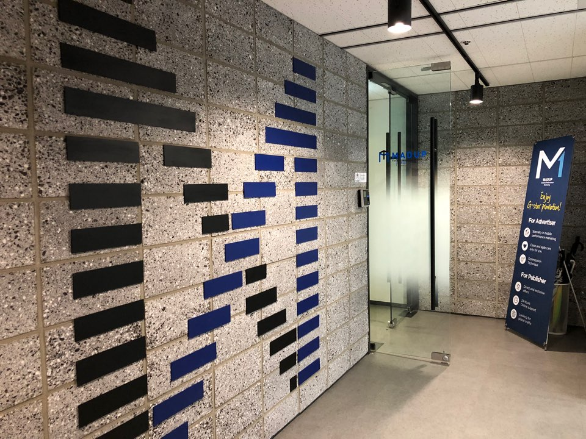
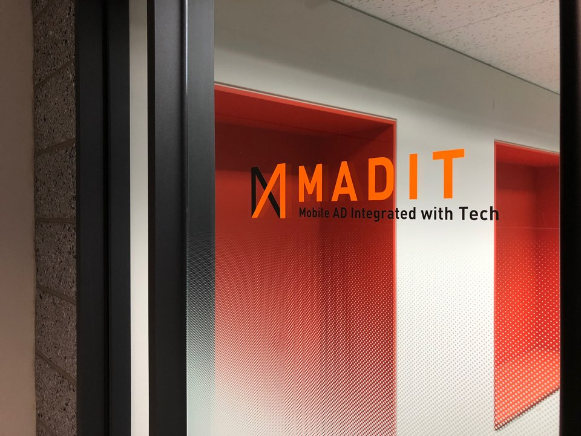

##### 매일 수십 장의 지원서를 검토하는 우리가 '좋은 인재'를 찾는 특별한 방법에 대하여

### 숨어있는 인재를 찾습니다
지난 여름, 날씨만큼 뜨거웠던 외침의 대자보가 매드업 마당 한가운데에 붙었습니다. 호기심 많은 매드업 동료들의 큰 관심을 끌었던 이 대자보의 정체는 우리의 **'추천채용제도'**를 장려하는 한 동료분의 호소문이었습니다. 

네, 매드업은 말그대로 **폭풍성장** 중입니다. 매드업의 성장은 모두가 '절벽을 오른다'고 비유할만큼, 광고집행액 규모만 보아도 전년 대비 매월 40~60%씩 커지고 있습니다. 로켓이 커질 수록 비행사가 많이 필요하듯 인력 규모 역시 2017년 43명에서 현재는 103명으로 2.4배 성장했어요. 매드업의 가파른 성장을 눈여겨보고 함께하고자 하는 뛰어난 지원자분들도 점점 늘어나고 있습니다. 저 역시 커뮤니케이션팀 인턴으로서 날마다 수십 개씩 들어오는 지원서를 업로드하고, 회의실이 부족하도록 바쁘게 면접 일정을 잡으며 숨어있는 보석같은 인재를 찾기 위해 노력합니다.

그래서 대자보를 발견한 후 더욱 궁금증이 생길 수밖에 없었습니다. **'이미 멋진 지원자분들이 끊임없이 매드업의 문을 두드리는데도 불구하고 왜, 매드업은 추천채용제도까지 도입하게 된 걸까?'**하고 말이지요.

### 추천채용, 이래서 합니다!

##### 매드업의 내부&외부 추천채용제도란?
그 이유를 알아보기 전에 먼저 매드업의 추천채용제도에 대해 간단히 소개할까 합니다. 매드업은 현재 회사 내부와 외부 모두를 통해서 인재를 추천받고 있는데요. 우선 내부추천채용 제도는 매드업 동료가 직접 매드업에 적합한 인재나 함께 일하고 싶은 동료를 추천하는 제도입니다. 또한 외부추천채용 제도는 매드업 구성원이 아니더라도 매드업에 추천하고 싶은 인재가 주변에 있다면 누구나 추천할 수 있는 제도예요. 

추천채용제도를 시행하는 회사들은 추천에 대한 보상으로 대부분 100~200만원 정도의 장려금을 제공하고 있어요. 하지만 매드업은 무려 최대 천 만원까지 장려금을 지급하고 있는데요. 매드업이 인재를 찾는데 누구보다 적극적으로 비용을 투자하는 이유는 무엇일까요?

##### 천만원보다 사람과 함께하는 것의 가치를
매드업에 추천채용제도를 도입한 인사담당자 분은 **'동료가 최고의 복지'라는 기업 철학을 그 이유로 꼽았습니다.** 매드업의 기둥과도 같은 이 철학을 바탕으로 두 대표님들 역시 구성원들의 복지가 되어줄 수 있는 분들과 함께 일하는 것에 무척 관심이 많았다고 하는데요. **아무리 뛰어난 인재라도 절벽을 오르는 매드업의 성장과 방향성이 다르다면 서로의 복지가 되어주기 어렵겠죠.** 

담당자 분은 내부 구성원이 추천하는 인재라면 우리의 퍼즐에 딱 들어맞는 좋은 동료가 될 것이라고 생각해 내부추천채용 제도를 처음 도입하게 되었다고 합니다. 사람을 중시하는 매드업 문화의 특성과 급격히 성장 중인 디지털 마케팅 분야의 업무상 핏은 아무래도 함께 일하는 구성원들이 가장 잘 알고 있을 것이기 때문이에요.

또한 사람과의 관계를 중시하는 매드업답게 오랜 기간 같이 일해온 외부 파트너분들이 인재를 추천해주는 경우도 종종 있었다고 하는데요. 진심으로 매드업을 좋아해주고 응원하는 이분들의 마음에 조금이라도 감사를 드리기 위해 외부추천채용 제도까지 도입하게 된 것입니다. 

인사담당자 분께서는 작은 규모로 시작했던 이 제도들이 이제는 더욱 발전해 회사의 좋은 친구들을 많이 만들었다는 점이 정말로 기쁘다고 말합니다. **사람으로 인해 기뻐하고, 좋은 사람과 회사를 연결해준 노력에 적극적으로 감사를 표하는 매드업!** 감사의 마음을 비용으로 환산할 수는 없지만, 좋은 사람과 함께하기 위해서는 비용이 결코 아깝지 않다는 이들의 진심이 전해집니다.

### 좋은 회사에 좋은 동료를, 좋은 동료에게 좋은 회사를

##### "매드업에서 다시 설렘을 찾았어요."
내부추천을 통해 매드업과 함께한지 벌써 3개월이 된 테크사업부 성욱님은, 자신을 추천해준 분과 이전 직장에서 오랜 시간 함께 일해왔기 때문에 **매드업의 장단점에 대해 꾸밈 없이 솔직하게** **들을 수 있었다고 합니다.** 그만큼 그에게 매드업을 선택한 것은 진정성 있는 결정이었어요.
> "책임감으로 다니던 이전 직장에서는 느낄 수 없었던 설렘이 있었고, 회사와 함께 성장해 나가는 것에 대한 기대감이 생겼습니다."

성욱님은 매드업에 방문했다가 갑작스레 대표님과 식사 자리를 갖게 되었고, 함께 얘기를 나누면서 매드업이 얼마나 큰 비전을 가지고 있는지 그리고 직원 복지를 위해 얼마나 노력하고 있는지 알 수 있었다고 하는데요. 매드업을 선택한 이유에 대해 묻자 그는 "나는 아직 배고프다. 매드업에서 하고 싶은 것들이 아직 많다."라고 답했습니다. 

광고사업부 효진님 또한 동료분으로부터 매드업만의 회사 문화에 대해 들을 수 있었고, 회사가 급격하게 성장하고 있다는점과 앱 광고를 전문으로 하는 특성에 매력을 느꼈다고 합니다. 효진님은 매드업이 많이 배우며 한 층 더 성장할 수 있는 기회가 될 것이라 생각해 입사를 결심했다고 하는데요. 결과적으로 추천채용제도는 **매드업에 성장을 추구하는 좋은 인재를 안겨다주었을 뿐 아니라 성욱님과 효진님에게도 좋은 회사에서 설렘을 느끼며 일할 수 있는 기회를 가져다주게 되었습니다.**.

##### "함께 일하고 싶은 동료를 직접 추천해요."
성욱님을 매드업에 추천한 장본인인 테크사업부 제웅님은 인재를 추천한 이유에 대해 **'매드업을 좋은 동료와 함께 더 좋은 회사로 만들고 싶었다'**고 말합니다.

> "꿈을 이루기 위해 도전하고 회사와 함께 성장하는 것을 추구하는 분이라면 같이 즐겁게 일할 수 있을 것이라 생각했고, 성욱님은 그런 분이기 때문에 함께 동료로서 일하고 싶어 추천하게 되었습니다."

제웅님은 **추천채용제도를 통해 좋은 회사를 함께 만들어 나간다는 것이 스스로를 그냥 직원이 아닌 회사의 주인으로 만들어주는 것 같다**고 말합니다. 더군다나 자신의 추천을 믿고 인재를 채용했기 때문에 그만큼 회사에 대한 애정과 책임감이 생겼다고 하는데요. 때문에 그는 추천채용제도를 좋은 동료를 모으는 가장 좋은 방법으로 꼽았습니다. 추천채용으로 좋은 인재를 모으는 동시에 이미 함께하고 있던 동료들에게도 매드업의 사람을 중시하는 기업 문화를 다시금 일깨워주기 때문이죠.

광고사업부 미진님은 효진님을 매드업에 추천할 때 별다른 고민 없이 바로 추천할 수 있었다고 합니다. **미진님에게 매드업은 '서로가 서로를 존중하며 일을 하는 회사'였고 따라서 소중한 동료를 기꺼이 추천하기에 부담이 적었기 때문이에요.** 미진님은 오랜 기간 알고 지낸 효진님과 매드업에서도 함께 하게 되어 마음 역시 든든하다며, 기회가 된다면 더 많은 사람들에게 매드업을 추천하고 싶다고 말했습니다.

이처럼 매드업의 추천채용제도는 회사에게도, 함께하는 인재에게도 잘맞는 짝꿍을 찾아주는 고마운 존재가 되었어요. 더군다나 추천자에게는 보상금까지 지급하니 모두에게 win-win인 제도가 아닐 수 없겠지요.

### 절벽을 함께 오를 인재를 찾다

추천채용제도에 대해 낱낱이 취재하고 나니 이제서야 대자보를 보고 생겼던 의문이 풀리는 듯 합니다. 매드업은 여전히 불티나게 면접 스케줄을 소화하고 있지만, 이제 막 성장의 페달을 밟은 스타트업 특성상 회사가 커가는 속도에 맞춰 회사에 핏한 인재를 찾기에는 장벽이 분명 존재합니다. '좋은 인재'란 완벽한 사람이 아니라 우리와 박자가 맞는 사람인데, 회사의 성장속도만큼 빠르게 이들을 찾아내는 일은 보통 어려운 일이 아니니까요.

한순간에 도전하여 절벽을 오르는 성장, 성취의 짜릿함보다는 차근차근 신중히 언덕의 둘레길을 오르는 안정감을 추구하는 인재들도 있습니다. **반면 우리는 함께 손을 잡고 가파른 절벽을 오르는 인재들과 시너지 효과를 내려합니다.** 어떠한 방식이 더 옳다는 것은 결코 아니지만, 이러한 사람들이 바로 우리를 성장시켜주고 동시에 우리 회사가 성장에 도움을 줄 수 있는 사람들이겠지요. 추천채용제도가 존재하는 이유가 바로 이러한 보석같은 인재를 빠르게 찾기 위함이며 동시에 제도가 많이 알려져야 하는 이유 역시 그렇습니다.
##### 폭풍성장 매드업의 추천채용 공유 이벤트
어떻게 하면 매드업의 추천채용제도를 널리 알릴 수 있을까요? 그 방법으로 작은 이벤트를 준비했습니다. 해당 이벤트에 참여하신 분들 중 추첨을 통해 20분께 스타벅스 아메리카노 기프티콘을 드려요. 단, **참여하신 분들이 100명이 넘을 경우 감사의 마음을 담아 참여자 모두에게 기프티콘을 제공하기로 했습니다**.

맫력어필의 모든 글들은 카드뉴스로도 만들어진다는 사실을 아셨나요? 공유 이벤트는 아티클 하단의 '**카드뉴스 바로가기**'를 눌러 참여하실 수 있습니다. 해당 이벤트 게시글과 Madtech 페이스북 페이지에 응원하는 마음을 담아 '좋아요'를 꾹 누른 후, 댓글로 이벤트 게시글 퀴즈의 정답을 달아주세요. 마지막으로 게시글을 자신의 페이스북 타임라인에 전체보기로 공유하면 참여 완료입니다. 더욱 많은 분들이 매드업의 추천채용제도에 대해 아셨으면 하는 마음을 담았습니다.

매드업은 여전히 폭풍성장 중이고, 매드업과 함께 성장하는 것을 진정으로 즐길 수 있는 분들을 기다리고 있습니다. 매드업의 성장 로켓에 함께 해주세요! 그리고 추천해주세요. 함께 절벽을 올라 정상에 깃발을 꽂아봅시다.

**공유 이벤트에 참여하고 싶다면?**  
[카드뉴스 바로가기](http://bitly.kr/zZ1Rk0lJ)  
**폭풍성장 매드업에 인재를 추천하고 싶다면?**  
hr@madit.kr로 이력서를 전달해주세요 :)  
**추천보다 내가 직접 지원하고 싶다면?**  
[매드업 채용 바로가기](https://www.notion.so/78775178b17243c8b00112447343ab22)

