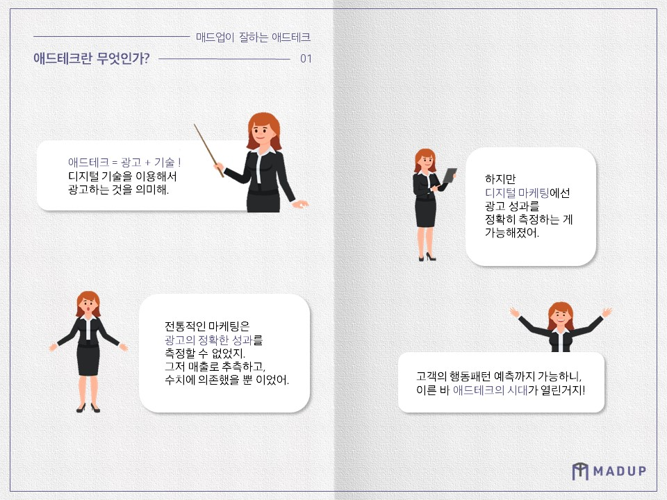
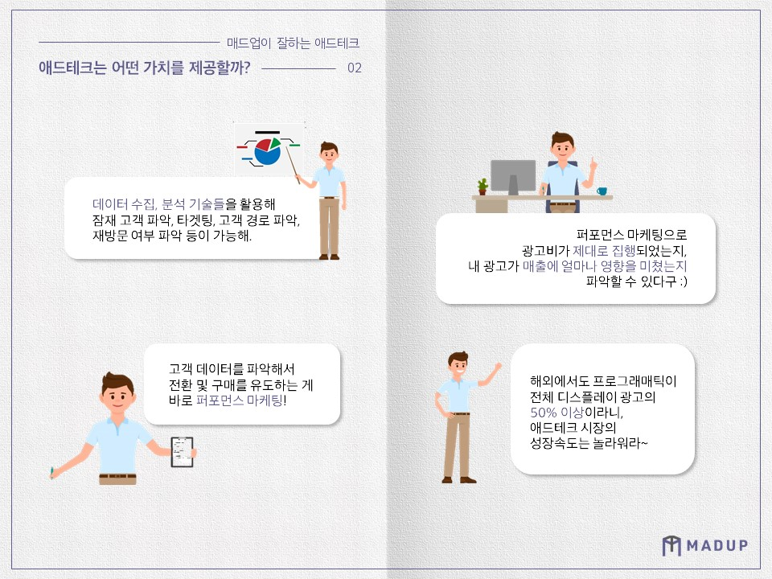
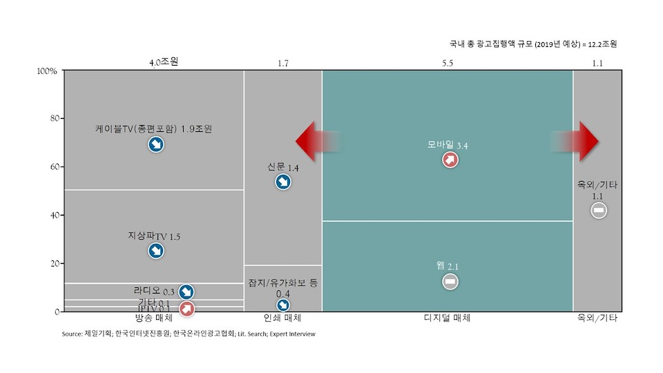
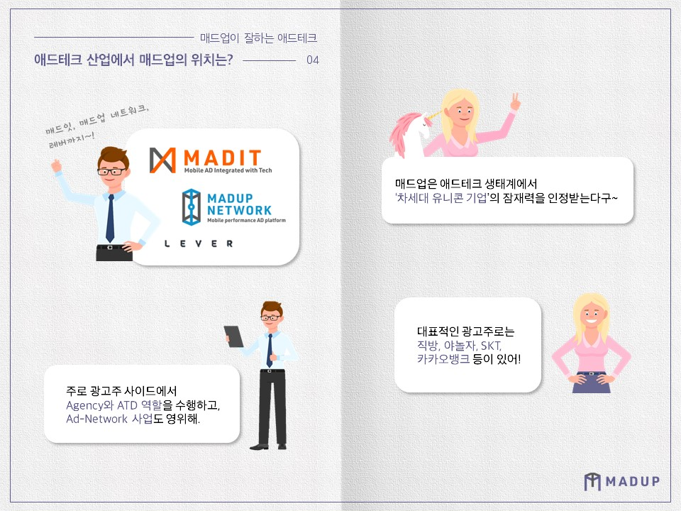
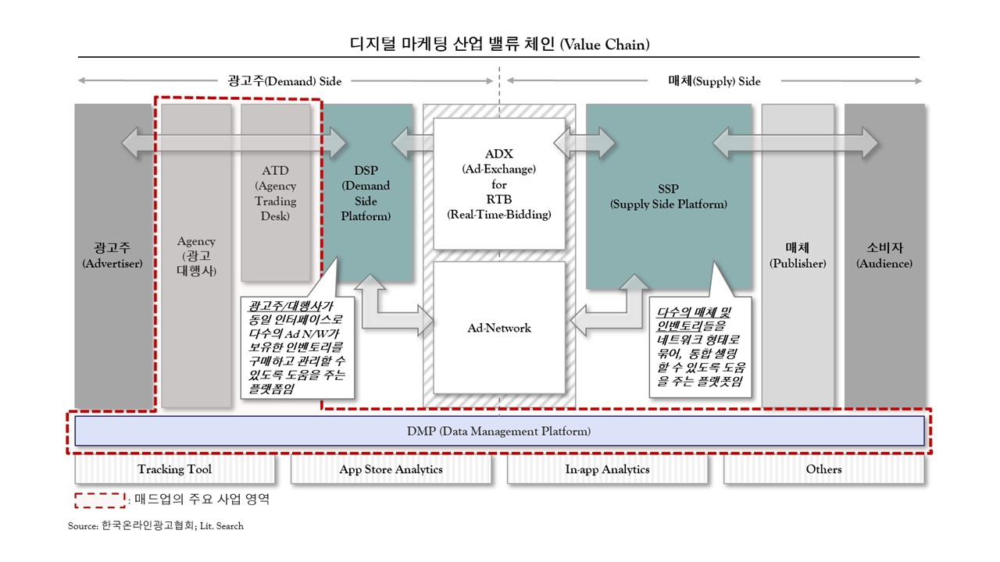

폭풍 같은 성장으로 광고업계에서 주목을 끌고 있는 '매드업'. 첫인상부터 강렬한 매드업이라는 이름에는 '모바일 애드업'이라는 의미와 '미친듯한 성장'이라는 두 가지 의미가 숨어 있는데요. **안 그래도 요즘 핫한 애드테크를 매드업이 그렇게 잘한다는데,** 애드테크란 대체 무엇일까요? 그리고 애드테크는 왜 요즘 주목을 받고 있는 걸까요? 매드업에게 직접 물어봤습니다.

### 애드테크(Ad-Tech)란 무엇인가?
“애드테크”란 **광고(Advertising)에 기술(Tech)을 접목**시킨 것으로 **디지털 기술을 이용해 광고하는 것을 의미**합니다.
**전통적인 마케팅 방식**은 광고에 따른 정확한 성과를 측정할 수 없었습니다. 단순히 매출의 증감 추이를 보고 마케팅 캠페인이 성공적이었는지, 실패하였는지를 판단하며, **경험적인 추측과 대략적인 수치에 의존하여 결과를 제시하는 것이 전부**였죠. 그러나 디지털 마케팅에서는 다양한 기술들을 활용하여, **디지털 고객 여정(Digital Customer Journey) 각 단계 별로 광고 성과를 정확히 측정**하며, 이 후 온라인 상의 행동패턴에 대한 예측까지도 가능하게 되었습니다. 이른 바, 애드테크의 시대가 열린 것입니다.

### 애드테크(Ad-Tech)가 주목받게 된 배경은 무엇이며, 어떤 가치를 제공하는가?
애드테크 시대에는 다양한 데이터 수집, 분석 기술들을 활용하여,
* 잠재 고객을 파악하고, 
* 맞춤화된 타겟팅 알고리즘을 활용하여 광고를 집행할 수 있으며, 
* 내 고객의 주요 관심사는 무엇인지, 내 고객이 어떤 경로로 유입되었으며, 
* 유입 이후 실제 매출이 발생하기까지 이뤄지는 과정은 어떠한 지, 
* 매출이 일어난 후 재방문/재구매가 다시 이루어지는지 등을

파악하는 것이 가능하게 되었으며, 많은 기술 기반 회사들이 이를 통해 다양한 서비스를 제공하고 있습니다.

##### 애드테크, 퍼포먼스 마케팅에 주목하다
데이터를 기반으로 디지털 상의 고객 데이터를 파악하여, 전환/구매를 유도하는 것이 바로 **퍼포먼스 마케팅**입니다. 광고에 대한 효율을 정확히 측정하여, 성과를 극대화하며 다양해진 광고매체 사이에서 효과가 좋은 매체와 그렇지 않은 매체를 선별해낼 수 있습니다. 
퍼포먼스 마케팅을 이용해 디지털 광고비가 제대로 집행되었는지, 내가 집행하는 광고가 목표하는 매출액을 달성하는데 얼마나 영향을 미쳤는지 등을 파악하여 디지털 마케팅 전략 수립에도 반영할 수 있습니다. 또한 데이터를 이용해 프로그램이 자동으로 오디언스(audience)를 분석하고 타깃에 맞춘 광고를 띄워주는 프로그래매틱 바잉(programmatic buying)으로 광고비 지출을 최적화하고, 전환율을 높일 수 있는 작업도 가능합니다.

점점 세분화된 고객 니즈와 타겟팅이 요구되면서 고객정보와 데이터를 바탕으로 개인화 마케팅이 구현되면서 오디언스 타겟팅(audience targeting)의 중요성도 커지고 있습니다. 프로그래매틱 바잉을 통한 디스플레이 광고 플랫폼인 구글GDN은 이미 타겟 데이터를 추출하여 GA(구글 애널리틱스)와 연결한 데이터를 제공하고 있으며, 해외(미국/유럽 등 글로벌시장)에서도 프로그래매틱이 전체 디스플레이 광고의 50% 이상의 비중을 차지하고 있는 등, 애드테크 광고시장은 지속적으로 성장하고 있습니다.

### 애드테크 산업의 향후 전망은 어떠한가?
국내 연간 총 광고집행액 규모는 약 12.2조원입니다. 이 중 디지털 광고에 속하는 모바일 및 웹(PC) 광고 집행액 규모는 약 5.5조원으로 전체 집행액 중 무려 45% 비중을 차지하고 있습니다. 
지상파TV, 케이블TV, 신문 등 전통 매체의 집행 규모는 지속적으로 하락하고 있는 추세이고, 모바일 광고가 큰 폭으로 성장하며 그 비중을 지속적으로 넓히고 있습니다. 과거 3년 간 연 평균 성장률은 30%를 상회할 정도로 고성장하고 있으며, 향후에도 20% 이상의 고성장세를 유지할 것으로 많은 전문기관들이 예상하고 있습니다.

소비자들의 매체 소비는 과거 TV, 신문, 라디오 등 전통 매체에서 모바일, 인터넷 등 신규 매체로 쉬프트(shift)되고 있으며, 특히 저연령 층을 중심으로 신규 매체 소비 비중이 급격하게 늘어나고 있습니다. 최근 통계 조사에 따르면, 10대-20대 소비자들의 모바일 및 인터넷 매체 소비 비중이 70%를 상회한 수준이라고 합니다. 이처럼 모바일 및 인터넷 매체의 소비 비중이 높아질수록 광고주들의 해당 매체에 대한 집행도 함께 늘어날 것으로 예상되고 있습니다.

### 애드테크 산업에서 매드업의 위치는?
매드업은 
* 디지털 마케팅 에이전시 사업 - 브랜드명: 매드잇(MADIT)
* 다양한 affiliate 매체들을 네트워크화하여 제공하는 애드 네트워크 사업 – 브랜드명: 매드업 네트워크(MADUP Network)
* AI 기술을 활용한 디지털 마케팅 자동화 솔루션 사업 – 브랜드명: 매드업 레버(Lever)

이렇게 세 가지 사업을 영위하고 있습니다.

디지털 광고 산업의 밸류 체인 상에서 보면 주로 광고주 사이드에서 Agency 역할과 ATD 역할을 수행하고 있으며, 매드업 네트워크는 Ad-Network 사업을 영위하고 있습니다. 이 외에도 자체 보유한 트랙킹 기술, 데이터 분석 기술들을 활용한 DMP 기반 사업도 진행하고 있어요.

매드업은 시장에서 기술 경쟁력을 인정 받아, 국내 유수의 벤처 캐피탈과 사모투자펀드로부터 총 150억원 규모의 누적 투자를 성공적으로 유치했습니다. 매분기 전년 동기 대비 50% 이상의 초고속 성장을 기록해오고 있으며, 애드 테크 생태계에서 **🦄차세대 유니콘 기업🦄**으로의 성장 잠재력을 보유한 기업으로 평가받고 있습니다.
매드업의 대표적인 광고주로는 **직방, 야놀자, SKT, 카카오뱅크, 아모레퍼시픽, 코오롱FnC, W컨셉** 등이 있으며, 유치한 투자금을 활용하여 기술 및 데이터 기반 경쟁력 강화, 우수 인재 확보, 영업 확대 등에 활용하며 고속 성장을 계속 이어갈 계획입니다!

매드업의 좀 더 구체적인 사업 내용과 어떤 구성원들이 있는지에 대해서는 추후 콘텐츠들을 통해 다시 공개해드릴 예정입니다! 😊

**2편에서 계속됩니다 →**

**매드업은 지금 채용 중!**
[매드업 채용 바로가기](https://www.notion.so/78775178b17243c8b00112447343ab22)

