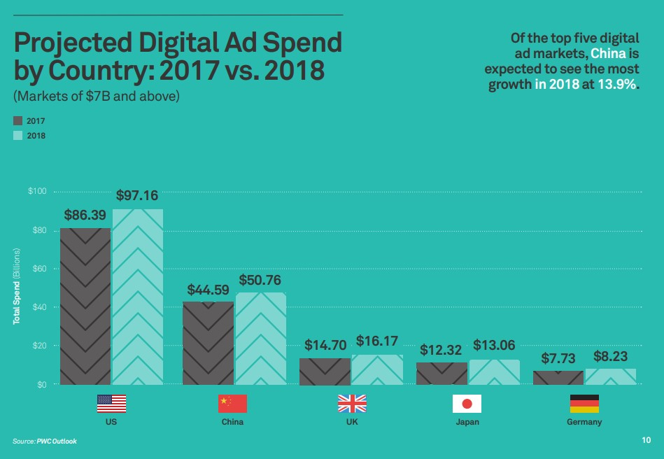
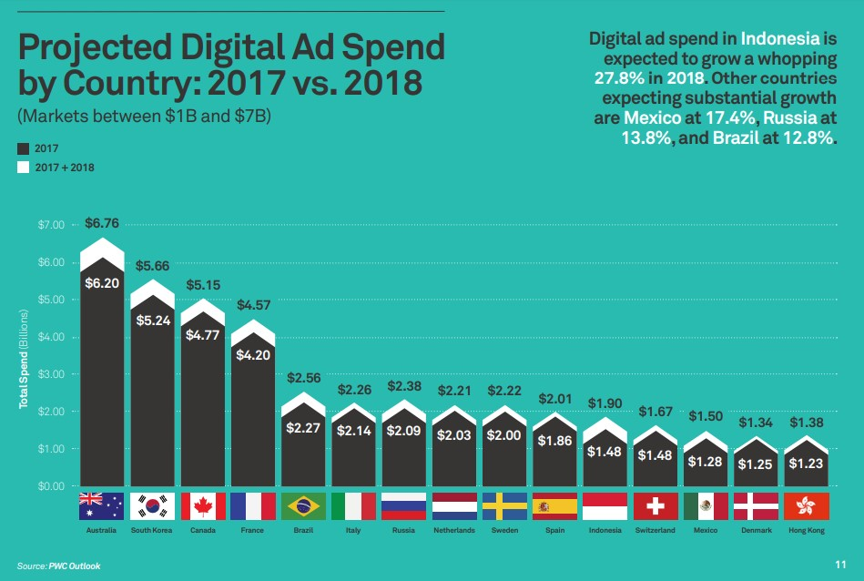
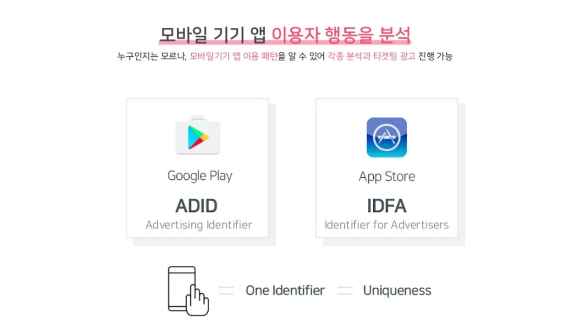
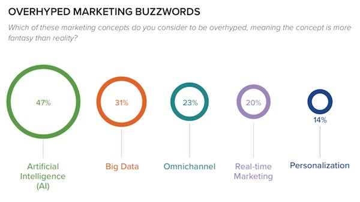
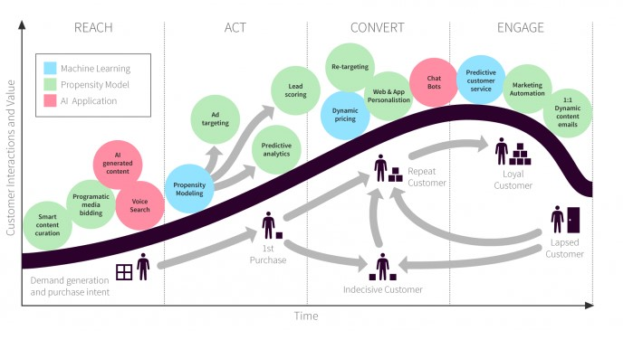

지난 편에서는 매드업이 잘하기로 소문난 애드테크란 대체 무엇인지, 애드테크가 요즘 얼마나 핫한지, 그리고 매드업은 어떤 애드테크를 하는지에 대해 소개해드렸는데요. 오늘은 조금 더 세부적인 이야기를 해볼까 합니다. 

### 애드테크(Ad-Tech) 글로벌 시장은 지금
세계에서 디지털 광고를 가장 많이 하는 나라는 어디일까요? 아래 그래프에서 글로벌 Top 5 디지털 광고 집행 국가를 살펴보면 미국, 중국, 영국, 일본, 독일 순입니다. 압도적으로 1위를 차지한 미국에서는 2018년 기준으로 연간 약 100조원 이상이 디지털 광고에 집행되었다고 하니, 역시 천조국 답네요!

(출처: PwC Outlook)

##### 구글? 유튜브? 알고보면 애드테크가 핵심이다
이쯤 되니 우리나라의 디지털 광고 집행 규모가 궁금해집니다. 대한민국은 전세계에서 7번째로 디지털 마케팅 집행액이 높은 국가인데요. 2018년 기준으로 약 6조원 이상 집행한 것으로 집계되고 있으며, 2024년까지 10조원 이상의 규모로 쭉쭉 성장할 것으로 기대됩니다. 이는 매드업이 속한 비즈니스 도메인이 규모(글로벌 150조 이상, 국내 6조원 이상) 측면에서나, 성장성 측면(국내 기준 매년 20% 이상 성장)에서나 굉장히 매력적이라는 뜻이기도 하죠.
모두가 아는 글로벌 IT 기업인 구글과 페이스북의 경우에도 2019년 기준 각각 전체 매출의 83%, 93%가 광고 사업에서 발생합니다. 구글과 페이스북은 정보 검색 서비스와 SNS 서비스를 제공하고 있지만, 실제로는 광고를 통해서 대부분의 수익을 발생시키고 있는 것이지요! 최근 언론을 통해 실적을 최초로 공개한 유튜브의 경우에도 2019년 한 해 동안 광고 사업으로만 18조원 이상의 매출을 기록할 정도로, 바야흐로 디지털 광고의 시대가 도래하고 있습니다.
이렇게 보면, 구글, 페이스북, 유투브, 인스타그램 등 미국의 주요 IT 기업들은 플랫폼 업체임과 동시에 Ad-Tech 업체라고 해도 무방할 것 같네요.

(출처: PwC Outlook)

##### 스마트폰, 디지털 마케팅의 중심이 되다
대한민국의 디지털 마케팅 시장이 전세계에서 7번째나 큰 시장이 될 수 있었던 주요 배경은 잘 갖춰진 통신망과 높은 스마트폰 보급률이라고 합니다. 참고로 대한민국의 스마트폰 보급률은 95%를 이미 넘었고, 무려 전세계 1위 입니다! 보급률만 보면, 미국보다도 10%p 이상 높은 수준이네요!

스마트폰 보급이 디지털 마케팅에 왜 중요할까요? 바로 스마트폰은 디지털 마케팅이 더욱 발전하고, 정교화되는 결정적인 배경이기 때문입니다. 모든 스마트폰은 흔히 ADID (advertising ID) 또는 IDFA (Identifier for Advertiser)라고 불리는 기기 식별 ID를 가지고 있는데요. ADID는 구글이 2014년에 도입한 것으로 각각의 스마트폰에 알파벳과 숫자가 조합된 32자리의 고유번호이며, IDFA는 애플이 도입한 고유번호입니다. 

(출처: IGA웍스)

디지털 마케팅 업체들은 이 코드를 통해 기기를 식별할 수 있으며, 각 기기들의 사용 패턴과 구매 행동 등의 다양한 데이터 트랙킹이 가능합니다. 모바일 앱 마케팅의 목표이자 KPI는 ‘유저 획득’과 ‘유저 당 가치 극대화’인데요. 디지털 마케터(혹은 퍼포먼스 마케터)는 스마트폰마다 부여된 ADID, IDFA 데이터와 수많은 3rd Party 업체들이 제공하는 트랙킹 도구, 분석 솔루션들을 활용하여, 어떤 매체에서 얼마의 고객 획득비용(Acquisition cost)으로 얼마나 많은 유저를 획득하였는지 등을 아주 정밀하게 측정할 수 있습니다. 
또한 매체별, 크리에이티브별, 캠페인별, 타겟 오디언스 별 마케팅 효과 측정이 가능하기에 이에 따른 최적화도 가능하니, 이제 마케팅계의 대세는 디지털 마케팅이라고 해도 과언이 아니겠죠!

다음으로는 디지털 마케팅 업계에서 가장 핫한 토픽이면서도 다소 과장된 측면이 있는 키워드들에 대해 다뤄보겠습니다. 바로 인공지능(AI)와 빅데이터 입니다!

### 인공지능(AI)과 빅데이터

(출처: Resulticks)

인공지능(AI) 기술은 디지털 마케팅, 애드테크 분야 내 고객 확보(Acquisition) 단계에서부터 육성(Cultivation), 리텐션(Retention) 전 영역에 걸쳐 영향을 미치고 있습니다.

(출처: Digital Marketing Summit Korea 2020)

광고주(혹은 판매자)가 소비자(혹은 타겟 오디언스)를 포착하는 시점, 행동을 유도하는 시점, 구매로 전환하는 시점, 그리고 구매 확정에 이르게 하는 시점 등 모든 과정에서 AI/빅데이터 기술을 활용한 분석/모델링이 활용되고 있습니다. 현재 업체들은 AI/빅데이터 기술을 활용하여 과거에는 수행하지 못했던 분석을 수행하거나 실시간으로 결과를 도출하지 못했던 분석들을 가능하게 하고 있으며, 구글, 세일즈포스, Adobe 등 글로벌 선도 업체들이 다양한 분석 솔루션들을 오픈 소스로 제공하며 AI 생태계를 발전시켜 나가고 있습니다.

##### 애드테크 강자 매드업의 AI 그리고 빅데이터
매드업도 AI/빅데이터 기술을 활용한 자동화 솔루션을 열심히 개발하고 있는데요. 
* 과거 사람이 하던 일을 기계(machine)가 하도록, 
* 과거 사람이 못하던 일을 기계(machine)가 할 수 있도록 하는데 초점을 맞추고 있습니다. 

실제로 매드업에는 개발자, 데이터 사이언티스트, AI 스페셜리스트 분들이 열심히 연구 개발에 집중하고 계십니다! 이제는 “디지털 퍼스트”, “모바일 퍼스트”의 시대를 지나 “AI 퍼스트”의 시대가 도래하였으며, 매드업은 애드테크 선도 기업으로서 이처럼 시대의 파도를 앞장 서서 헤쳐 나가고 있습니다.

애드테크 업계 선도 업체인 크리테오의 언론 기사 주요 Quote로 이 글을 마무리하고자 합니다.
> “애드테크 기술은 광고 운영을 사람이 하는 것이 아니라, 기계가 스스로 학습해서 이뤄지도록 하는 과정이 본질입니다. 기계가 학습하기 위해서는 많은 양의 데이터가 필요합니다. 
크리테오가 애드테크에 집중해온 이유는 다른 어떤 산업보다 많은 양의 데이터가 존재하기 때문입니다. 많은 데이터는 더 좋은 학습을 가능하게 하며, 데이터가 축적되면 축적될수록, 초격차를 만들어낼 수 있다고 믿습니다.”

AI 퍼스트 시대에 매드업은 얼마나 성장하고 또 어떤 모습으로 발전하게 될까요? 앞으로도 애드테크 강자 매드업의 행보를 기대해주세요 :)

**1편 보러가기**
[매드업이 잘하는 AD-TECH(1)](https://tech.madup.com/madup-adtech-1/)

**매드업은 지금 채용 중!**
[매드업 채용 바로가기](https://www.notion.so/78775178b17243c8b00112447343ab22)

