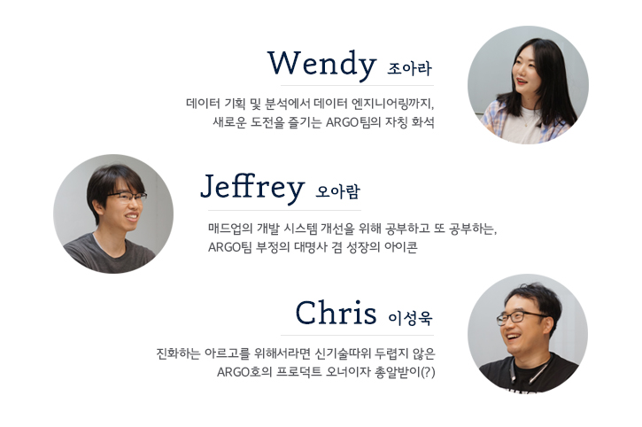
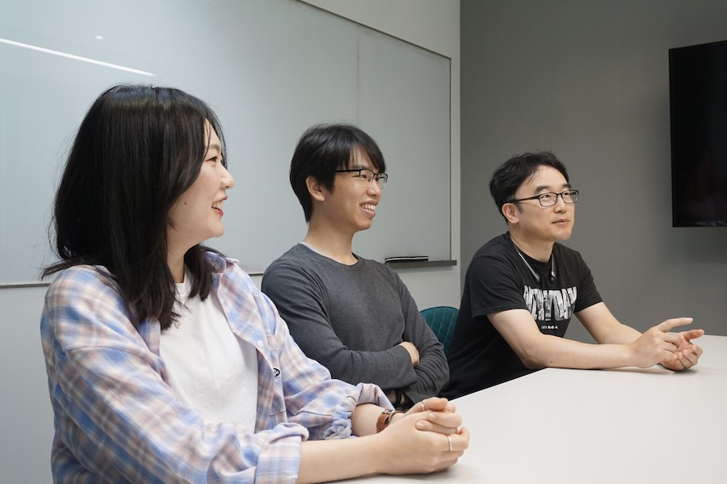
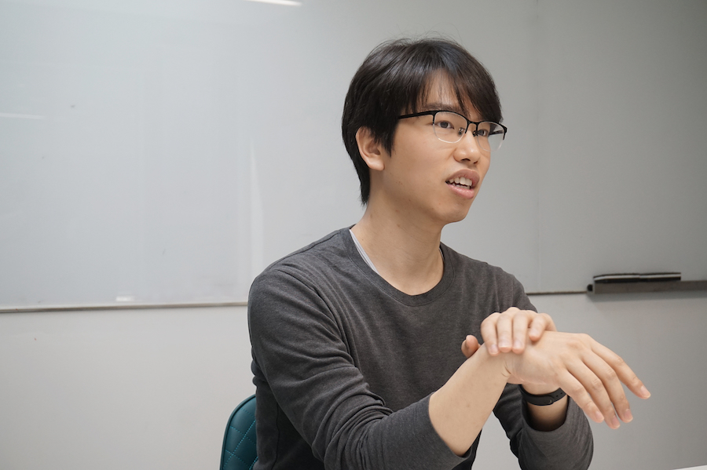
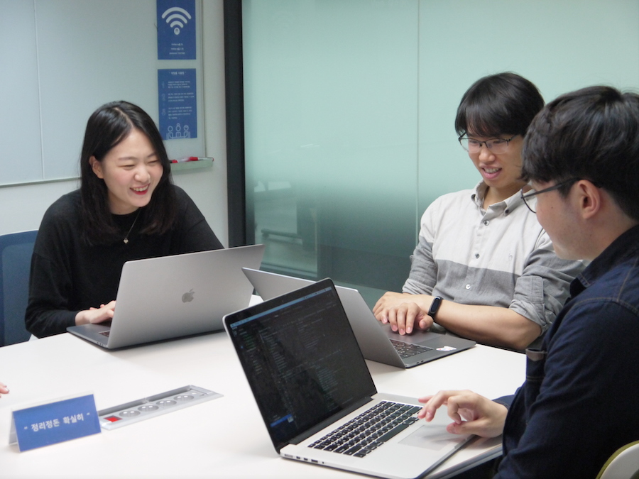
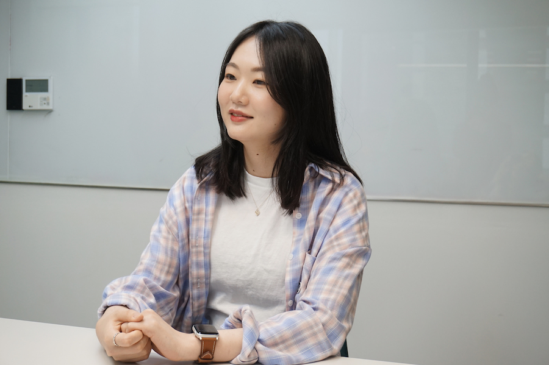
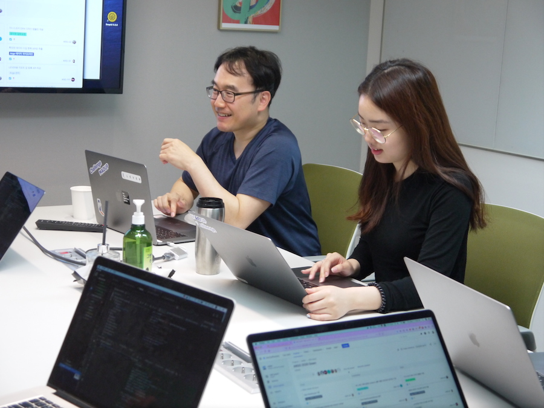
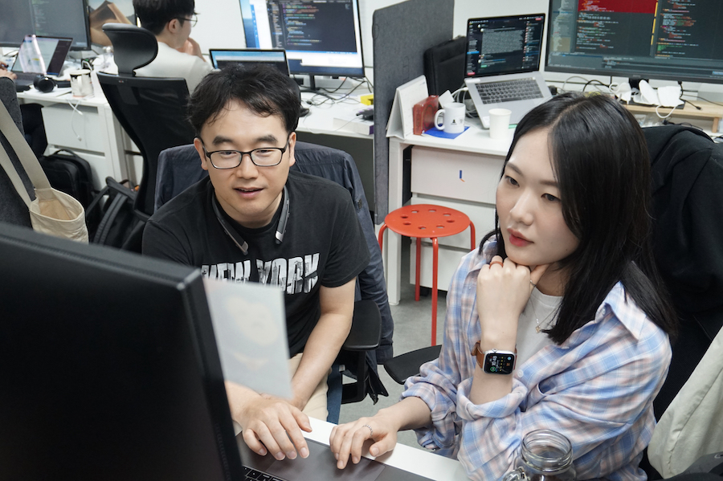

## 매드업의 아르고호를 만나다
아르고 원정대 이야기를 아시나요? 아르고호는 우리도 잘 알고 있는 고대 그리스 로마 신화에 나오는 모험의 배 이름이죠. 전설의 황금 양털을 가져오기 위해 아르고호에 탑승한 영웅들은 세이렌의 노랫소리에도 굴하지 않고, 부딪히면 결코 살아남을 수 없다는 무시무시한 절벽 사이로 돌진하기도 하는데요. 온갖 괴물과 거친 파도를 헤치며 용감하게 바다를 항해하는 이들의 이야기는 우리로 하여금 가슴을 두근거리게 하기도 하고, 진정 위대한 여정이 무엇인지 떠올리게 하기도 합니다. 

그런데 매드업에도 모험의 바다를 누비는 아르고 원정대가 있습니다. 바로 매드업의 바다를 만드는 영웅들, 테크사업부의 ARGO팀입니다. 이들은 매드업의 모든 데이터가 잘 흐를 수 있도록 데이터의 바다를 구축하고, 흐르는 데이터 속에서 자유롭게 헤엄칠 사람들을 찾고 있다고 하는데요. 이들이 찾고자 하는 전설의 보물은 무엇일까요? 그리고, 이들이 항해 끝에 도달하고자 하는 미지의 영토는 어디일까요? ARGO팀을 직접 만나 이야기를 들어봤습니다.

## 데이터가 흐르는 곳에 ARGO가 있다
**반갑습니다, ARGO팀! 간단히 자기 소개 부탁드려요.**  
**Wendy** : 안녕하세요! ARGO팀에서 데이터 엔지니어로 일하고 있는 조아라(Wendy)라고 해요. ARGO팀 중 매드업에 합류한지 가장 오래돼서, 일명 화석을 담당하고 있어요.

**Jeffrey** : ARGO팀에서 부정의 대명사를 맡고 있는 오아람(Jeffrey)입니다. 주로 회의 중에 반대 의견을 내는 역할을 해요. ARGO 시스템 유지 보수 및 개선 작업을 하고 있어요.

**Chris** : ARGO팀의 프로덕트 오너이자 총알받이를 담당하고 있어요. 총알은 외부에서만 날아오는 건 아니더군요. 😂

**정말 개성넘치는 다양한 분들이 모여계시는 팀 같아요. ARGO팀은 매드업에서 어떤 일을 하나요?**

**Wendy** : 광고사업부와 협업해서 여러 디지털 광고 매체와 트래커의 데이터를 수집하기도 하고, 광고 운영 최적화를 자동화하기도 해요. AE의 업무 중 기술로 대체할 수 있는 부분이나 기술이 더 유용하게 쓰일 수 있는 부분을 최대한 지원하고 있죠. AE분들이 인사이트 도출, 광고주 대응 등 더 가치 있는 일들에 집중할 수 있도록 도움을 주는 역할을 한다고 보시면 될 것 같아요.

**Jeffrey** : 맞아요. 애드테크 시장에서 기존에 마케터들이 하던 업무를 컴퓨터에게 시켜서 더 빠른 데이터 분석과 더 정확한 광고 운영을 돕는 플랫폼을 개발하는 일을 해요. 이 일은 매드업에서 가장 중요하고 핵심적인 일이라고 생각해서, ARGO팀이 매드업의 심장이라고 자부할 수 있습니다.

**말씀하신 플랫폼에 대해 더 자세히 알고 싶어요.**

**Chris** : ARGO팀이 매드업을 위해 개발하는 플랫폼의 이름이 바로 ARGO인데요. 데이터의 수집, 전처리, 저장 및 분석에 대한 일련의 프로세스를 자동화 하고 효과적으로 운영할 수 있도록 해주는 플랫폼이죠. AWS Cloud 기반의 Serverless 환경으로 구축되어 있고, 보다 많은 자원을 필요로 하는 무거운 작업을 위해 ec2까지 확장 가능한 구조로 되어 있어요.

## 미지의 영토를 향하여
**ARGO팀의 비전은 '데이터가 흐르는 조직, 데이터가 흐르는 회사'라고 들었어요. 어떤 의미를 가지고 있는 비전인가요?**

**Chris** : ARGO가 플랫폼 그 이상의 의미를 갖기 위해서는 데이터를 빼놓을 수 없어요. 그리고 데이터를 흐르게 하는 것은 단순히 데이터를 모아두는 것 이상의 의미를 갖고 있다고 생각해요. 

흔히 더 이상 성장하지 못하고 멈춰 있는 상황을 고인물이라고 하잖아요? 고여 있는 물은 결국 썩게 되거든요. 저희는 방대한 양의 광고 데이터를 저장하는 것 뿐만 아니라, 데이터 분석을 통해 그 안에서 의미 있는 값을 찾아 낼 수 있다면 점점 선순환하는 데이터 흐름을 만들어낼 수 있다고 생각했어요. 또 이 흐름은 회사가 지속적으로 성장해 나갈 수 있는 원동력이 될 거고요. 그래서 '데이터가 흐르는 회사'를 만드는 것을 비전으로 잡았습니다.

**데이터가 흐른다고 하니 마치 출렁이는 바다가 떠오르는데요. ARGO팀의 이름도 신화에 나오는 배 이름인 '아르고호'에서 영감을 얻었다고 들었는데 맞나요?**

**Chris** : 네, 맞아요. 전설의 보물을 찾아서 미지의 바다를 항해하는 이야기로 유명한 아르고호의 이름을 따왔어요.

**그렇다면 ARGO팀이 데이터의 바다를 구축해서 찾고자 하는 전설의 보물이란 무엇일까요?**

**Chris** : 광고 운영 완전 자동화라고 할 수 있겠네요. 저희의 일차적인 목표는 회사에서 관리하는 모든 데이터가 데이터 레이크(Data Lake)에 모여지고, 데이터 파이프라인을 통해 구조화돼서 광고사업부 AE분들께 의미있는 데이터로 전달되게끔 하는 것인데요.

이 단계에서 데이터 레이크가 완성이 되더라도 플랫폼 위에서 데이터가 자동화되어야 합니다. 그래야 AE분들의 소모적인 업무를 덜어주고, 회사 전체적으로 자동화가 되는 동시에 생산성이 높아지니까요.

**광고 운영 완전 자동화라니, 듣기만해도 놀라워요! 이 목표를 달성하기 위해 ARGO팀에서는 어떤 노력을 하고 있나요?**

**Chris** : 광고 데이터 뿐만 아니라 누구나 얻을 수 있는 공공 데이터를 수집해서 거대한 데이터 레이크와 데이터 웨어하우스(Data Warehouse)를 구축하고 있어요. 이 웨어하우스를 기반으로 한 최상의 분석 환경을 제공해주는 것을 목표로 ARGO 플랫폼을 구축 중이에요.

**그런데 정말 사람의 개입 없이 광고가 운영되는 날이 올까요? 말그대로 '전설의' 보물 같은데요.**

**Chris** : 맞아요. 어려운 일이에요. '완전 자동화를 다 할 수 있느냐?'는 질문에 대해서는 늘 미지수인지라, 말 그대로 미지의 영역을 향해 가는거죠. 효과적인 광고 운영을 위해선 어떤 광고 소재를 만들어야 하는지, 누구를 대상으로 어떤 매체를 통해 광고를 노출시킬 것인지 등 수많은 것들을 고려해야 하니까요. 시장의 상황도 사람들의 취향도 계속해서 변하기 때문에 정해진 답이란 건 앞으로도 존재하지 않을 겁니다. 

그래서 저희는 완전 자동화를 목표로, 여러 가지 운영 항목들 중에 일부를 단계별로 자동화 시켜가고 있는 단계예요. 그러다 어느 순간 사람의 개입이 전혀 없이도 광고를 자동으로 만들고 운영하게 되는 시점이 온다면, 광고 운영이 완전 자동화 되었다고 할 수 있지 않을까요? **(언제쯤 가능할까요?)** 글쎄요. 제 욕심일 수도 있겠지만 2022년에는 가능하지 않을까요? 😊

## 새로운 파도를 항해하는 아르고호
**팀원분들께서도 Chris가 말해준 비전을 충분히 공유하고 있는 것 같아요. 이런 멋진 비전을 뒷받침해줄 ARGO팀만의 개발 기술력이 있다면 소개해주세요!**

**Jeffrey** : ARGO팀은 최근 클라우드 서비스의 발달로 주가가 오르고 있는 Serverless 기술을 적극적으로 활용하고 있어요. 이 기술을 통해 종래의 서버 구축과 유지에 필요한 자원을 서비스 개발에 활용할 수 있기 때문에, 서비스의 품질에 집중할 수 있다는 장점이 있죠.

**Chris** : Jeffrey가 말해준 것처럼 ARGO팀에서는 어떻게 하면 최소한의 비용으로 최대 효율을 낼 수 있는가에 집중하고 있어요. ARGO 플랫폼이 클라우드 기반 서비스들을 활용하여 설계된 것도 그러한 이유라고 할 수 있죠.

저희는 Serverless 기반으로 RDS, S3, CloudWatch, Lambda, API Gateway, Route53, SQS, Athena 등을 활용하고 있고, 그 외에도 필요한 기능이 있다면 지속적으로 플랫폼을 확장해 나가고 있는데요.
최근에는 자동화 구현 범위가 점점 넓어지면서 Serverless 환경만으로는 처리 할 수 없는 요구사항들이 생겨났고, 이를 수용하기 위해 서버 기반에서 운용되는 새로운 파이프라인을 확장하여 연결했어요. 아직은 만들어져 가는 단계이지만 Data Visualization을 위한 Tableau Server도 구축하여 운영하고 있습니다.

**기술력 외에도 자랑할만한 개발 문화가 있을까요?**

**Jeffrey** : 적극성과 수용력의 콜라보! 개발과 관련해서 도입해야 할 기술이나 추가되어야 할 기능, 개선해야 할 점 등을 서로 적극적으로 의논하면서도 다른 사람의 의견을 진지하게 듣고 받아들일 수 있는 유연함이 자랑이에요.

**Chris** : 무엇보다 개발자에게 가장 좋다고 느껴지는 부분은 ARGO 플랫폼이 계속해서 진화하고 있다는 점과 실운영으로 연결되어 있다는 점이에요. 

모든 회사에서 가장 많이 쓰는 용어가 '플랫폼을 개발한다'는 것인데요. 플랫폼 개발이 안정화되는 것도 중요하지만 개발자로서는 신기술을 끊임없이 접해보고 접목시키는 것도 매우 중요해요. 이런 면에서 ARGO팀은 신기술을 도입할 때 주저하지 않고 실무에 적용하며, 그 때 그 때 실운영에서 피드백을 받을 수 있기 때문에 자랑할만한 개발문화를 가지고 있다고 생각해요.

**이렇게 끊임없이 도전하는 문화에 대해 팀원분들은 어떻게 느끼실지 궁금해지는데요.**

**Wendy** : 늘 자극이 되고, 새로운 것들을 공부하도록 만드는 좋은 원동력이라고 느껴요. 덕분에 저도 나날이 성장하고 있어요!

**Jeffrey** : 새로운 기술은 익히는 시간이 필요하기 때문에 그만큼 업무 난이도가 상승하는데, 그런 것들을 회피하거나 배척하지 않고 적극적으로 도입하는 모습을 보며 저도 영향을 많이 받아요. 그래서 항상 업무에 도움이 될만한 새로운 기술, 기존에 도입했던 기술의 보완점을 틈틈이 공부하며 업무에 반영하려고 노력하고 있습니다.

**개발적인 부분을 떠나서, ARGO팀의 팀내 분위기는 어떤가요?**

**Wendy** : 자유롭고 편안한 분위기😎 하루에도 몇 번씩 시도 때도 없이 깨알 개그를 치시는 Chris 덕분에 모두들 즐겁게 일하고 있습니다 :)

**Jeffrey** : 맞아요. 업무 외에도 팀에서 간식을 먹거나 회식을 할 때, 모두가 적극적으로 자기 의견을 내면서도 빠르게 다른 의견에 수긍하는 모습을 재미있게 보곤 합니다. 😆

## ARGO와 함께한 여정, 함께할 여정
**데이터에 대해 잘 모르는 저도 ARGO팀의 매력에 빠질 것 같네요. 자유롭고 도전적인 팀 분위기 덕분에 세 분 모두 ARGO팀과 함께한 시간만큼 스스로도 많이 성장하셨을 것 같아요.**

**Wendy** : 저는 처음에는 개발 직무가 아닌 데이터 기획 및 분석 직무로 입사했지만 데이터 엔지니어링에 관심을 갖게 되어 직무를 전환한 케이스인데요. 그만큼 직무 스킬을 늘리려고 항상 노력하고 있는데, 늘 새롭고 도전적인 과제가 주어지는 ARGO팀 덕분에 많이 배우고 성장하고 있어요.

**Jeffrey** : 저도 기술적으로 많은 성장을 했어요. 특히 학교에서만 보고 들었던 기술과 이론을 실무에 활용하게 되니 더 앞선 기술을 계속해서 흡수해야 했다는 점이 도움이 됐던 것 같아요. 

**Chris** : 저 역시 ARGO팀의 다양한 기술스택 덕분에 많은 경험을 쌓을 수 있었다는 게 가장 크게 성장한 점이 아닐까 싶어요. 저는 아직 다듬어지는 과정 중에 있고, ARGO 플랫폼 역시 지속적으로 새로운 기술이 더해지며 저와 함께 성장해 나갈 것이라고 생각합니다.

**그렇다면 반대로 ARGO팀과 매드업의 성장에 본인이 도움이 된 점이 있을까요?**

**Wendy** : 애드테크 도메인에 발을 담근지 2년이 되었는데요. 아무래도 데이터를 좋아한다는 개인적인 관심사와 도메인에 대한 지식이 합쳐져서 시너지 효과를 내고 있다고 믿고 있습니다. 😊

**Jeffrey** : 이전에 파이썬 언어 스터디를 진행했던 경험이 가장 먼저 떠오르네요. 많은 팀원분들이 프로그래밍을 하는데 도움이 되었다고 하는 얘기를 들으면서 뿌듯했거든요. 또 지금은 다른 팀원들이 더 쉽고 안전하게 코드를 작성할 수 있도록 ARGO팀 시스템 개발 환경을 개선하려고 노력하고 있어요.

**Chris** : 사실 저는 ARGO팀 초기 멤버가 아닙니다. 그러다보니 자연스레 기존의 시선과는 조금 다른 새로운 시선으로 ARGO를 바라볼 수 있었는데요. 기존에는 당연하게 생각했던 제한사항이나 불편함들도 '이렇게 하면 할 수 있지 않을까?'하는 도전적인 마음으로 접근하니 개선해 나갈 수 있었어요 👍

**앞으로 매드업에서 이루고 싶은 목표가 있나요?**

**Wendy** : 회사에 있는 누구나 쉽고 빠르게 다양한 데이터를 접하고 분석해볼 수 있는 환경을 만들고 싶어요. 이전에 다녔던 회사는 금융권이어서 데이터가 있어도 접근조차 하기 어렵고, 활용 또한 민감할 수 밖에 없었는데요. 데이터를 활용하는 입장에서는 늘 아쉬움이 있었어요. 애드테크 도메인 그리고 매드업에서는 다양한 데이터를 쉽게 접할 수 있기 때문에, 이제는 데이터 파이프라인을 직접 만드는 입장에서 그 아쉬움을 직접 해소하고 싶어요.

**Jeffrey** : 두 가지의 목표가 있는데요. 하나는 프로그램을 만드는 방법을 배우는 것이고, 또 하나는 매드업에서 저의 기여가 녹아든 서비스를 고객에게 제공하고 발전시키는 거예요. 학생일 때부터 지금까지 프로그램을 열심히 만들어오긴 했지만 아직도 부족한 점이 눈에 많이 들어와요. 제가 만든 서비스를 런칭시키고 지속적으로 유지하는 과정에서 이런 부족한 점들을 개선하고 발전시킬 수 있을 것이라고 생각합니다.

**Chris** : 너무 당연한 얘기지만, 매드업의 성공이 최우선 목표예요. **(그 이후에는요?)** 회사가 잘 되고 나서 이루고 싶은 것이야 너무 많죠. 첫번째로 생각나는 건 회사 근처로 이사오고 싶네요. 지금은 출퇴근 시간이 너무 길거든요. 🙂

**ARGO팀의 향후 행로(or행보)가 더욱 기대되는 목표들이네요! 모두 항해하는 ARGO호의 키를 잡은 항해사들이시잖아요. 앞으로의 각오에 대해 들어봐도 될까요?**

**Wendy** : 애드테크 도메인을 잘 아는, 전문성을 갖춘 데이터 엔지니어가 되고 싶어요. 늘 맡은 업무를 열심히 해주시는 팀원분들과, 협업을 하고 있는 AE분들에게서도 좋은 자극을 받고 있는데요. 저 또한 그분들께 좋은 영향을 주는 동료가 되기 위해서 일도, 직무 관련 공부도 게을리하지 말자! 라는 각오를 외치고 있습니다.

**Jeffrey** : 개발 환경을 발전시켜서 ARGO팀의 팀원뿐만 아니라 회사 전체에 있는 개발자들의 개발 생산성을 높이고 싶어요. 이런 목표를 가지고 소프트웨어 개발 방법론, 환경 구축 등의 다양한 분야에 대해 공부하고 있습니다.

**ARGO팀은 '데이터에서 자유롭게 헤엄치고 싶은 사람'을 찾고 있다고 들었는데요. 해당 인재상은 어떤 사람일까요?**

**Chris** : 데이터 전문가를 찾는 것도 아니고, 수영선수를 찾는 것은 더더욱 아닙니다. 물론 데이터를 많이 다뤄본 사람이면 좋겠죠. 수영까지 잘하면 더 좋고요. 😀 지금 ARGO팀에서는 파이썬으로 개발을 하고 있고, 모든 데이터 파이프라인은 AWS를 사용하여 구축하고 있지만 이러한 기술 스택이 필수는 아니에요. 개인의 역량과 노력이 있다면 기술적인 부분은 얼마든지 채워줄 수 있거든요.

때문에 우리가 같이 일하고 싶은 사람은 문제점을 잘 찾는 사람보다는 그 문제를 해결하기 위해 함께 파도를 헤쳐나갈 사람입니다. 스스로의 일만 잘하는 사람보다는 데이터의 바다에서 함께 자유롭게 일하고 싶은 사람을 찾고 있어요.

**마지막으로 ARGO팀에 합류를 원하는, 혹은 지원을 고민하고 계신 개발자분들께 한 마디 부탁드려요!**

**Wendy** : 디지털 광고, 애드테크 도메인에 대해 흥미를 갖고 있다면 ARGO팀에서 다양한 경험을 해보실 수 있을 거예요. 새로운 도전을 좋아하고 자유롭게 자신의 의견을 내는 것을 두려워하지 않는 분이라면 망설이지 말고 합류하세요! 

**Jeffrey** : 학교 또는 학원에서만 프로그램을 만들던 사람이 매드업에 오면, 프로그래밍 기술이나 소프트웨어에 대한 지식만으로는 충분치 않다는 것을 가장 먼저 느끼실 거예요. 그리고 소프트웨어 개발을 위해 얼마나 다양한 도메인 지식이 있을 수 있는지, 그것들을 어떻게 이해하고 받아들여야 할 지 배우실 수 있을 겁니다. 

이런 지식들은 대부분의 회사에서는 얻을 수 없는 것들이기에, 자신의 것으로 소화할 수 있다면 앞으로 어떤 분야에서 일을 하시더라도 빠르게 받아들일 수 있는 유연함을 얻으실 거예요.

**Chris** : 제가 매드업으로 이직할 때 가장 크게 고민했던 점은 '회사가 안정적인가?'와 '광고는 내 전문 분야가 아닌데 괜찮을까?'하는 것이었습니다. 하지만 매드업에 대해 알아보면서 두 번째 고민은 질문 자체가 잘못되었다는 것을 깨달았어요. 데이터가 광고 데이터일 뿐, 실제 데이터를 다루는 기술 자체는 다른 여느 업계의 IT와 크게 다를 것이 없었기 때문이죠.

결국 매드업 입사를 결정 짓게 한 것은 첫 번째 고민에 대한 제 스스로의 질문이었습니다. 
'지금 내가 있는 이 곳에서 3년 후에 난 어떤 모습일까?'
이 질문을 통해 저는 제가 했던 고민이 얼마나 부질 없는 것인지 깨닫게 되었어요. 제가 그랬듯 이 곳에서 하루하루 도전하고 성장하는 자신을 느끼고 싶으신 분이라면, 기다리고 있겠습니다.

흐르는 데이터 위에서 광고 운영 자동화라는 미지의 영토를 향해 두려움 없이 나아가는 ARGO호 원정대! ARGO팀과 대화를 나누고 나니, 이들은 진정 드넓은 바다를 항해할 용기를 가진 원정대 그 자체라는 생각이 들었습니다. 안정적인 것은 도전의 반대말이라고 하던가요. 휘몰아치는 파도도 폭풍우도 없는 잔잔한 호수같은 삶을 돌아볼 법도 하지만, ARGO팀은 오늘도 닻을 올리며 단단히 파도에 맞설 준비를 합니다. 

이들이 앞으로 헤쳐나갈 새로운 파도는 무엇일까요? 도전과 모험으로 가득찬 데이터의 바다를 향해, ARGO호가 지금 출항합니다.

매드업과 함께 데이터의 바다에서 헤엄치고 싶다면

🌊[매드업 채용 바로가기][madup]🌊  
👍[매드업 개발자 추천 이벤트 진행중 (~5/31)][event]👍

[madup]: <https://www.notion.so/maduphr/f5cafd7a9ab645889a843dcb2bc8605e>
[event]: <https://tech.madup.com/recommend-event>
