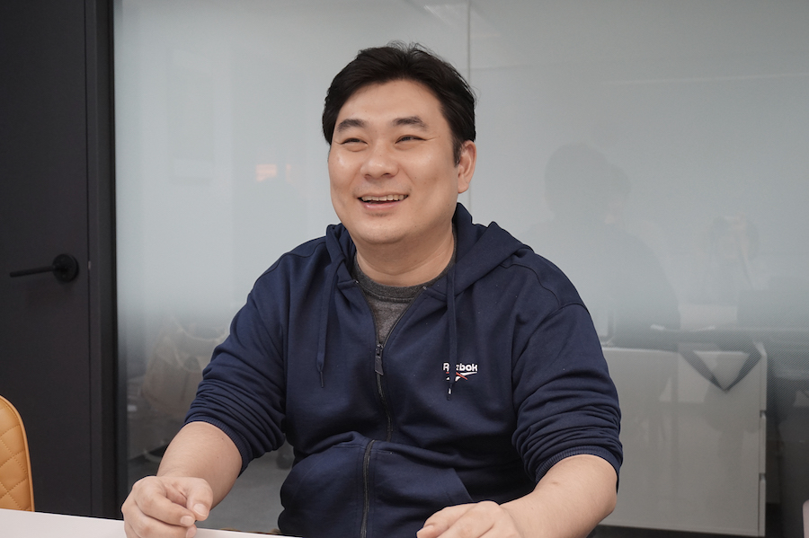
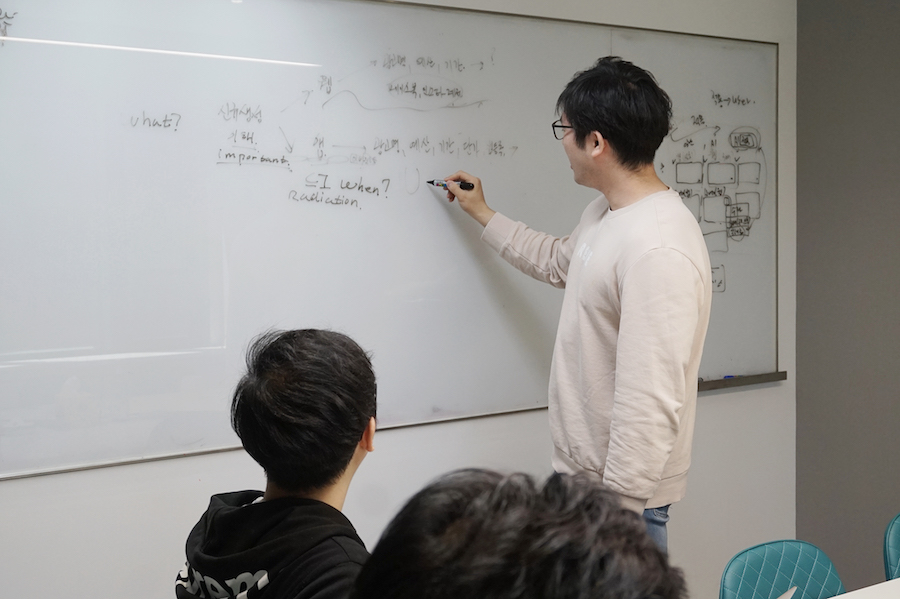
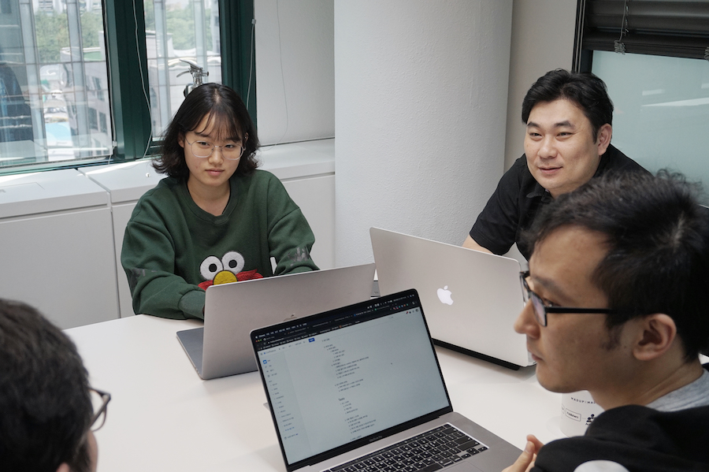
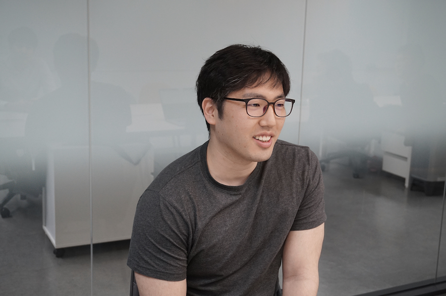
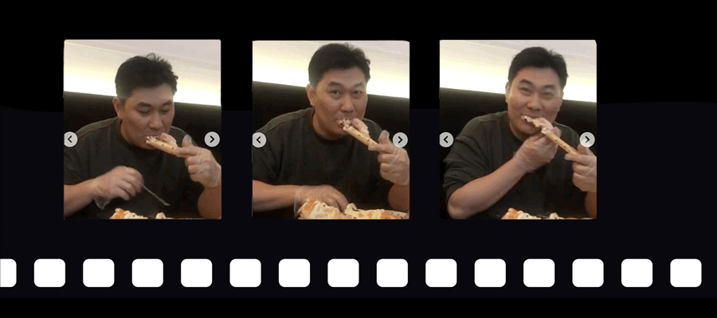

## 누구보다 태그스럽게
​
**바야흐로 태그(tag)의 시대입니다.** 인터넷 서핑과 SNS를 즐기는 이들이라면 누구나 해시태그를 붙여 #맛집, #여름옷을 검색하기도 하고, #selfie, #cafe로 정보를 공유하거나 사진의 아이덴티티를 표현하기도 하지요. 그뿐인가요? @이름 하나로 같이 보고 싶은 게시글에 친구를 바로 소환해서 함께 댓글로 수다를 떨기도 합니다.

이런 얘기를 해도 남녀노소 낯설게 느끼지 않을 만큼, 이제 태그는 젊은 세대의 전유물이 아니라 누구나 정보를 쉽고 편하게 공유할 수 있는 고마운 도구가 되었습니다. 가볍고 간단하게 태그 하나만 슥 붙이면 전세계 사람들에게 내 사진을 보여줄 수도 있고, 반대로 태그 하나만 입력해도 방대한 정보를 한 눈에 볼 수 있으니까요. **한마디로, 태그 앞에서는 누구나 평등합니다.**

**매드업의 TAG팀은 이름처럼 정말 '태그'스럽습니다.** 이들은 누구나 쉽고 편하게 광고를 할 수 있는 세상을 만들기 위해, 매드업 그 어느 팀보다 쉽고 편하게 의견을 낼 수 있는 분위기를 자랑으로 가지고 있다고 하는데요. 듣기만 해도 누구보다 태그스러운 TAG팀! 이들을 인터뷰해보았습니다.

 
**TAG팀 프로덕트 오너 정승원(Jason)님께 물어봤습니다.**

​
### #마케팅의 시작 #TAG
**Q. TAG팀은 어떤 일을 하며, TAG팀이 만드는 태그란 무엇인가요?**

TAG팀은 '모든 데이터는 측정 가능하다'는 비전 아래, SMB 업체들이 어려운 지식이나 정보 없이도 마케팅을 할 수 있도록 광고를 자동화하는 시스템을 개발하고 있어요.

TAG팀이 만드는 태그는 우리가 평소에 쓰는 '태그'라는 말과는 조금 달라요. 광고의 측면에서 쇼핑몰에 코드를 심는 것을 태그라고 하고, 이 태그를 통해 트래킹이 가능하기 때문에 태그는 마케팅의 시작점이라고 할 수 있어요. 하지만 쇼핑몰이 소규모인 경우에는 태그의 필요성을 모르는 경우도 많고 알더라도 어려운 용어들에 접근하기 힘들 수밖에 없죠. 

**저희는 페이스북의 픽셀, 구글의 리마켓팅 태그 등 다양한 광고 도구를 보다 쉽게 설치하게 도와주고, 궁극적으로는 매드업만의 TAG를 개발하는데 목표가 있습니다.** 소규모 사업자들이 어려운 용어를 몰라도 누구나 쉽게 마케팅을 할 수 있는 세상을 꿈꾸고 있는 거예요.
​
​

​
​
### #모든 데이터 #측정 가능

**Q. TAG팀의 비전에 대해 말씀해주셨는데, 태그를 설치하는 것과 데이터를 측정하는 것에는 어떤 연관성이 있을까요?**

태그는 사실 그 자체로는 의미가 없기 때문에, 태그를 설치했다고 저희의 임무가 끝나는 것은 아니에요. 태그팀은 태그를 통해 발생되는 데이터를 적재하고 가공해서 또다시 마케팅의 재료로 쓰일 수 있게끔 해요. **이런 선순환 구조를 이루기 위해서는 데이터들이 어떤 의미를 가지고 있고, 어떻게 쓰일 수 있을지 '측정'해야 하죠.**

전에는 이러한 광고 데이터 트래킹이 어려웠어요. 대표적으로 TV 광고와 같은 것들은 광고 성과나 효과를 측정하기가 힘든 구조를 가지고 있기 때문인데요. 하지만 웹이나 모바일 광고가 활성화되면서 대기업들은 데이터 트래킹이 가능해진 반면, **SMB는 여전히 네이버, 쿠팡 등의 플랫폼에 종속되어 있기 때문에 광고 효율을 측정하기가 어려워요.** 이들을 위해 우리가 광고 자동화를 해주고 싶었죠.

그래서 저희의 진짜 관심은 고객이 사이트에 유입한 이후 발생시키는 데이터에 있어요. 매드업 내에서 MARS팀과 ARGO팀은 광고를 통해 사이트로 고객의 유입을 유도하고, 유입된 고객 정보를 바탕으로 광고 효과를 분석하는데 데이터를 활용하고 있다면 **저희는 태그를 통해 사이트 내에서 측정하고 싶은 데이터의 경로나 성과를 측정하고 있어요.** 이를 통해 광고 자동화를 이루는 플랫폼을 만들고자 하고 있습니다.

​
### #상용화 #트래킹툴 개발

**Q. 데이터 측정을 통한 자동화가 TAG팀의 중요한 역할이군요. 그런데 계속해서 기존의 툴을 사용해도 될텐데, 매드업만의 도구(tag)를 개발해서 데이터를 측정하려는 목표를 설정하신 이유가 있을까요?**

제 궁극적인 목표는 회사에 직접적이고 측정가능한 성과를 가져오고 싶다는 것인데요. 예를 들면 매출을 올리는 등의 성과가 있을 수 있을테고, 그렇게 되기 위해선 상용화 과정이 필요하다고 생각해요.

저는 데이터를 정제 및 가공하여 정보화할 수 있을 때 보다 가치가 있다고 판단하기 때문에, 이런 일련의 과정들을 플랫폼화 할 수 있을 때 서비스를 상용화할 수 있지 않을까 생각했어요. **이 모든 과정에는 매우 정확한 데이터가 늘 필요합니다. 그런 데이터를 얻을 수 있는 방법이 매드업만의 트래킹 툴, 즉 태그를 개발하는 것이고요.** 직접 데이터를 트래킹 한다면 더 정밀한 데이터를 측정할 수 있게 될 것이고 이를 통해 데이터를 제약없이 자유롭게 활용할 수 있으리라 기대하고 있습니다.
​

​ 
 **TAG팀의 기획자 안현우(Iron)님께 물어봤습니다.**

### #술 #흥겨움 #자유로움

**Q. TAG팀 채용공고에 '술' 얘기가 있는게 굉장히 독특해요. 현우님의 의견이라고 들었는데, 자세히 설명 부탁드려요!**

'술을 어느 정도 즐길 줄 알고, 흥겨움과 즐거움이 내재된 사람'이 TAG팀과 함께 했으면 좋겠다는 내용인데요. 프로덕트 오너 승원님께서 우리팀의 인재상에 대해 아이디어를 요청하셨고, 저희 팀의 공통점을 찾다보니 모두가 술자리를 좋아한다는 점과 즐겁게 일하는 분위기라는 점이 눈에 띄었기에 해당 문구를 제안했어요. 

일은 사람이 하는거라, 사람 간 감정적인 유대 없이는 잘될 일도 안될 수 있다고 생각해요. 물론 미림님처럼 팀원 중 술을 안 드시는 분들도 계시지만 술자리에서 맛있는 음식을 먹으면서 함께 놀기도 하거든요. 굳이 술을 좋아해서 같이 마시는 분이 아니더라도, **가끔은 같이 맛있는 안주를 먹으면서 어색하지 않게 재밌는 대화를 이어갈 수 있는 사람**이라면 저희 팀과 함께 했을 때 시너지가 많이 날 수 있다고 느꼈어요. (웃음) 

**Q. TAG팀의 인재상에 팀원분들의 의견도 적극적으로 반영되었다는 점이 인상깊어요. 평소에도 누구나 쉽게 의견을 낼 수 있는 분위기인가요?**

네, 그런 면에서 프로덕트 오너 승원님이 중심을 잘 잡아주고 계신다고 할 수 있죠. 누구 의견이든 필요하면 채용공고에도 쓸 수 있으니까요. 커뮤니케이션에 있어서는 너무 위축되지 않았으면 좋겠다는 것이 승원님의 철학이에요.

실제로 금요일 오후 4시쯤 누군가의 '킹크랩 먹으러 가자!'라는 말에 4명이서 다같이 밀린 팀비로 킹크랩과 소고기 60만원 어치를 먹고 온 적도 있습니다.

(킹크랩!)

​
 
 **TAG팀에서 백엔드 개발을 하고 있는 이호열(Spike)님께 물어봤습니다.**

### #기술도 #자유롭게

**Q. 이런 자유롭고 유연한 분위기가 개발자분들께 기술적, 업무적으로는 어떤 영향을 끼칠지 궁금해요.**

저는 엄청나게 게으르기 때문에 조금이라도 일을 덜 하려고 기술이나 툴 등을 많이 찾아보는 편인데요. (웃음) **유연한 팀 분위기 덕분에 제가 공부하고 있거나 하고 싶었던 것을 업무로써 사용하게 되어 성장의 좋은 밑거름이 되고 있어요.**

실제로 제가 제안한 툴이 회사 전체에 반영된 적도 있었어요. 테크사업부에서 사용하고 있었던 백엔드 프레임워크인 Flask를 FastAPI로 바꿨던 일인데요. FastAPI는 문서 자동화나 데이터 검증 등 직접 코딩할 일이 적은 툴이기 때문에 바꾸자고 제안을 했었고, 회사 전체에 영향력이 컸던 일이라고 생각해요. 이렇게 회사와 팀에 직접적으로 도움이 되니 더 열심히 공부를 하게 되는 것 같아요.

**Q. 매드업 자체에도 의견을 적극적으로 수용하는 분위기가 형성되어 있는 것이군요?**

네, 맞아요. TAG팀이 이런 분위기를 가질 수 있었던 것도 회사 자체에서 유연하고 자유로운 환경을 만들어준 덕분이라고 생각해요. 

팀을 떠나 백엔드 챕터에서 새로운 기술이나 팁 등을 서로 공유하는 매드업의 문화 역시 저의 기술적인 성장에 한 몫을 했죠. 기술력도 겸비하고자 하는 기획자, 경험 많은 리더, 건방진 프론트 개발자가 회사 내에서 서로 자유롭게 의견을 나누고 있는데요. 덕분에 생각의 폭이 많이 넓어졌어요.
​

​ 
 **TAG팀에서 태그 스니펫을 만들고 있는 유미림(Cindy)님께 물어봤습니다.**

### #성장도 #자유롭게

**Q. 미림님은 TAG팀 팀원들 중 매드업에서 가장 오래 근무하셨다고 들었어요. 그만큼 매드업이 미림님에게 가져다 준 변화가 클 것 같아요.**

입사 초반과 비교해보자면, 지금의 저는 **서로가 윈윈하는 협업을 하면서 성장 중인 것 같아요.** 초반에는 저의 담당 업무만 처리하기 바빴는데 지금은 주변도 살피려고 노력해요. 그러다 보니 제가 아는 것은 알려주고, 제가 모르는 것은 다른 팀원으로부터 배우면서 빠르게 습득할 수 있었어요. 같이 일하는 방법을 잘 배워나가고 있는 중입니다.

**Q. 조직개편 이후 TAG팀과 함께한지 6개월째이신데, 그 이후 달라지거나 성장한 점도 있을까요?**

그동안은 퍼포먼스 마케팅이나 애드테크를 이론과 코드로만 접했었는데요. TAG팀에 들어와서 직접 태그 설치도 해보고 실전에서 문제도 해결해봤어요. 이런 경험들이 애드테크에 대한 이해도를 높여준 것 같아요. 항상 옆에서 궁금증을 해결해주는 현우님께 이 자리를 빌려 감사하다고 말하고 싶어요!

또 전에는 개발자들끼리만 같은 팀이었는데, TAG팀에는 기획자분도 계시기 때문에 새로운 분야의 업무를 다룰 수 있다는 점이 가장 큰 변화인 것 같아요. 저는 프론트엔드 개발자라서 백엔드 개발자와 API 관련한 소통을 제일 많이 했었는데, **TAG팀에 합류한 이후 API 말고도 다른 업무로 소통을 많이 해서 좋았어요.** 저 역시 TAG팀에 도움이 되고자 매체의 다양한 태그와 관련 변수를 한 곳에 정리해 놓기도 했어요. 팀원들이 필요할 때마다 찾아보고 있습니다. 아마도 그럴걸요? (웃음)
​
​
## 나에게 TAG팀은

**이들에게 TAG팀을 한마디로 표현해달라고 했습니다.**

### #적재 #단비 #공장 #놀이터

**승원님** : 나에게 TAG팀은 적재다. 저희 팀은 '모든' 데이터를 측정하고 적재하는데 목표가 분명한 팀이기 때문입니다. 참고로 팀가는 적재의 '별보러 가자'입니다.

**현우님** : 나에게 TAG팀은 가뭄의 단비다. 여기에 제가 아는 지식을 모두 쏟고, 회사와 팀에서 더 발전된 지식과 경험을 쌓고 싶어요.

**호열님** : 나에게 TAG팀은 공장이다. 데이터를 정형화하는데 공장처럼 많은 시간을 쏟고 있기 때문인데요. (웃음) 사람이 하지 않아도 되는 단순 반복 작업들을 자동화하고 데이터를 효율적으로 수집 및 가공하려는게 저의 목표입니다.

**미림님** : 나에게 TAG팀은 놀이터다. 하고 싶은 일을 마음껏 도전할 수 있기 때문이에요. 앞으로는 아무것도 모르는 사람도 쉽게 광고 성과를 추적할 수 있게 도와주고 싶어요. 아직 보편화 되지 않은 새로운 기능을 쓸만하게 잘 만드는 것이 목표입니다. 그 날까지 파이팅!

처음 인터뷰를 시작할 때 프로덕트 오너 승원님은 TAG팀에 대해 소개하며 현우님은 자유로운 것을, 호열님은 맥주를, 미림님은 회식을, 그리고 승원님 본인은 일을 좋아한다고 말해주셨는데요. 팀원들이 좋아하는 걸 확실하게 파악하고 있는 팀장님의 모습을 보니 TAG팀이 커뮤니케이션에 있어서 얼마나 자유로운 분위기를 가지고 있는지 다시 한 번 느껴집니다.

> *"TAG팀에서는 자기가 좋아하는 걸 쉽게 얘기할 수 있고 쉽게 수용할 수 있어요. 불평이든, 칭찬이든 얘기를 하는 게 가장 좋다고 생각해요." - 승원님*

누구나 쉽게 광고를 하는 세상이라는 비전을 위해, TAG팀은 내부에서부터 누구나 쉽게 목소리를 내고자 합니다. 방대하고 개성 넘치는 태그처럼, 이들과 이야기를 나누다보면 꼭 무지개가 떠오르곤 하는데요. 팀원 모두가 각자의 통통 튀는 색깔을 숨기지 않으면서도, 하나의 팀으로 멋지게 어우러져 나가는 케미를 가진 TAG팀!

오늘도 TAG팀은 태그스럽게, TAG팀답게 나아갑니다.

태그스러운 사람이라면!
[매드업 채용 바로가기][madup]

[madup]: <https://www.notion.so/maduphr/f5cafd7a9ab645889a843dcb2bc8605e>
[ad-tech]: <https://tech.madup.com/madup-adtech-1/>
