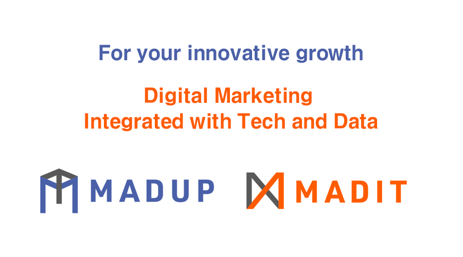
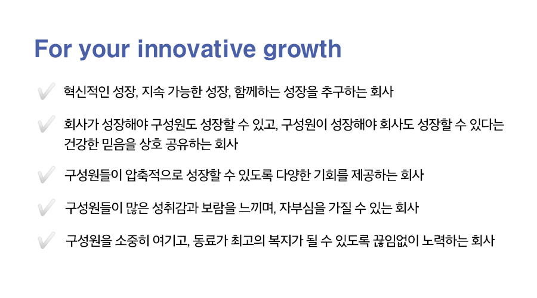
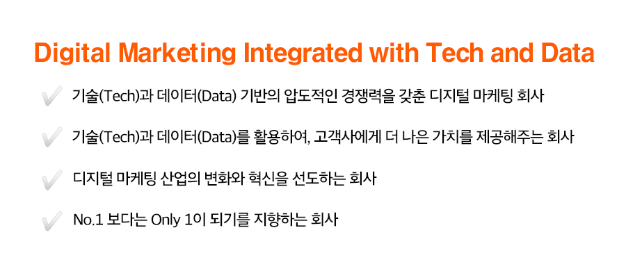
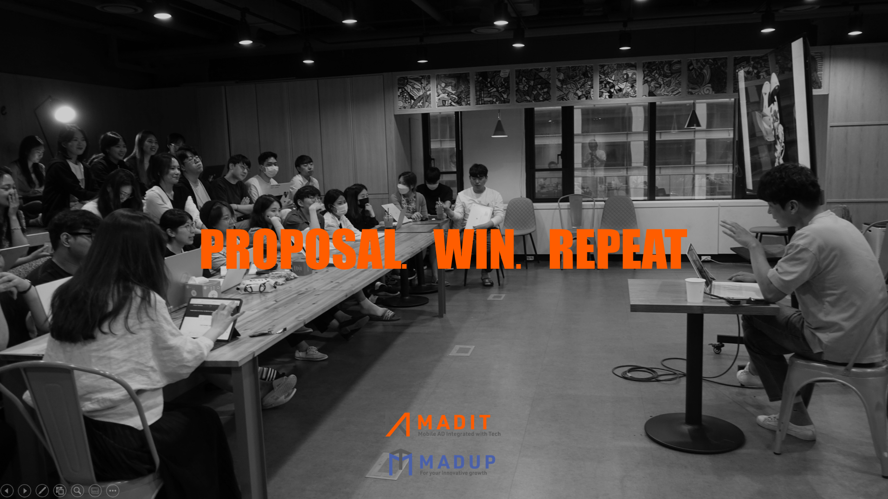
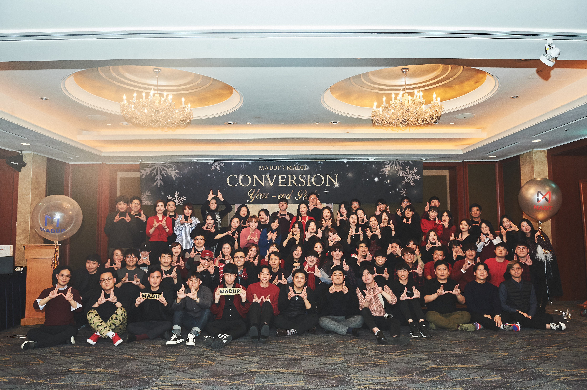

## 당신의 성장을 위하여

매드업 입사 첫날이면 웰컴키트 에코백에 큼직하게 적힌 **'For Your Innovative growth'**라는 문구가 가장 먼저 반겨줍니다. 오늘부터 천천히 매드업에 대해 생생하게 느끼고 알아갈 신규입사자들이지만, '당신'의 '성장'을 위한다는 문구만 보더라도 우리가 사람 그리고 성장을 얼마나 중요하게 생각하는지 한 번에 알 수 있게 되지요.

지난 이야기에서 우리는 '사람의 힘'을 중시하는 회사라고 말했습니다. 미션, 비전, 핵심가치를 명문화하는 것은 성장하는 동시에 사람의 힘을 지키기 위해서이며, 명문화된 가치 역시 외부에 있는 것이 아니라 우리 안에 있는 사람의 힘을 찾아 하나로 모은 것이라고 말입니다.

저 또한 인턴생활 6개월 동안 매드업의 여러 사람을 인터뷰하고 글을 쓰면서, 성장에 대한 열정으로 빛나는 매드업 사람들의 힘에 대해 매일매일 몸소 느낄 수 있었는데요. 우리가 명문화한 사람들의 힘에 대해, 그리고 우리가 중시하는 성장이란 무엇인지, 매드업을 처음 알아가는 신규입사자의 마음으로 돌아가 지금부터 소개해볼까 합니다.

<figure>
  
  <figcaption>테크사업부 대표 동호 님(왼쪽), 광고사업부 대표 주민 님(오른쪽)</figcaption>
</figure>

## 매드업의 방향성을 찾아서
매드업 두 대표 이주민 님, 이동호 님은 배틀 그라운드 게임 순위 아시아 100위 안에 들기도 하고(주민 님), 창업 2년 차에 군대를 다녀온 이력이 있을 정도로(동호 님) 어딘가 재미난 구석이 있는 분들입니다. 이름에 '이주'와 '이동'이 들어가 회사가 설립 5년 동안 이사를 여섯 번이나 했다는 우스갯소리가 있다고도 하는데요. 조용한 환경에서 그저 묵묵히 개발과 데이터 분석에만 집중하고 싶어 한다는 '기술과 데이터 덕후' 이들을 찾아가, 매드업에 대해 물었습니다.

#### **Q. 매드업의 미션, 비전을 소개해주세요!**

**주민** : 미션, 비전으 로 정의하기보다는, 우리가 어떤 방향을 추구하는지를 잘 보여주는 슬로건으로부터 이야기를 시작하고 싶어요. 첫 번째가 바로 지난 5년 동안 매드업이 가져왔던 'For your Innovative Growth'이고, 두 번째가 'Digital Marketing Integrated with Tech and Data'예요.

저희는 이 두 가지 슬로건을 가지고 폭발적으로 성장해왔어요. 우리의 중장기적 방향을 잘 잡아주었던 문장들이죠. 그렇기 때문에 이 키워드들을 어떻게 조합하느냐에 따라 미션과 비전이 탄생할 수 있을 것 같습니다.

**동호** : 결국 우리를 움직이는 동인은 '성장하고자 하는 열정이 강한 사람들이 모였다는 것'임을 잘 보여주는 슬로건이라고 생각해요. 그 사람들이 빠르게 성장할 수 있도록 회사가 적극적으로 지원한다는 의미도 내포되어 있죠. 더불어 우리가 궁극적으로 되고 싶은 모습은 기술과 데이터 기반의 압도적인 디지털 마케팅 회사라는 것도요. 

#### **Q. '매드업'하면 바로 생각나는 것은 역시 '성장'인 것 같아요. 그 중에서도 매드업이 혁신적인 성장, 지속가능한 성장, 함께하는 성장을 추구하는 이유가 무엇인가요?**

**동호** : 결국은 **이 세 가지가 성장의 모든 것을 아우른다고** 생각하기 때문이에요. 성장은 디지털 마케팅 업의 핵심적인 본질이라고 할 수 있는데요. 고객사들이 우리를 찾는 이유는 다름이 아니라 빠르고 효과적으로 성장하고 싶기 때문이니까요. 그리고 빠르고 효과적인 성장은 곧 혁신적인 성장을 의미하죠. 

또한 장기적인 관점에서 성장은 반드시 지속가능해야 합니다. 광고 효율을 단기적으로 확 끌어올리는 의사결정도 있고, 당장은 아니지만 길게 봤을 때 효율이 쭉 올라가는 결정들도 있을 거예요. 장기적으론 후자가 광고주에게도, 우리에게도 좋은 방법이겠죠. 
우리는 사람이기 때문에 1년 365일 쉬지 않고 일하면 번아웃이 와요. 그래서 **빠르게 달리다가도 중간에 쉼표를 찍어서 지속가능하게 성장하는 것이 중요하다고 생각합니다.** 이를 위해 [비긴어게인 휴가 제도](https://tech.madup.com/vacation/)도 도입했어요. 마지막으로 매드업의 핵심이자 근간이 되는 것은 사람이기 때문에 함께하는 성장을 추구하는 것은 필수적이라고 보았어요.

<figure>
  
  <figcaption>'매드톡'을 진행하는 매드업 구성원들</figcaption>
</figure>

#### **Q. 한마디로 고객과, 회사와, 구성원이 함께하는 성장이군요. 구성원이 성장해야 회사도 성장하고, 회사가 성장해야 구성원도 성장하는 믿음의 사례는 무엇이 있을까요?**

**주민** : 먼저 구성원이 성장해야 회사가 성장할 수 있는 이유는 동호 님이 말씀해주신 것처럼 **사람이 곧 우리 회사**이기 때문이에요. 매드업에서 [사람을 빼면 남는 게 없다](https://tech.madup.com/recommended-recruitment/)고 해도 과언이 아니기 때문에 이런 믿음이 생기게 된 거죠.

반대로 회사가 성장해야 [구성원 역시 성장](https://www.youtube.com/watch?v=c5-dRAYCy-I)하는 이유는 **구성원들이 누릴 수 있는 기회가 많아지기 때문**이에요. 회사가 잘될수록 다양한 광고주가 유입되어 구성원들이 할 수 있는 일의 범위가 넓어지고, 사용할 수 있는 기술이나 데이터 솔루션도 늘게 되죠. 매드업이 지금처럼 빠르게 성장해준다면 우리 구성원들도 다른 회사에서는 절대 경험할 수 없는 커리어를 쌓게 될 것이라고 굳게 믿고 있어요.

**동호** : 맞아요. 이번에 더 좋은 공간으로 이사를 앞둔 것처럼, 점차 일하는 환경도 개선되고 보상 수준도 좋아지게 되겠죠. 이런 변화들이 결국은 좋은 인재를 계속해서 유입하는 밑거름이 될 거고, 계속해서 선순환이 이루어질 거예요.

실제로 계속해서 훌륭한 인재들이 모이고 있고 이는 또 하나의 성장의 자극제가 되기도 해요. 좋은 동료와 함께 일한다는 것은 커리어 상 축복이라고 할 수 있죠. 저희는 이런 선순환 고리를 만들어가기 위해 **'동료가 최고의 복지'**가 되기 위한 노력을 계속할 겁니다.

#### **Q. 구성원들이 압축적으로 성장할 수 있도록 회사 차원에서 어떤 기회를 제공해왔나요?**

**주민** : 가장 먼저 꼽고 싶은 건 **교육 프로그램**이에요. 저희는 선제적으로 태블로를 도입하고 있고, 태블로를 처음 접하는 분들을 위해 외부 전문 업체에서 운영하는 '태블로 신병훈련소'라는 교육 프로그램에 참여하고 있어요. 2주간 동영상 강의와 과제를 수행하고 전문가의 피드백을 받으면 단기간에 성장할 수 있죠. 또 동호 님은 밤 9시, 10시까지 남아서 구성원들을 대상으로 직접 [파이썬 교육](https://www.youtube.com/watch?v=4qgWY-qxtqs)도 진행하고 있는데요. 힘들겠지만 보람찰 겁니다. (웃음) 

최근에는 외부 전문가를 초빙해서 **리더십 코칭 프로그램**도 시작했어요. 리더진들을 대상으로 12주 동안 나의 리더십 스타일은 무엇인지, 사람들을 어떻게 동기부여하고 팀원들에게 피드백은 어떻게 줘야 하는지 등을 교육하고 있습니다. 주로 대기업 임원들을 대상으로 하는 교육이라 비용이 만만치 않지만, 장기적 관점에서 훌륭한 투자라고 생각해요. 프로그램에 참여하고 있는 구성원들의 긍정적인 반응을 보니 투자가 아깝지 않기도 하고요! 지금은 리더 대상으로 진행하는 교육이지만, 점진적으로 리더 후보자까지 대상을 확대할 예정입니다.

<figure>
  
  <figcaption>회사 주변 카페에서 '리모트 근무'를 하는 구성원들</figcaption>
</figure>

**동호** : 저는 **자율과 책임의 문화**를 꼽고 싶어요. 매드업은 가능한 자율적이고 독립적인 상황에서 구성원들이 결정을 내릴 수 있도록 지원하고 있는데요. 대표적으로는 [리모트 근무](https://tech.madup.com/remote-work/) 제도가 있어요. 본인이 주도적으로 업무를 해나갈 수 있는 문화가 결국에는 구성원들의 커리어 디벨롭에 도움이 된다고 생각해요.

테크사업부 AT 디비전과 광고사업부 데이터팀 같은 경우에도 새로운 알고리즘이나 기술적인 솔루션 도입에 대해서 굉장히 오픈마인드를 갖고 있는데요. 회사 차원에서도 이를 장려해 금액적으로 많은 지원을 하고 있어요. 또한 AWS 자격증 취득 지원, 포상금 제도 운영 등 구성원들의 성장에 진심으로 관심을 가지고 도움을 드리고 있습니다.

#### **Q. 구성원들이 매드업에서 성취와 보람을 느낄 수 있다고 하셨는데, 구체적으로 어떤 성취와 보람이 있을까요?**

**주민** : 에이전시 업은 구조적 이슈 때문에 힘들 수밖에 없는 업이에요. 고객사 입장에서 직접 처리하시기 까다롭고 어려운 일이기 때문에 외부 전문가인 대행사에 업무를 맡기는 거니까요. 그러니 이왕 힘든 일이라면, 더 많은 성취와 보람을 느끼는 게 중요하다고 생각해요!

물론 성취와 보람의 의미는 개인마다 다를 거예요. **그럼에도 매드업이 구성원에게 확실한 성취감을 가져다 준다는 것은 비딩 성공률만 봐도 알 수 있어요.**

만약 개인이 열심히 하는데 회사가 그만큼 받쳐주지 못해서 경쟁 입찰에서 떨어지면 정말 힘들 거라고 생각해요. 하지만 매드업의 비딩 성공률은 정말 높습니다. (웃음) 경쟁 입찰에서 연이어 울려 퍼지는 승전보가 구성원들의 내재되어 있는 winning spirit을 고취하고 있죠. 이처럼 저희는 구성원의 성취감에 무조건 도움이 되는 방향으로 열심히 나아가고 있다고 자신할 수 있습니다.

#### **Q. 이제 매드업의 두 번째 슬로건에 대해 질문하고 싶은데요! 매드업이 특히나 테크(기술)와 데이터를 강조하는 특별한 이유가 있나요?**

**동호** : 지난 20년 동안 에이전시 업의 성공 방정식은 관계, 인적 네트워크였다고 생각해요. 그런데 디지털 마케팅 그리고 모바일 디바이스가 출현하면서 정교한 데이터 분석과 타겟팅이 가능하게 됐죠.

시장 환경이 이렇게 변화하다 보니, 개발 백그라운드를 가지고 있었던 저와 주민 님은 기술과 데이터로 매드업만의 독자적인 차별점을 구축할 수 있을 것이라고 확신했어요. 실제로 현재까지 매우 유효한 전략이기도 했고요.

**주민** : 맞아요. 저희는 다른 에이전시 대표들 대비 나이가 어려서 인적 네트워크가 특히나 부족했거든요. 그리고 저는 영업보다는 개발을 더 좋아하는 경영자이기도 하고요. (웃음) 그러다 보니 기술과 데이터 경쟁력이 우리의 생존전략이자 강점일 수밖에 없었죠. 

저희는 **젊은 대표** 그리고 후발주자로서 **기술과 데이터 중심의 빠른 대응, 민첩함 등을 내세워서 차별화를 시도**했어요. 지금도 저희는 기술과 데이터가 디지털 마케팅 시장의 큰 변혁을 가지고 올 것이라고 믿고 있고, 여기에 매진하고 있습니다.

#### **Q. 말씀하신 것처럼 매드업이 시장과 기술의 변화에 빠르고, 젊게 대응한 사례가 있을까요?**

**동호** : 일단 외부적으로 매체사 광고주들의 평가만 보더라도, 매드업은 새로운 매체나 기술 도입에 대한 제안이 가장 빠르고 활발한 대행사라고 인식되고 있어요.

하지만 더 중요한 것은 **내부적으로 신속하고 빠른 대응을 매우 중요하게 여기는 사람들이 많다는 점**이죠. '우리는 힙(hip)해야 돼', '우리 이 업계에서 사람들 입에 오르내려야 돼'라고 생각하는 분들이 감사하게도 매드업 내부에 함께하고 있고, 이런 [사람의 힘](https://www.youtube.com/watch?v=L4aEjnuBx_I&t=415s) 덕분에 시장 변화나 광고주의 니즈 변화에 민첩하게 대응해 올 수 있었다고 생각해요.

**주민** : 사람의 힘이라는 것에 정말 공감해요. 저희는 다른 대행사들 대비 평균 연령 자체가 최소 4~5세 이상 낮고, 팀장급이나 리더급은 비교적 더 낮아요. 이를 통해 항상 '젊게' 대응할 수 있었죠.

우리는 **젊은 소비자들이 어떤 디지털 문법으로 소비하고 반응하는지 너무 잘 알고 있어요.** 아무리 공부하고 이해해도 직접 느끼는 것과는 다른데, 우리는 모바일 시대에 태어나 어려서부터 모바일을 경험한 사람들이기 때문에 DNA 자체가 다를 수밖에 없죠. 광고주들도 계속 젊어지고 있고, 젊은층을 타겟해야 하는 니즈가 꾸준히 있는 상황에서 빠르고 젊게 반응할 수 있다는 것은 매드업만의 빛나는 강점이 아닐까요?

#### **Q. 그렇다면 매드업이 기술과 데이터를 통해 이끌어낼 변화와 혁신은 어떤 것일까요?**

**동호** : 저희의 궁극적인 목표는 기술과 데이터를 통해 **<사람이 하던 일을 기계가 잘 하도록, 그리고 사람이 하지 못하던 일을 기계가 할 수 있도록>** 만드는 것입니다.

여기서의 기술과 데이터란 데이터를 수집하고, 분석하고, 결과를 도출해서 타켓팅 알고리즘에 적용하는 것을 의미하는데요. 저는 가장 중요한 것이 **디지털 마케팅 운영을 자동화하는 기술**이라고 생각해요. 사람이 하루에 다섯 번 열 번씩 일일이 세팅하던 것을 컴퓨터가 하게 만드는 것이죠. 이렇게 된다면 전문가의 머릿속에 있는 프로세스를 코딩을 통해 컴퓨터가 할 수 있게 되고, 그럼 **매드업의 구성원들 모두가 높은 수준의 퍼포먼스**(광고 효율)를 내는 것이 가능해집니다.

이를 통해 저희는 **실제로 변화를 이끌어냈어요.** 매드업의 오래된 핵심 광고주인 A사와 B사의 경우인데요. 데이터 크기가 너무 커서 도저히 분석하지 못했던 데이터들을 매드업 내부의 데이터 사이언티스트와 개발자들이 협업해서 분석해낸 케이스입니다.  

저희는 매체사와 트래커사의 **API를 통해 광범위한 데이터를 효과적으로 수집**하고, [태블로를 활용하여 데이터를 시각화](https://www.youtube.com/watch?v=01B3tvBAIP4&amp;feature=youtu.be&amp;vq=hd1080)한 후 이를 활용하여 **다양한 각도의 분석을 진행**합니다. 태블로 같은 좋은 툴을 활용하면 **다양한 분석 결과를 도출하는 것까지 가능**하더라구요. 분석 결과들을 **실제 광고 운영에도 반영**하여, **API를 통해 알고리즘으로 매체를 운영**하는 것까지 계속해서 발전시키고 있습니다. 이 부분에 많은 노력을 기울이고 있어요!

> "궁극적인 목표는 기술과 데이터를 통해 사람이 하던 일을 기계가 잘 하도록, 그리고 사람이 하지 못하던 일을 기계가 할 수 있도록 만드는 것입니다."

**주민** : 그때만 생각하면 아직도 뿌듯한데요. 이처럼 저희는 기술과 데이터가 디지털 마케팅 시장을 혁신할 것이라고 믿으며, 그 혁신을 매드업이 반드시 주도하도록 하고 싶어요.

동호 님이 앞서 말씀해주신 두 가지 목표를 달성하게 되면, 광고주뿐 아니라 우리 **AE들의 생산성이 높아질 거예요.** 그 시간을 휴식에 쓸 수도 있고 더 고민하고 인사이트를 도출하는데 쓸 수도 있겠죠. 이게 곧 변화 그리고 성장 아닐까요? 

디지털 마케팅에 대한 이해를 갖추기 위해서 초반 6개월에서 1년 정도 광고 소재 세팅, 설정 등 디테일한 운영 업무를 경험해보는 것은 분명 큰 도움이 될 겁니다. 하지만 매일매일 똑같은 반복 업무를 너무 오랫동안 하게 되면 성장할 수 없을 거예요. 그래서 **저희는 어떻게 하면 구성원들이 더 고부가가치의 일을 하게 할 수 있을지**에 대해 늘 고민하고, 또 고민합니다.

#### **Q. 기술과 데이터로 시장을 혁신한다는 매드업의 목표, 정말 멋진 것 같아요. 마지막 질문입니다! 매드업이 No.1이 아닌, Only 1이 되길 지향한다는 것의 의미는 무엇인가요?**

**동호** : 물론 광고집행액, 즉 취급고를 높여서 업계 No.1이 되는 것도 중요한 일이에요. 취급고가 올라가야 재무적으로 사업의 안정성이 높아지고, 회사에서는 더 새롭고 혁신적인 시도를 할 수 있는 재원이 마련되거든요. 하지만 취급고 1등 자체가 매드업의 목표는 절대 아닙니다.

매드업의 목표는 디지털 마케팅 업계에서 기술적으로 가장 빠르고, 압도적인 경쟁력을 갖춘 회사가 되는 것이에요. **기술과 데이터가 압도적인 Only 1이 된다면 취급고 No.1이 되는 것은 시간의 문제일 뿐**, 자연스레 따라오게 될 거라고 생각하기 때문이죠.

**주민** : 제가 좋아하는 말 중에 '게임의 궁극적인 룰(Ultimate Rule of the game)'이라는 말이 있는데요. 결국 이 시장에서 승리하는 궁극적인 룰은 **높은 광고 효율과 편리한 사용성**이라고 생각해요. 그래서 '최종적으로 누가 살아남는 건데?'라고 질문했을 때 취급고가 높은 회사가 아니라, 기술과 데이터가 압도적인 회사가 이 룰을 달성해서 취급고 1등 자리에 오를 수 있겠죠. 저희는 한 마디로 **'디지털 마케팅을 효과적으로, 더 쉽게'** 할 수 있도록 기술과 데이터로 시장을 변혁해 나갈 겁니다.

> "디지털 마케팅을 더 효과적으로, 더 쉽게 할 수 있도록 기술과 데이터로 시장을 변혁해 나갈 겁니다."

## 사람의 힘으로 성장하는 우리

두 대표님과의 인터뷰를 마무리하고 난 후 마음속에 남아있는 것은 여전히 '사람' 그리고 '성장' 두 단어였습니다. 6개월 전 두근거리는 마음으로 처음 사무실에 들어와 웰컴키트를 받아들었던 그때의 첫인상처럼 말이지요.

다만 이제는 매드업이 왜 사람과 성장을 중요하게 생각하고, 어떻게 사람을 통한 성장을 이루어내는지 깊게 알 수 있을 듯합니다. 열정이 가득한 인재들의 힘을 통해 성장하고, 그렇게 성장하여 얻은 풍부한 기술과 데이터로 또다시 사람의 힘을 고도화하기 위한 자동화 업무에 박차를 가하는 매드업! 동호 님, 주민 님께서는 '이렇게 해야만 구성원들이 시간을 더 효율적으로 쓸 수 있고, 자신의 성장에 필요한 가치 있는 일에 집중할 수 있다'고 애정을 담아 말합니다.

매드업의 사람이 이루어낸 성장의 선순환 고리가 놀랍고도, 자랑스러운 순간입니다. **이렇게 오늘도 매드업은 '당신의 성장을 위하여' 달려 나갑니다.**

&lt;이 글에서 언급된 콘텐츠 모아보기&gt;

- [바쁜 일상에 매드업이 드리는 쉼표, 비긴 어게인 휴가](https://tech.madup.com/vacation/)  
- [폭풍성장 매드업은 왜 추천채용을 할까?](https://tech.madup.com/recommended-recruitment/)  
- [매드잇 퍼포먼스 마케터 '자문자답' 인터뷰](https://www.youtube.com/watch?v=c5-dRAYCy-I)  
- [매드업 파이썬 교육의 모든 것!](https://www.youtube.com/watch?v=4qgWY-qxtqs)  
- [자율적인 공간이 당신에게 주는 힘](https://tech.madup.com/remote-work/)  
- [매드업 주니어 AE 빈칸 인터뷰](https://www.youtube.com/watch?v=L4aEjnuBx_I&t=415s)  
- [Lever Google AC Dashboard](https://www.youtube.com/watch?v=01B3tvBAIP4&feature=youtu.be&vq=hd1080)  

[매드업 채용 바로가기](https://www.notion.so/maduphr/f5cafd7a9ab645889a843dcb2bc8605e))  
