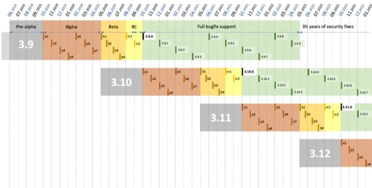
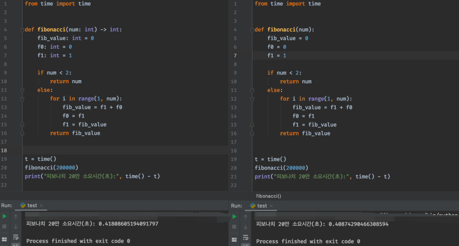

새로운 파이썬 버전이 나왔습니다.

파이썬에는 Node나 리눅스 처럼 딱히 LTS(Long Term Support) 버전이 이라 명명하는 버전이 없지만, RC(Release Candidate)에서 정식 버전 채택 후 18개월간의 수명을 가지며, 이 후 3년 6개월간 보안관련 업데이트를 지원합니다.

이 18개월의 시간을 Full Bugfix Support 기간이라 하며, 보통 동시에 2개 버전이 이 기간을 가지게 됩니다.



1개의 버전에 약 5년 가까이 지원하여, 굳이 LTS 버전이 필요없는 파이썬은 빠르게 버전업이 진행되며, 그때마다 새로운 기능들이 자주 추가 됩니다.  [파이썬 버그 트래커](https://bugs.python.org/)와 PEPs(Python Enhancemt Proposals)에 새로운 Features 후보와 기존 버전들이 가지고 있는 버그들을 토대로 RC버전이 나오게 되고 복수의 RC 버전 중 하나를 골라 정식 버전으로 채택됩니다. 우리가 보는 python 3.10.1 rc2 이런 버전들이 릴리즈 후보 입니다.

정식 버전이 나오기 전 약 1년 반 동안 갈고 다듬어진 Python 3.9버전의 버그 픽스, 피쳐, 업데이트 중 상큼하게 변경된 8가지를 정리해 보았습니다.  

<br/>

## 1. Dictionary Update

개발을 하면서 정말 있었으면 좋겠다고 생각한 적이 있었던 기능입니다. 2개의 딕셔너리를 합하는 방법입니다.

**기존 Dictionary Update**
```
>>> a = dict(a="abc", b="bcd") 
>>> b =dict(c="cde", e="efg") 

>>> a.update(b) 
>>> a 
{'a': 'abc', 'b': 'bcd', 'c': 'cde', 'e': 'efg'}

>>> c = {**a, **b} 
>>> c 
{'a': 'abc', 'b': 'bcd', 'c': 'cde', 'e': 'efg'}
```

**새로운 Dict Update 기능**
```
>>> x = {"key1": "value1 from x", "key2": "value2 from x"} 
>>> y = {"key2": "value2 from y", "key3": "value3 from y"}

>>> x | y 
{'key1': 'value1 from x', 'key2': 'value2 from y', 'key3': 'value3 from y'}
 
>>> y | x 
{'key2': 'value2 from x', 'key3': 'value3 from y', 'key1': 'value1 from x'} 

>>> x|= y 
>>> x 
{'key1': 'value1 from x', 'key2': 'value2 from y', 'key3': 'value3 from y'}
```
​
<br/>

## 2. 타입 힌트
파이썬 3.6에서 처음으로 선보인 Type Hint! 하지만, typing 모듈을 불러와야 하는 단점이 있었습니다. 이제 type 모듈에서 List와 Dict를 사용하 지 않고 빌트인 된 콜렉션 타입으로 타입에 힌트를 줄 수 있습니다.

뿐만 아니라 다른 타입의 파이썬 표준 라이브러리로도 타입힌트(queue.Queue 등)로 줄 수 있게 되었습니다.

**기존 타이핑**
```
from typing import List, Dict

def hello(r: List[str]):
    for a in r:
        print(a)
```

**새로운 타이핑**
```
def hello(r: list[str]):
    for a in r:        
        print(a)

```

#### ❗ 여기서 잠깐

타입 힌트가 속도 때문에 생긴 것이 아닙니다. 인터프리터 언어인 Python 에게 타입 힌트는 전혀 연산속도에 도움을 주지 않습니다.  



<br/>

#### ❓ 그럼 왜 Type Hint 를 사용하는가?

[Zen of Python](https://en.wikipedia.org/wiki/Zen_of_Python)에서 엿볼 수 있습니다.  

- Beautiful is better than ugly. (못생긴 것 보다는 이쁘게)   
- Explicit is better than implicit. (암시적인 것 보다는 명시적으로)   
- Simple is better than complex. (복잡한 것 보다는 간단하게)  
- Complex is better than complicated. (난해한 것 보다는 복잡하게)   
- Readability counts. (가독성이 중요하다)  

타입 힌트를 세상에 내어 놓기 위해 처음으로 제시 되었던 [PEP-484](https://www.python.org/dev/peps/pep-0484/)는 아래와 같이 이야기 하고 있습니다.   
- Type Annotation의 Standard 를 제공.  
- 보다 쉬운 분석과 리팩토링의 시대를 열다.  
- 잠재적인 런타임 타입 체킹  
- 코드 내에서 타입정보를 사용  
​
<br/>

## 3. 새로운 String Method
- removeprefix() 
- removesuffix()

기존 구현 방법은 replace method나 정규식 사용을 해야 하며, 다양한 스트링을 받을 경우 처리 해야하는 예외 사항이 많습니다.

**새로운 기능**
```
>>> string = "매드업 매드잇" 

>>> string.removeprefix("매드업 ") 
'매드잇' 

>>> string.removesuffix(" 매드잇") 
'매드업'
```
<br/>

## 4. JAVA에 있던 nextafter() 의 등장
math.nextafter(x,y) 로 구성되고, x → y 까지의 수 중 표현할 수 있는 다음 수를 리턴합니다.
```
>>> from math import nextafter
>>> nextafter(2, 3) 
2.0000000000000004 

>>> nextafter(6, 0) 
5.999999999999999 

>>> nextafter(0, 9) 
5e-324 

>>> nextafter(3.141592, 3.14) 
3.1415919999999997
```

첫번째 예를 보면, 2에서 3의 방향으로 첫 숫자가 `2.0000000000000004` 라고 되어있는데 2.000000000… 1 이라는 수를 파이썬은 표현하지 못하기 때문입니다.  
​
<br/>

## 5. 패키지 Import Error 버그 픽스
피쳐는 아니지만, 사람들을 의아하게 만들었던 모듈 임포트 버그 개선.
`__import__()`는 이제 ValueError 가 아닌 ImportError를 raise 합니다.  

```
builtins.__import__() raise ValueError whereas

importlib.__import__() raise ImportError
```
<br/>

## 6. 랜덤바이트 생성
이미 파이썬은 다양한 랜덤 바이트 생성 함수가 있습니다.
```
os.getrandom() 
os.urandom() 
secrets.token_bytes()
```
하지만, 이 랜덤 바이트 들은 다시는 생성할 수 없죠.
random.seed 가 같다면 재생성 가능한 랜덤 바이트를 만들 수 있습니다.
```
>>> random.randbytes(19) 
b'\x9a5;\x83\xd2Q\x93\x145\x18\x827\xe0w\xb7\x01\\\x96\xf2'
```
재생성이 가능하다는 말은 시크릿 토큰으로 사용할 수 없다는 이야기 입니다. 시크릿 토큰을 만들기 위해서는 secrets 모듈을 사용하셔야 합니다. [Python Secrets 모듈 공식문서](https://docs.python.org/ko/3/library/secrets.html#)  
​
<br/>

## 7. pytz로 부터 해방. IANA 타임존
2018년 서울과 평양시간을 GMT+9 시간이 아닌 GMT+08:30 으로 표현하는 버그가 있었습니다.  
해당 github 이슈 : <https://github.com/stub42/pytz/issues/15>  
그래도 유일한 방법이라 언제나 반신반의 하면서 사용하던 pytz. 이제는 새로운 구현법이 생겼습니다!  

**말도 많고 탈도 많고, 버그도 많은 pytz를 사용한 타임존 구현법**
```
>>> from datetime import datetime 
>>> from pytz import timezone

>>> utc = datetime.utcnow()
>>> utc 
datetime.datetime(2020, 10, 12, 4, 21, 44, 737440)

>>> kst = utc.astimezone(timezone('Asia/Seoul')) 
>>> kst 
datetime.datetime(2020, 10, 12, 4, 21, 44, 737440, tzinfo=<DstTzInfo 'Asia/Seoul' KST+9:00:00 STD>)
```

**새로운 타임존 구현법**
```
>>> from datetime import datetime 
>>> from zoneinfo import ZoneInfo 

>>> utc = datetime.utcnow() 
>>> utc
datetime.datetime(2020, 10, 12, 4, 24, 49, 297058) 

>>> kst = utc.astimezone(ZoneInfo('Asia/Seoul')) 
>>> kst 
datetime.datetime(2020, 10, 12, 4, 24, 49, 297058, tzinfo=zoneinfo.ZoneInfo(key='Asia/Seoul'))
```
​
<br/>

## 8. 편해진 최소공배수, 최대공약수 구하기
파이썬의 built-in 모듈 중 math 에서 지원하는 최소공배수(LCM), 최대공약수(GCD) 모듈은 2개의 인수 밖에 받아내질 못했습니다 그래서 2, 6, 8 의 GCD를 구하려면 아래와 같이 구했어야 합니다.
```
>>> import math 
>>> math.gcd(2,6) 
2 

>>> math.gcd(2,6,8) 
Traceback (most recent call last):  
	File "<input>", line 1, in <module> 
TypeError: gcd expected 2 arguments, got 3

>>> math.gcd(2, math.gcd(6, 8)) 
2
```

하지만 Python 3.9에서는 아래와 같이 할 수 있습니다.
```
>>> import math 
>>> math.gcd(2, 6, 8) 
2 

>>> math.lcm(2, 4, 6) 
12 
```

**EASY.**
*파이썬 3.10 이 정식 배포되는 예정 시기인 2021년 11월에 다시 만나요!*

[매드업 채용 바로가기](https://www.notion.so/maduphr/f5cafd7a9ab645889a843dcb2bc8605e)
