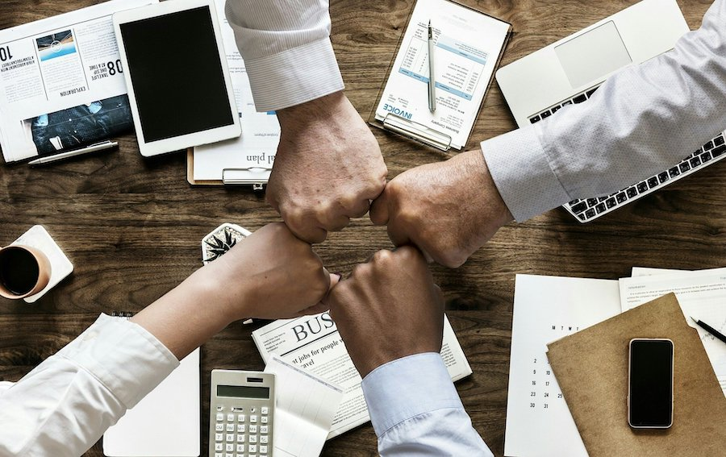
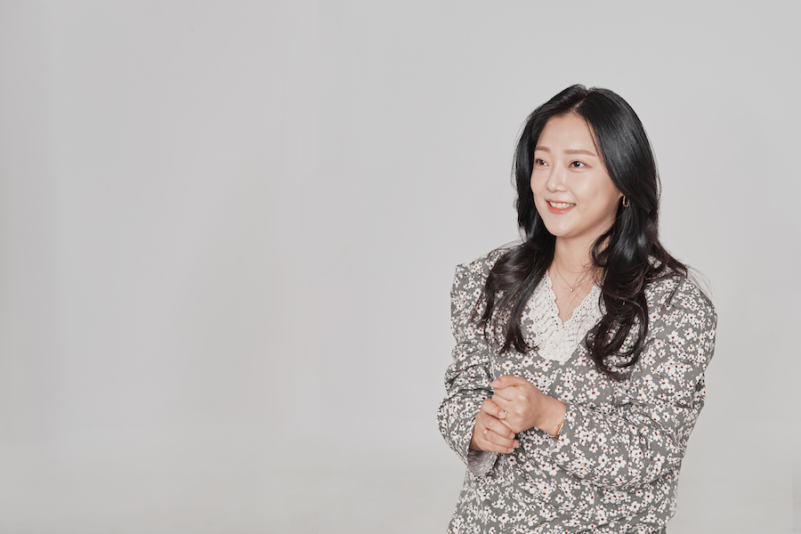
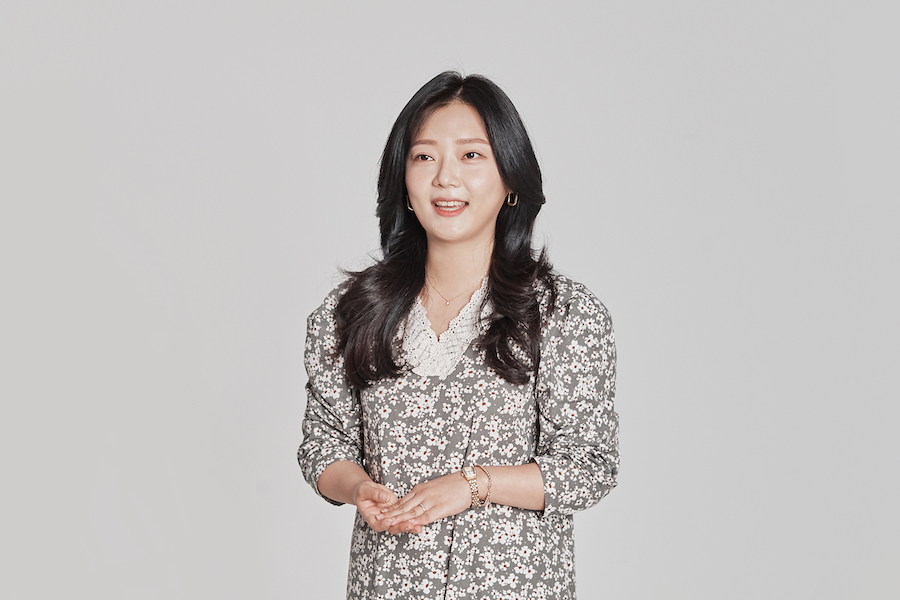
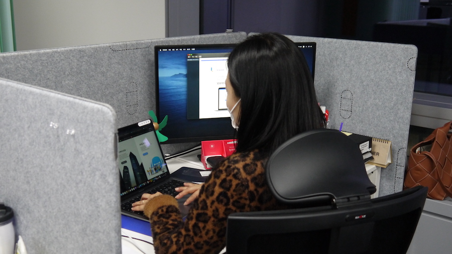
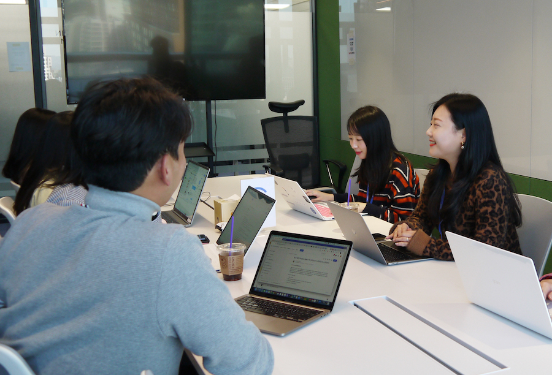
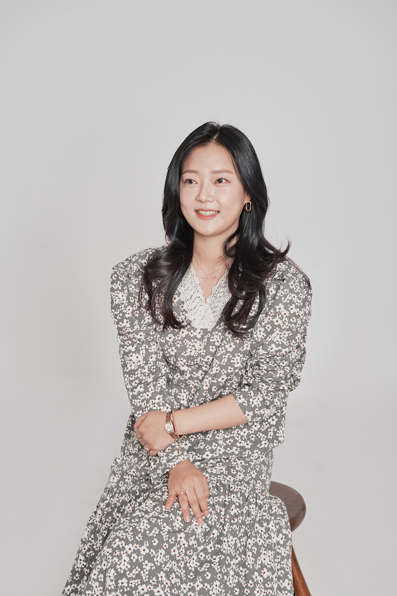
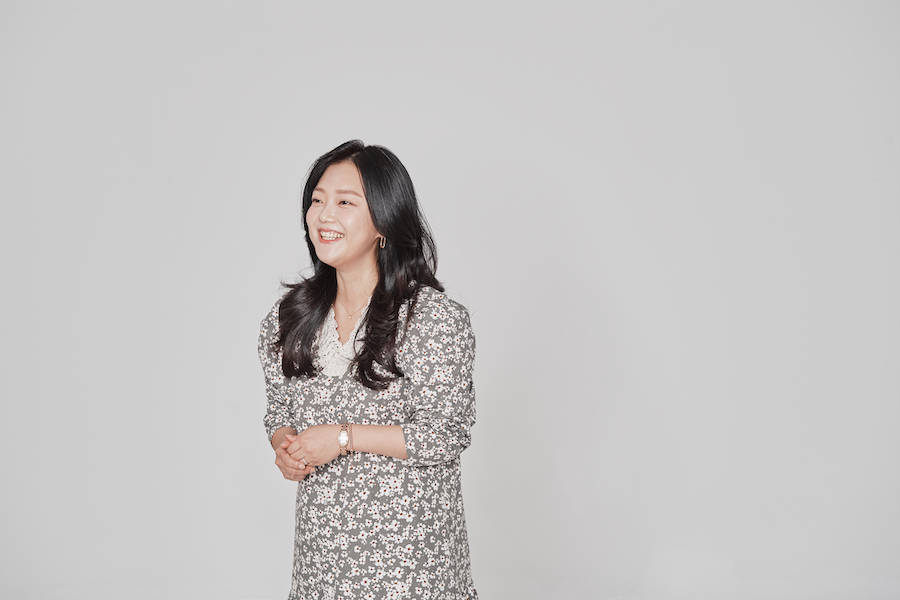

세상에는 다양한 관계가 존재합니다. 조력 관계, 우호 관계, 적대 관계 등등. 우리는 모두 관계 속에서 살아가기 때문에 관계의 시작점에선 모두가 신중한 선택을 하게 되죠. 특히, 서로에게 도움이 되는 관계가 되기 위해선 상호 간 많은 이해와 노력이 필요하기에 시작을 주저할 수 있습니다. 하지만 그러한 관계가 '성장'이란 하나의 목적지를 향해 함께 나아간다면 어떤 어려움 속에서도 의지할 수 있는 든든한 존재가 될 거예요.

CR팀은 **"세상의 모든 꿈 꾸는 사람들을 돕는다"**라는 캐치프레이즈와 함께, 그늘에 가려져 있던 좋은 서비스와 제품들이 성공이라는 빛을 볼 수 있도록 중소사업자(SMB)의 동반자가 되기로 했습니다. 마케팅 시장의 빈익빈 부익부에 맞서 선한 영향력이 가득한 세상을 만들기 위해서 말이죠.
오늘은 중소사업자와 동반 성장하는 CR팀 선영님의 이야기를 들어보려 합니다.

**Q. 안녕하세요 선영님, 선영님의 짧은 소개와 CR팀 소개 부탁드립니다!**  

안녕하세요, **매드업 CR팀의 팀리더 김선영**입니다. 팀명은 *Customer Relationship*의 약자인데요, CR이라고 하면 ‘CRM’의 사전적 정의 그대로 '고객 관계 관리'를 생각하는 분들이 많지만, 저희는 단순 고객 관리에 그치지 않고 고객들을 최전방에서 만나 디지털 마케팅에 대한 전반적인 컨설팅을 제공해드리죠. 실제 캠페인 운영을 통한 효율 극대화는 물론, 고객사의 니즈를 취합해서 레버(마케팅 자동화 플랫폼)에 반영시키는 역할을 하고 있습니다!  

현재 CR팀은 고객사를 직접 만나서 컨설팅을 도와드리는 컨설팅 파트와 운영 파트로 나누어져 있어요. 저는 지금 주로 컨설팅 파트 업무의 비중을 좀 더 높게 가져가고 있고, 저희 팀은 전반적인 광고 분석/운영 업무를 집중적으로 하고 있습니다.  

**Q. CR팀과 레버는 업무적으로 연결고리가 있는 것 같은데요, 레버와 함께 이루고 싶은 CR팀의 목표가 있나요?**  

네, 아주 큰 목표가 있죠. ‘레버(Lever)’가 ‘지렛대’라는 뜻이잖아요. **모든 중소형 비즈니스들을 성공으로 견인하는 지렛대** 역할을 하겠다는 아이덴티티를 담고 있어요. 

신규 중소사업자들의 애로사항 중 가장 큰 부분이 마케팅에 대한 어려움이에요. 사업의 전반적인 운영과 기획만으로도 바쁘신데 마케팅까지 신경 쓰시기가 어렵죠. 현실적으로도 중소사업자분들은 마케팅과 관련해서 도움을 받을 곳이 많지 않아요. 세상에는 진짜 좋은 제품들이나 서비스들이 많이 있는데, 소비자에게 도달하지도 못하고 소멸되는 게 아쉽더라고요. 그래서 저희는 이런 어려움을 해소하면서, 디지털 마케팅 대행의 생태계를 뒤집는 작은 거인들이 되겠다는 목표를 가지고 일하고 있어요. 일종의 **선한 영향력**이랄까요?  

**레버를 통해서라면 예산의 제약이나 운영에 차별점을 두지 않을 수 있어요.** 다양하게 고도화된 마케팅 솔루션과 데이터 기술을 공평하게 제공해드리면서 성공의 기회를 함께 가져갈 수 있죠. 저희의 목표는 레버를 통해 매드업과 고객이 **동반 성장**하는 것입니다.  

**Q. CR팀의 선한 영향력이 빛을 발한 것 같아요. CR팀의 활약으로 이번 달에 좋은 결과를 내셨다고 들었어요. 축하드립니다! 어떻게 이와 같은 결과를 이끌어내셨는지 여쭤보고 싶어요.**  

축하 감사합니다!😀 감사하게도 정식 론칭 이후 **4개월 만에 목표 광고거래액 95%를 달성했어요.** 100% 목표 달성은 아니지만, 초기 서비스 당시보다 **30배** 가까이 확대된 수치이기도 하고, 더불어 고객사들의 만족을 통해 소개 건도 많아지다 보니 고객 수가 자연스럽게 많아지면서 생각보다 빠르게 좋은 결과가 나타나고 있어요.  

CR팀에선 미팅 전에 굉장히 많은 것들을 체계적으로 준비하고 있는데요, 고객사의 비즈니스에 대해서 최대한 많은 것을 파악하려고 노력합니다. 현재 어떤 매체를 통해 어떻게 광고를 진행하고 계시는지, 어떤 크리에이티브들로 소구하고 계시는지 또 타겟 시장은 어떤지 경쟁사는 어떤지 등등 굳이 말씀하지 않으셨던 내용까지도 파악을 하고 만나요. 미팅을 진행하는 그 시간만큼은 고객사의 인하우스 마케터가 되어 정직하고 과장 없이 컨설팅을 도와드리고 있습니다. 그렇다 보니까 아무래도 **진정성**이 전달되는 것 같고, ‘아 이런 사람들이면 좀 믿고 할 수 있겠다.’하시고 믿어주시는 것 같아요.  

사실 고객사 분들은 사이트 오픈과 동시에 쏟아지는 광고 영업 전화로 대행사를 접하시다 보니 부정적인 인식도 상당하시거든요. 그래서 저희는 더 정직하고 진정성 있게 다가가려고 노력합니다. 이렇게 CR팀 모두가 업무적으로 많이 투자하면서 성공 사례들을 만들고, 그런 성공 사례를 통해 레버를 더욱 고도화함으로써 고객사에 더 나은 솔루션을 제공하려고 노력 중입니다. 이런 과정에서 저희도 성장하는 것을 느끼고 있고요.  

**Q. 말그대로 고객사와 CR팀의 동반성장이네요! 이러한 성장을 이뤄내고 있는 CR팀의 분위기가 궁금합니다. 특별한 팀 문화까지도 마음껏 자랑해주세요!**  

개인적으로는 저희 팀 분위기가 굉장히 좋다고 생각해요. 정말 자랑하고 싶은 부분 중 하나인데, 지금까지 저희는 작은 트러블도 있었던 적이 없거든요. 현재까지 이탈한 팀원이 단 한 명도 없다는 거 아시죠?😀  

그렇게 유지할 수 있었던 건 이전 직장에서의 경험의 영향이 커요. AE의 길을 걸을 수 있게 해주신 저의 첫 사수 분께서 칭찬을 정말 많이 해주셨어요. 진짜 작은 것도요! 간단한 자료들만 정리했는데 ‘이걸 했어?’ 식의 과장된 칭찬을 해주셨어요. 처음엔 이게 이렇게 칭찬받을 일인가 싶기도 하고 부담스럽기도 했는데 그게 저한테 큰 동기부여가 되더라고요. 그러면서 더 열심히 해보고 싶다는 생각이 들었고, 저도 나중에는 저런 선임, 동료가 되고 싶다고 결심했습니다.  

**그래서 우리 팀의 독특한 문화인 ‘칭찬합시다’가 만들어졌죠.** 매드업에서 전사적으로도 진행하고 있는 캠페인이잖아요. 사실 그 전에 저희가 먼저 시작하고 있었거든요. 저희 팀 슬랙 채널에서는 주로 작은 칭찬들을 주고받는데, 서로 박수 이모지를 붙이고 그러면서 업무 분위기가 확 좋아져요. 그런 말 있잖아요. **칭찬은 긍정을 낳고 긍정은 열정을 낳는다.** 작은 칭찬이 모여서 긍정적인 팀 내 분위기를 만들고 이런 팀 내 분위기가 열정으로 이어지고 또 좋은 결과로 이어진다고 생각하고 있어요.  

**Q. 매일매일이 칭찬으로 가득한 CR팀이겠어요. CR팀의 문화가 팀원들을 열정으로 이끌었듯 매드업의 조직 문화가 새로운 자극이 되었던 경험이 있으신가요?**  

아직도 처음 출근했던 날이 생생하게 기억나요. 첫 출근 날 문을 열고 들어갔더니 동호님이 문 바로 앞자리에 앉아서 에어팟을 끼고 열일하고 계셨어요. ‘어? 저분은 대표님이신데 왜 저기 앉아계시지.' 했는데 알고 보니 대표실이 없더라고요. 제가 업력이 길고 다소 수직적인 회사도 다녀봤어서인지 저한테는 상당히 신선한 충격이었어요.  

그리고 실무에 적극적으로 참여 하시다보니 업무적으로도 직접 빠르게 소통할 수 있고, 단순 의사결정권자가 아니라 리더로서 좋은 방향으로 이끌어간다는 느낌을 많이 받았습니다. 동호님 뿐만 아니라 모든 구성원과의 소통도 마찬가지예요. **수평적인 구조를 바탕으로 구성원들의 성장을 독려하고 이끄는 문화이기 때문에 저 스스로도 나태해지지 않기 위해 매일 자극 받고 있는 것 같습니다.**  

**Q. 그렇다면 앞으로 선영님은 '매드러너'로서 어떤 성장을 하고 싶으신가요?**  

저는 제 퍼포먼스 목표를 달성하는 데 급급한 성장은 하고 싶지 않아요. **동료들과 함께 성장하는 것**이 매드러너로서 제가 성장하고자 하는 방향이라고 할 수 있을 것 같습니다. 최근 1년 동안 인원이 두 배 이상 많아지면서 좋은 사무실로 이사까지 왔잖아요. 지금까지 제가 겪어본 중에 가장 폭발적인 성장을 하는 회사라고 말할 수 있어요! 이런 성장의 이유는 역시 동료라고 생각합니다.  

업무용 메신저 슬랙을 통해서 모르는 부분, 확인하고 싶은 부분에 대해 질문을 올리면 너도나도 도와주려는 모습을 많이 볼 수 있어요. 솔직히 자기 업무만으로도 시간이 촉박하고 신경 쓸 게 많은데도 시간을 내서 도움을 주려고 하는 그런 모습들이 정말 좋다고 느끼거든요. 그래서 저도 제가 가지고 있는 노하우와 스킬을 공유하고 앞장서 최선을 다해 도움을 드리는 동료가 되고 싶습니다. 그러기 위해서는 저도 나름대로 긴장의 끈을 놓지 않고 끊임없는 학습과 고민을 해야겠죠?  

**Q. 선영님의 말씀을 들으니 '동료가 최고의 복지'라는 말이 생각나네요. 저도 좋은 동료가 될 수 있도록 항상 다짐해야겠어요! CR팀에서도 함께할 많은 분들을 모실 계획이라는 소식을 들었습니다! CR팀은 어떤 분들과 함께 하면 좋을까요?**  

일단 매드업의 DNA가 성장 그 자체인 것처럼 성장을 갈망하고 성장하기 위해 끊임없이 노력하는 사람과 함께하고 싶어요. 그리고 한 가지 더 꼽자면 책임감이 가장 중요하다고 생각해요. 업무는 누구든지 처음부터 잘할 수 없기 때문에, 처음부터 많은 것을 기대하지는 않아요. **성장과 책임감**, 두 개의 키워드만 가지고 오시면 충분히 잘 융화되실 수 있을 것 같습니다. 디지털 마케팅 분야는 계속 공부하지 않으면 도태될 수밖에 없거든요. 스스로 꾸준하게 책임감을 가지고 성실히 업무를 수행하고 성장하기 위해 **RUN** 할 준비가 된 분이라면 얼마든지 환영입니다!  

  

**Q. 마지막으로 팀원들에게 한 마디 부탁드립니다.**  

요즘 굉장히 바쁜 하루의 연속이지만 지친 내색 없이 각자 자리에서 최선을 다하는 모습 정말 멋져요! 감사한 부분이 너무 많아서 하나하나 말씀드리자면 너무 길어질 것 같아서 거두절미하고! 우리 팀원들 이름을 한 분 한 분 불러드리고 싶네요. **Ella ,May, Lucy, Jamie, Jennie, River** 여러분과 함께할 수 있어서 영광이고 제 동료가 되어주셔서 진심으로 감사드리고요, 저도 더 좋은 동료가 될 수 있도록 노력하겠습니다.  

인터뷰 내내 반짝이는 눈으로 CR팀과 레버가 가진 선한 영향력에 대해 말씀해주시던 선영님의 모습이 아직도 선명한데요. 세상을 바꾸겠다는 선영님의 결심이 CR팀과 함께 확신이 되고, 매드업에서 곧 현실이 될 것이라 생각합니다. **디지털 광고 시장에 큰 울림이 될 작은 거인들**, CR팀의 도약은 이제부터입니다!  

**CR팀과 함께 세상을 바꾸고 싶다면?** [매드업 채용 바로가기](https://www.notion.so/maduphr/f5cafd7a9ab645889a843dcb2bc8605e)

