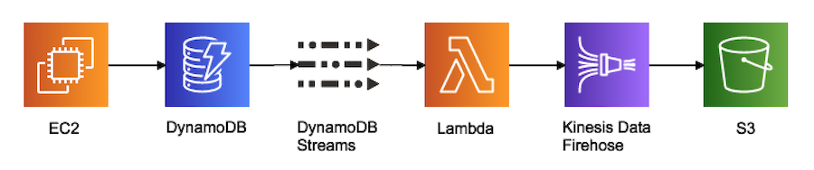
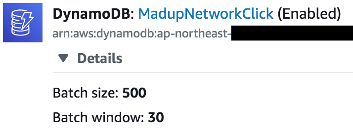
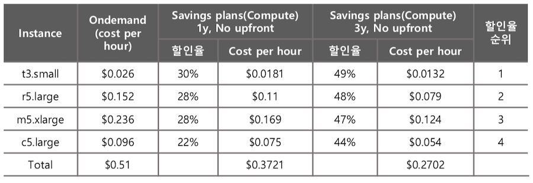

이 글은 매드업 네트워크의 서버 비용을 줄이며 적용한 방법을 공유하기 위해 작성되었습니다.  
실질적으로 AWS 비용을 줄이는 것이라기 보다 저희의 서비스를 최적화하며 경험한 내용입니다.  

<br/>

### Lambda 비용 줄이기
매드업 네트워크는 초당 3~4천건 이상의 트래픽이 발생하는 AD-Network 서비스입니다.  
이 대용량 트래픽을 안전하게 S3로 저장하기 위해 다음과 같은 데이터 파이프라인을 구축하였습니다.



S3로 데이터를 딜리버리하여 운영에 이상은 없었지만 한가지 문제가 발생하였는데,  
바로 람다 비용이 과도하게 발생한다는 것입니다.

람다는 메모리에 따라 다르지만 요청과 요청 시간에 의해 비용이 측정됩니다.  
매드업 네트워크에서는 월 33억 건의 람다 호출을 하고 있었고  
약 $6,000의 비용이 발생되었습니다.

결론부터 말씀드리면,  
Batch size와 Batch window의 설정으로 요청수를 대폭 줄일 수 있었습니다.



예를들어 위와 같이 설정을 할 경우,  
사이즈가 500이 되거나 시간이 30초가 되었을때 람다가 실행됩니다.

서비스 초기 Lambda로 DynamoDB Streams의 설정에는 Batch size만 존재하였는데,  
설정 값과는 상관없이 사이즈가 1~2에도 람다가 실행되는 문제가 있었고  
이는 Batch window의 디폴트 값이 0이기 때문에 배치 크기를 아무리 늘려도 바로 실행이 되어버린 것입니다.

지금은 두 가지 설정을 모두 할 수 있기 때문에 반드시 모두 설정 해야합니다.  
현재 매드업 네트워크는 33억건의 람다 호출을 5천만건까지 줄였고, 약 $6000에서 **$90**로 $5910, 99% 비용을 절감하였습니다.  

<br/>

### 서버 인스턴스 줄이기
매드업 네트워크는 총 10대의 EC2 인스턴스를 운영하였습니다.  
평소 10대를 모두 사용할 필요는 없지만,  
언제 발생할지 모르는 트래픽 스파이크를 대비하기 위해서가 가장 컸고 미리 준비 되지 않으면 커넥션에 실패합니다.

이런 원인은 순간적으로 대량의 트래픽이 발생되면 TIME_WAIT가 급속도로 생성되고 내부 포트가 과다하게 사용되어 포트 고갈 상태가 됩니다.

아래는 매드업 네트워크에서 포트 고갈을 막기위해 적용한 방법이고  
이 방법으로 대량의 트래픽에 대비할 수 있게 되어 서버 인스턴스를 줄일 수 있었습니다.  

##### 1. 로컬 포트 허용 범위 증가
EC2 인스턴스 서버에 기본적으로 포트설정을 해주지 않으면, 포트의 범위가 32768 ~ 60999로 잡힙니다.  
따라서 아래와 같이 커널 파라미터를 수정하여 포트 범위를 늘립니다.
```
echo "10240 65535" > /proc/sys/net/ipv4/ip_local_port_range
```

##### 2. TIME_WAIT 소켓 재사용
TIME_WAIT 소켓이 처리될때 바로 재사용해주면 포트가 낭비되지 않고 커넥션이 가능합니다.
```
sysctl -w "net.ipv4.tcp_timestamps=1"
sysctl -w "net.ipv4.tcp_tw_reuse=1"
```

##### 3. 세션 유지
간단히 말씀드려서 Nginx의 keepalive를 적용하여 세션을 유지할 수 있습니다.  
keepalive는 서버의 상황에 따라 적절한 값을 설정해야 합니다.  
자칫 낭비가 될 수 있기 때문에 테스트를 충분히 하는 것이 좋습니다.
```
upstream localhost {
  server 127.0.0.1:5000;
  keepalive 1024;
}
```

##### 4. TIME_WAIT 소켓의 최대 개수 설정
TIME_WAIT 소켓의 최대 개수를 설정 할 수 있습니다.  
최대 개수 이상의 소켓이 오픈되면 TIME_WAIT 소켓이 파괴되기 때문에 최대 값을 설정해 주는 것이 좋습니다.
```
sysctl -w "net.ipv4.tcp_max_tw_buckets=1000000"
```

<br/>

### CloudWatch PutLogEvents 최소화
매드업 네트워크에서는 실시간 access 로그를 확인하기 위해 CloudWatch를 사용하고 있는데,  
트래픽이 많다보니 비용이 상당히 발생합니다.  
이 CloudWatch 사용을 최소화 하기 위해 정상 트래픽은 로그로 쌓지 않고  
HTTPError와 ClientError만 핸들링하여 CloudWatch에 쌓을 수 있게 수정하였습니다.

CloudWatch는 설정 파일을 통해 필요한 항목만 직접 적용할 수 있습니다.  
(참조 : [Manually Create or Edit the CloudWatch Agent Configuration File](https://docs.aws.amazon.com/AmazonCloudWatch/latest/monitoring/CloudWatch-Agent-Configuration-File-Details.html))

필요한 로그만 쌓는 걸로 변경한뒤,  
월 평균 약 $1,800에서 약 **$120**으로 비용을 $1680, 93% 절감하였습니다.  

<br/>

### Savings Plans(SP) 적용
가장 손쉽게 비용을 절감할 수 있지만 가장 어려운 방법이기도 합니다.  
서비스를 운영하면서 어려운것 중 하나가 예측인 것 같습니다.  
예기치 못하게 트래픽이 많이 발생할 수도 있고 또 줄어들 수도 있습니다.

현재 상황에 맞게 시스템을 구성하였지만,  
1년 혹은 3년뒤 서비스의 상황을 예측하는 것은 쉽지 않습니다.

SP에는 Compute SP와 EC2 Instance SP의 상품이 있습니다.  
Compute SP는 유연하게 인스턴스를 변경할 수 있지만 그만큼 할인율이 낮고  
EC2 Instance SP는 제한이 있지만 할인율이 높습니다.  
(참조: [Pricing with Savings Plans](https://aws.amazon.com/savingsplans/pricing/?nc1=h_ls))



예측하기 어려운 상황과 낭비되는 리소스를 줄이기 위해  
저희는 1년 약정으로 Compute SP를 구입하기로 하였습니다.

Compute SP를 적용하기전에 가장 먼저 선행되어야 할 것은 불필요한 인스턴스를 정리하는 일입니다.  
그 뒤 인스턴스의 1년 사용량을 파악하여 적용하되 60~80%만 구입하는 것이 좋습니다.

저희는 1년 사용량의 75%만큼을 전체 선결제로 구입하였고,  
월 $274만큼의 비용을 절감할 수 있었습니다.

또한 RI도 같이 구입하여 총 30%의 비용을 절감하였습니다.  

<br/>

### 마무리
AWS의 비용을 줄이는 것은 SP/RI를 적용하는 것뿐만 아니라  
현재 상황에 맞게 끈임없이 인스턴스를 최적화하여 낭비되는 리소스를 줄이는 일이라고 생각합니다.

누구나 알고 있는 당연한 말이지만,  
이번일을 진행하면서 서버 비용을 상당히 줄일 수 있었고 다시 한번 중요함을 알게 되었습니다.  

<br/>

### 참조

* [Using AWS Lambda with Amazon DynamoDB](https://docs.aws.amazon.com/lambda/latest/dg/with-ddb.html)  
* [커널 파라미터 튜닝](https://jojoldu.tistory.com/319?category=777282)  
* [Nginx 튜닝](https://jojoldu.tistory.com/322?category=777282)  
* [Manually Create or Edit the CloudWatch Agent Configuration File](https://docs.aws.amazon.com/AmazonCloudWatch/latest/monitoring/CloudWatch-Agent-Configuration-File-Details.html)  
* [Pricing with Savings Plans](https://aws.amazon.com/savingsplans/pricing/?nc1=h_ls)

[매드업 채용 바로가기](https://www.notion.so/maduphr/f5cafd7a9ab645889a843dcb2bc8605e)
